# RoveringNow 基本設計書

| 項目 | 内容 |
|---|---|
| 文書名 | RoveringNow 基本設計書 |
| バージョン | 3.2 |
| 作成日 | 2026-08-16 |
| 最終更新日 | 2026-08-17 |
| ステータス | レビュー中 |
| 対象フェーズ | 基本設計 |

### 承認

| 役割 | 氏名 | 承認日 | 版 |
|---|---|---|---|
| 発注者 | | | |
| 設計責任者 | | | |

本書は上表の承認をもって基本設計フェーズの完了とし、詳細設計フェーズへ移行する。承認前の版で実装に着手してはならない。

### 改訂履歴

| 版 | 日付 | 内容 |
|---|---|---|
| 1.0 | 2026-08-16 | 初版作成 |
| 2.0 | 2026-08-16 | **「組織」を「グループ」へ再定義**。誰でも作成でき、恒久組織に加えてプロジェクト・イベント等の一時的な集まりも扱えるようにした。あわせて展開規模（全国一斉）・モデレーション体制を確定 |
| 3.0 | 2026-08-17 | **Six Thinking Hats による多観点レビューの反映**。①脱退・つながり解除・ブロック・投稿の編集/削除・管理者の辞任/剥奪といった「逆方向の操作」が全面的に欠落していたため新設 ②通知ミュートを配信元基準へ変更 ③配信対象のスナップショット化と上位グループの経路切断権を追加 ④「参加したい」の可視化を追加 ⑤提供形態をWEBアプリで確定 ⑥事実誤り（法令名・母数）を修正しKPIを再計算 ⑦共通エラー方針・導入定着計画・運用監視・外部合意事項の各節を新設 |
| 3.1 | 2026-08-17 | プロジェクトを**同人制作**と位置づけ、責任主体の確定を開発完了後の稟議へ送った（決定42）。データは**原則無期限保持**とし、退会時は個人特定情報のみ削除する方針を確定（決定43・44）。これにより詳細設計の開始をブロックする未決事項は解消 |
| 3.2 | 2026-08-17 | **工程2（実装）で発見した不整合の修正**。①オーナーの脱退を禁止（決定45）②権限マトリクスの「グループからの脱退」で、システム管理者を ✅ から ⭕️ に修正（所属しないグループからは脱退できないため）。あわせて詳細設計側で、総当たり件数の記載（130→175通り）と配信元グループの定義（決定 T-18）を修正 |

### 本書の位置づけ

本書は開発工程（基本設計 → 詳細設計 → 実装 → テスト）における**基本設計フェーズの成果物**であり、以降の全工程を規定する。

本書が定義するのは「**何を作るか**」（機能・体験・データの概念・運用ルール）までである。「**どう作るか**」に属する事項 — 言語・フレームワーク・データベース製品・インフラ・API仕様・テーブル定義 — は、すべて**詳細設計フェーズの領分**として意図的に記述しない。

本書と実装が食い違った場合は、**本書を正とする**。実装都合で仕様を変える必要が生じた場合は、実装より先に本書を改訂し、第15章の意思決定履歴に理由を記録する。

**用語の注意：** 本書における `Phase 1〜3` は**機能の提供段階**を指す。開発工程の番号（工程0〜5）は[実装計画](../00_read_me/10_implementation_plan.md)で定義しており、本書の Phase とは対応しない。

---

## 目次

1. [プロジェクト概要](#1-プロジェクト概要)
2. [ターゲットユーザーとペルソナ](#2-ターゲットユーザーとペルソナ)
3. [プロダクトコンセプト](#3-プロダクトコンセプト)
4. [スコープとリリース計画](#4-スコープとリリース計画)
5. [用語定義](#5-用語定義)
6. [主要ユースケース](#6-主要ユースケース)
7. [機能一覧と機能概要](#7-機能一覧と機能概要)
8. [ロール・権限設計](#8-ロール権限設計)
9. [概念データモデル](#9-概念データモデル)
10. [通知設計](#10-通知設計)
11. [画面一覧・画面遷移](#11-画面一覧画面遷移)
12. [運用・モデレーション・導入方針](#12-運用モデレーション導入方針)
13. [非機能要件](#13-非機能要件)
14. [制約・前提／対象外事項](#14-制約前提対象外事項)
15. [意思決定履歴](#15-意思決定履歴)

---

## 1. プロジェクト概要

### 1.1 背景

日本のボーイスカウト運動には「**ローバースカウト**」部門が存在する。学業・就職・転居といったライフステージの変化が最も激しい年代であり、他部門と比べて活動の継続が難しい。

現在、この年代の活動には次の5つの課題がある。

**課題1：組織からメンバーへの情報伝達が機能していない**
ローバースカウトは団・地区・県連盟といった複数の組織に同時に所属するが、それぞれの連絡手段が分散しており（口頭・メール・個別のSNS・紙）、必要な情報が末端のスカウトまで届いていない。特に**上位組織から末端スカウトへの伝達**が弱く、地区や県連盟が企画した活動の存在自体を知らないまま機会を逃すケースが生じている。

さらに、ローバースカウトの活動は恒久的な組織だけでなく、**プロジェクトやイベントごとの一時的な集まり**によって動く場面が多い。こうした集まりは既存の連絡手段の外側にあり、その都度メッセージアプリのグループが作られては散逸している。

**課題2：活動への参加意欲が年々低下している**
参加しても何も残らない。活動の履歴が個人の手元に蓄積されず、続けることへの手応えが得にくい。加えて、連絡が届いたとしても「参加しよう」と思わせる要素がなく、情報の到達と行動の間に断絶がある。

**課題3：ローバースカウト同士の交流が乏しい**
所属組織を越えた横のつながりが生まれにくく、活動で出会っても関係が続かない。

**課題4：全国ブログ「ローバーポート」のアクティブユーザーが少ない**
全国のローバー組織がアカウントを持ち活動報告を投稿しているが、読み手が集まらず、書き手の意欲も維持されにくい。

**課題5：所属を越えて、知らないスカウトと話せる場がない**
課題3が「出会った人との関係が続かない」であるのに対し、こちらは「そもそも出会う機会がない」。所属の外にいる同世代と気軽に話せる場が存在しない。

### 1.2 目的

上記の課題を、ローバースカウト世代が日常的に使うモバイル体験の上で一体的に解決する。

課題は独立していない。**課題1が解決しなければ他の課題も解決しない**。情報が届かない状態では、活動への参加自体が起こらず、交流も生まれず、記事も読まれないからである。したがって本アプリは、**情報伝達（課題1）を土台**とし、その上に参加動機づけ（課題2）と横のつながり（課題3・4・5）を積み上げる構造をとる。

### 1.3 ゴールと成功指標

**展開方針は「全国一斉導入」**とする。ただし全国公開の前に、限られた協力グループによるクローズドβを実施する（第4.4節）。

**母数**：日本のローバースカウト数は **5,862人**（2024年度末。日本連盟 2024年度事業報告による）。以下のKPIはこの値を母数とする。

> **【仮置き】** 数値目標は仮案である。クローズドβの結果を踏まえて確定する。

| # | 指標 | 測定方法 | 対応課題 | 初年度の目標（仮） |
|---|---|---|---|---|
| KPI-1 | 登録率 | 登録者数 ÷ 5,862 | 課題1 | 20%（約1,170人） |
| KPI-2 | 週次アクティブ率 | 週に1回以上アプリを開いた登録者 ÷ 登録者数 | 課題1 | 50% |
| KPI-3 | **稼働グループ数** | 月に1件以上の連絡が投稿されたグループ数 | 課題1 | 100グループ |
| KPI-4 | 連絡の到達率 | 連絡詳細画面を表示した人数 ÷ 配信対象者数 | 課題1 | 60% |
| KPI-5 | 参加意向率 | 「参加したい」が1件以上付いた連絡 ÷ 全連絡数 | 課題2 | 30% |
| KPI-6 | 年間スタンプ獲得数 | 1人あたりの年間平均 | 課題2 | 4個 |
| KPI-7 | 累計カード交換数 | 1人あたりの累計平均 | 課題3 | 5枚 |
| KPI-8 | ローバーポート流入数 | アプリ経由の記事アクセス数 | 課題4 | 【仮置き】現行値の実測後に確定 |

**KPI-1・KPI-2・KPI-3を最上位の指標**とする。とりわけKPI-3（稼働グループ数）は本アプリの生命線である。グループは誰でも作成できるため作成数自体は容易に伸びるが、**実際に連絡が流れているグループの数**こそが、アプリが日常の連絡手段として定着したかを示すためである。

KPI-4とKPI-5は対になっている。**KPI-4が高くKPI-5が低い状態は、「情報は届いたが誰も動かない」ことを意味し、課題2が未解決であることを示す。**

---

## 2. ターゲットユーザーとペルソナ

### 2.1 対象ユーザー

| 区分 | 対象 | 想定年齢 |
|---|---|---|
| 主対象 | ローバースカウト | 18〜26歳 |
| 主対象 | ローバー組織の運営スカウト（役員等） | 18〜26歳 |
| 副次対象 | ローバー隊長・隊指導者等、組織運営に関わる成人指導者 | 27歳以上 |

**年齢範囲についての注記。** 日本連盟によるローバースカウト部門の公式区分は「**18歳以上25歳以下**」である。本アプリが対象を26歳までとするのは意図的な拡張であり、**登録を離れた直後の層を取り込む**ことを狙いとする。この年代は課題2（参加意欲の低下）が最も顕在化する層であり、公式区分を外れた瞬間に接点を失うことは、本アプリの目的に反するためである。用語としての「ローバースカウト」は公式区分に従う（第5.1節）。

**全ユーザーが成人**である点は、設計上重要な前提となる。未成年保護に特有の要件（保護者同意、利用時間制限等）は本アプリの対象外とする。ただし副次対象として成人指導者がグループ管理者になり得るため、**グループ管理者＝ローバー世代とは限らない**前提で管理画面を設計する。

### 2.2 ペルソナ

**ペルソナA：一般ローバースカウト**
大学2年生・20歳。団のローバー隊と地区ローバー会に所属し、加えて夏の合同キャンプの実行委員も務めている。所属先の連絡がどこに来るのか把握しきれておらず、活動を知らないまま過ぎることがある。参加した活動が記録として残ることに価値を感じるが、記録のために手間をかける気はない。**義務感で開くアプリはすぐ使わなくなる。**

*設計上の含意：情報は取りに行かせず、届ける。恒久組織も一時的な集まりも同じ場所に届く。記録は自動で残す。そして「開きたくなる理由」を用意する。*

**ペルソナB：運営スカウト**
社会人1年目・23歳。地区ローバー会の役員として活動を企画し、参加を呼びかける立場。連絡手段が分散しているため何度も同じ内容を送り、それでも「聞いていない」と言われる。企画のたびにメッセージアプリのグループを作り直している。多忙で、運営作業に割ける時間は限られる。**上位者への催促や承認待ちが最も苦手。**

*設計上の含意：グループ作成と投稿がそれぞれ数十秒で終わること。運営作業の負担が参加人数に比例して増えないこと。承認を待つ工程を極力挟まないこと。*

**ペルソナC：成人指導者**
40代・ローバー隊長。スマートフォンは使うが最新のSNSには不慣れ。グループの管理者として参加承認等を担当する。

*設計上の含意：管理機能は説明なしで操作できる水準にする。承認操作の意味と影響範囲が画面上で分かること。*

---

## 3. プロダクトコンセプト

> ### 連絡が届き、活動が記録され、仲間が集まる
> **— ローバースカウトのためのデジタル手帳**

本アプリは3本の柱で構成される。

| 柱 | 意味 | 対応課題 |
|---|---|---|
| **届く** | 自分が関わるすべての集まりからの連絡が、一つの場所に確実に届く | 課題1・4 |
| **残る** | 参加した活動が、集めるほど厚みを増す記録として自動的に蓄積する | 課題2 |
| **繋がる** | 活動で出会った仲間が、記録として手元に残り関係が続く | 課題3・5 |

### 3.1 「グループ」という単位

本アプリにおける連絡の発信主体は、恒久的な組織に限定しない。

ローバースカウトの活動は、団ローバー隊や地区ローバー会といった恒久組織だけでなく、**期限付きのプロジェクト、単発のイベント、有志の集まり**によって動いている。恒久組織だけを対象とすると、こうした集まりは結局アプリの外（メッセージアプリのグループ等）で運用され、連絡が再び分散する。

そこで本アプリでは、これらすべてを「**グループ**」という単一の単位として扱う。

| グループ種別 | 例 | 性質 |
|---|---|---|
| 公式組織 | ○○団ローバー隊、△△地区ローバー会、□□県連盟ローバー会 | 恒久的。認証バッジの対象 |
| プロジェクト | 全国大会実行委員会、広報チーム | 期限付き |
| イベント | 夏季合同キャンプ2027 | 期限付き。参加者全員が対象 |
| その他 | 有志の集まり、勉強会 | 自由 |

**グループは誰でも作成できる。** 作成者が初代管理者となり、参加方式（招待制／参加申請制／フルオープン）を選ぶ。恒久組織と一時的な集まりを同じ仕組みで扱うことで、あらゆる連絡が単一のタイムラインに集約される。

### 3.2 「コレクション」という単一のメンタルモデル

本アプリの中核的な設計判断として、**活動スタンプと交換したプロフィールカードを、別々の機能として提示しない**。

ユーザーから見れば、どちらも「**活動していると集まっていくもの**」という同一の体験である。両者を `コレクション` という一つの領域に統合することで、アプリの人格が明確になる。

```
コレクション ＝ 自分がどこへ行ったか（スタンプ） ＋ 誰と会ったか（カード）
             ＝ ローバースカウトとしての活動の軌跡
```

これは物理的な**スカウト手帳のデジタル版**にあたる。「連絡アプリにゲーム機能が付いている」のではなく、「活動の軌跡が貯まっていく手帳であり、そこに連絡も届く」という位置づけを、画面構成とコンセプトの両面で一貫させる。

### 3.3 「届いた後」を設計する

連絡が届くことは目的ではなく手段である。**届いた連絡が参加につながらなければ、課題2は解決しない。**

スタンプは活動に参加した「後」にしか報いない。参加する「前」に人を動かす仕掛けが別途必要である。本アプリではこれを、**「参加したい」という意思の可視化**（第7.3節 F-10）によって満たす。この年代を動かすのは、多くの場合「友達が行くから行く」という力である。

### 3.4 プロダクトが守るべき原則

以下は、以降の設計判断で迷いが生じた際の判断基準とする。

1. **連絡が届くことを何よりも優先する。** 他のどの機能も、連絡の到達を妨げてはならない
2. **グループを作る手間を限りなく小さくする。** 作成が面倒なら、ユーザーはメッセージアプリに戻る
3. **運営者の作業量を、参加人数に比例させない。** 比例する運用は必ず続かなくなる
4. **記録のためにユーザーへ手間を要求しない。** 記録は活動の副産物として自動的に残る
5. **タイムラインの信頼性を守る。** 「見なくてもよい情報」を混ぜない
6. **やり直せるようにする。** 参加・接続・投稿のすべてに、取り消す手段を用意する
7. **人を追い詰める表示をしない。** 状態の可視化は本人の不利益に働いてはならない

---

## 4. スコープとリリース計画

### 4.1 リリースフェーズ

| フェーズ | 含む機能 | 狙い |
|---|---|---|
| **MVP（Phase 1）** | グループ・連絡・スタンプ・カード交換・通知基盤・通報 | 課題1と2を解決し、課題3の起点を作る |
| **Phase 2** | ローバーポート新着配信・匿名掲示板 | 課題4と5を解決する |
| **Phase 3** | ダイレクトメッセージ（実名／匿名） | 課題3を深める |

### 4.2 MVPの範囲

MVPには機能1（連絡）・機能2（スタンプ）・機能3（カード交換）の3機能に加え、これらを支える基盤（認証・グループ・通知・通報）を含む。

3機能を同時に対象とする理由は、**QRスキャンが機能2と機能3の共通基盤**であり、分割するとかえって非効率になるためである。

### 4.3 MVP内部の実装順序

MVPが3機能に及び、さらにグループ機能が当初想定より大きくなったことで、開発量は相応に増えている。ウォーターフォールで一括リリースする以上、リリース前に価値を検証する機会がない点がリスクとなる。

これを緩和するため、**実装フェーズ内部でも次の順序を守る**。

```
[1] 認証・グループ・通知基盤     ← すべての土台
        ↓
[2] 連絡機能（機能1）            ← ここで一度、実際の集まりで使ってもらう
        ↓
[3] スタンプ機能（機能2）        ← QR基盤をここで構築
        ↓
[4] カード交換機能（機能3）      ← QR基盤を再利用
```

**[2] が完了した時点で、協力グループに実際に触ってもらう機会を設ける**。ここで得た指摘を [3][4] の実装、および詳細設計の改訂に反映する。この検証機会の確保を、実装計画上の必須項目とする。

### 4.4 ローンチ方式

**全国一斉導入**とする。ただしその前段として、**クローズドβ**を実施する。

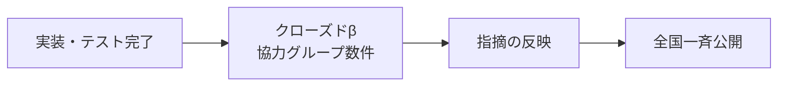

ウォーターフォールでは、リリース前に実ユーザーの反応を見る機会が構造的に存在しない。加えて全国一斉導入では、問題があった場合に**全国のユーザーが同時にそれを踏む**。段階的に地域を広げるロールアウトを行わない以上、クローズドβは省略できない工程である。

クローズドβでは特に次を確認する。

- グループ作成の手軽さが、メッセージアプリの代替として成立する水準にあるか
- 連絡が実際に届き、読まれているか（KPI-4）
- 届いた連絡が参加意向につながっているか（KPI-5）
- 通知量が過大になっていないか

なお、**クローズドβの通報発生頻度から全国公開時の発生頻度を外挿してはならない**。βは互いに面識のある協力者同士で行われるため荒れにくく、見知らぬ他人同士となる全国公開とは前提が異なるためである。モデレーション体制の規模は、βの結果ではなく想定登録者数から見積もる。

### 4.5 対象外事項

以下は本アプリの対象外とする（将来的な検討を妨げるものではないが、Phase 3までのスコープに含めない）。

- **イベントの出欠管理・参加申込**（「参加したい」の表明は行うが、人数の確定・申込・キャンセル管理は行わない）
- 会費・金銭の授受
- 進級課目・技能章など日本連盟の公式記録との連携
- 動画投稿・ライブ配信
- ローバースカウト以外の部門（ビーバー〜ベンチャー）への対応
- 日本国外のスカウト組織への対応
- 多言語対応（国外を対象外とするため）
- 既存システムからのデータ移行（移行元となるシステムが存在しないため）

---

## 5. 用語定義

### 5.1 スカウト運動の用語

| 用語 | 定義 |
|---|---|
| ローバースカウト | ボーイスカウト運動における部門の一つ。日本連盟の公式区分では**18歳以上25歳以下**（本アプリの対象年齢とは異なる。第2.1節参照） |
| 団 | 地域を基盤とするスカウト運動の基本単位 |
| 地区 | 複数の団によって構成される組織単位。各連盟が任意に設置する |
| 県連盟 | 都道府県単位の連盟組織。名称は「東京連盟」のように「県」を含まない場合がある |
| 日本連盟 | 全国を統括する連盟組織 |
| ローバー隊 | 団に設置されるローバースカウトの隊 |
| ローバー会 | 地区・県連盟等の単位で組織されるローバースカウトの集まり |
| ローバーポート | 正式名称 **ROVERPORT**。全国ローバースカウト会議（RCJ）が2024年に開始した、全国のローバー組織が活動報告を投稿するコミュニティサービス |

**各ローバースカウト組織は、階層から機械的に導出される名称ではなく、それぞれ固有の名称を持つ。** したがって本アプリでは、グループ名を階層構造から生成せず、**グループ固有の名称として保持する**（第5.2節）。階層上の位置づけは、種別と親グループによって別途表現する。

### 5.2 本アプリの用語

| 用語 | 定義 |
|---|---|
| **グループ** | 本アプリ上で連絡の発信主体となる単位。恒久的な公式組織のほか、プロジェクト・イベント・その他の集まりを含む。**誰でも作成できる** |
| **グループ種別** | 公式組織／プロジェクト／イベント／その他。作成者が申告する |
| **認証バッジ** | 実在する公式組織であることをアプリ運営が確認した証。運営のみが付与・剥奪できる |
| **グループ名** | グループ固有の名称。**全国で一意**であることをシステムが強制する |
| **オーナー** | グループの最終責任者。原則として作成者。他の管理者から除名・権限剥奪されない |
| **参加方式** | グループへの参加のしかた。招待制／参加申請制／フルオープンから作成者が選ぶ |
| **所属** | ユーザーとグループの関係。参加方式に応じた手続きを経て成立し、**本人の操作でいつでも解消できる** |
| **親グループ** | グループの上位に位置づけられるグループ。設定には**親側の管理者による承認**を要する |
| **配信範囲** | 連絡を届ける対象の指定。「自グループのみ」または「配下グループすべて」から選ぶ |
| **配信対象** | 連絡を実際に受け取る利用者の集合。**投稿時点で確定し、以後変化しない**（第9.3節） |
| **アーカイブ** | 期限を迎えたグループの状態。投稿はできないが、過去の連絡・スタンプは閲覧できる |
| **休眠** | 管理者が不在になったグループの状態。運営による管理者の再設定が可能（第9.4節） |
| **連絡** | グループ管理者が投稿する情報。本アプリにおける投稿の唯一の形式 |
| **タイムライン** | 所属するすべてのグループから届いた連絡を時系列で並べた一覧 |
| **スタンプ** | 活動への参加を証明する記録。グループ管理者が活動ごとに作成する |
| **プロフィールカード** | ユーザーが自分自身を表現するカード。QRを介して他者と交換する |
| **つながり** | プロフィールカードを交換した相手との関係。Phase 3のDM解禁条件となる。**一方の操作でいつでも解除できる** |
| **ブロック** | 特定の相手からの接触を遮断する状態 |
| **コレクション** | 獲得したスタンプと交換したカードを収める領域 |

---

## 6. 主要ユースケース

### 6.1 ユースケース一覧

| ID | ユースケース | 主アクター | 対応課題 | フェーズ |
|---|---|---|---|---|
| UC-01 | ユーザーがグループを作成する | 全ユーザー | 基盤 | MVP |
| UC-02 | ユーザーがグループに参加する | 全ユーザー | 基盤 | MVP |
| UC-03 | グループ管理者が参加を承認する／招待する | グループ管理者 | 基盤 | MVP |
| UC-04 | グループを既存グループの配下に位置づける | グループ管理者 | 基盤 | MVP |
| UC-05 | グループ管理者が連絡を配信する | グループ管理者 | 課題1 | MVP |
| UC-06 | スカウトが連絡を受け取り反応する | メンバー | 課題1・2 | MVP |
| UC-07 | グループ管理者が誤った連絡を訂正する | グループ管理者 | 課題1 | MVP |
| UC-08 | グループ管理者が活動スタンプを用意する | グループ管理者 | 課題2 | MVP |
| UC-09 | スカウトが活動でスタンプを獲得する | 全ユーザー | 課題2 | MVP |
| UC-10 | スカウト同士がプロフィールカードを交換する | 全ユーザー | 課題3 | MVP |
| UC-11 | スカウトがコレクションを振り返る | 全ユーザー | 課題2・3 | MVP |
| UC-12 | **ユーザーが関係を解消する**（脱退・つながり解除・ブロック） | 全ユーザー | 基盤 | MVP |
| UC-13 | **管理者が交代する**（辞任・任命・オーナー移譲） | グループ管理者 | 基盤 | MVP |
| UC-14 | ユーザーが不適切な内容を通報する | 全ユーザー | 基盤 | MVP |
| UC-15 | 運営が公式組織を認証する | システム管理者 | 基盤 | MVP |
| UC-16 | スカウトがローバーポートの新着記事を読む | 全ユーザー | 課題4 | Phase 2 |
| UC-17 | スカウトが匿名で掲示板に書き込む | 全ユーザー | 課題5 | Phase 2 |

### 6.2 中核ユースケースの流れ

#### UC-01／UC-02：グループの作成と参加

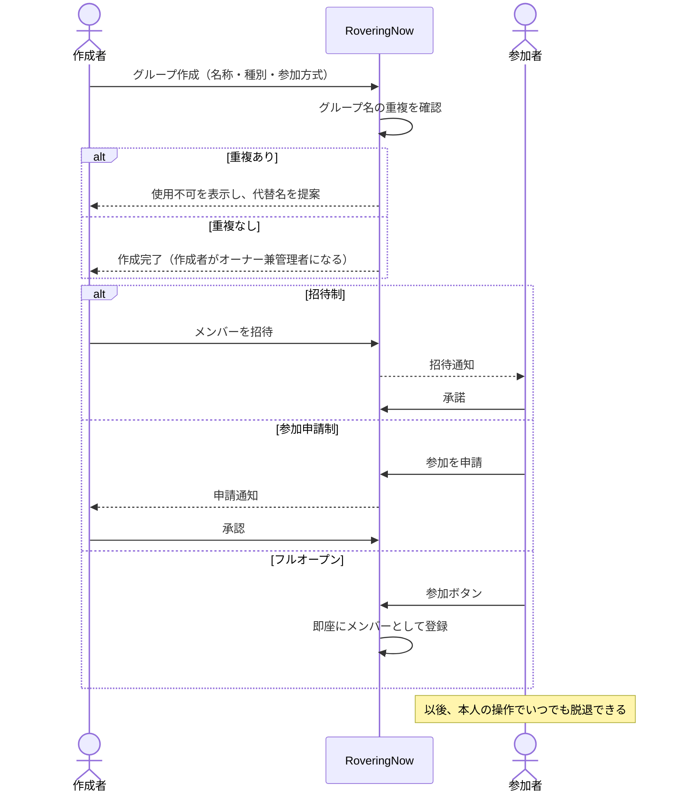

#### UC-05／UC-06：連絡の配信と受信

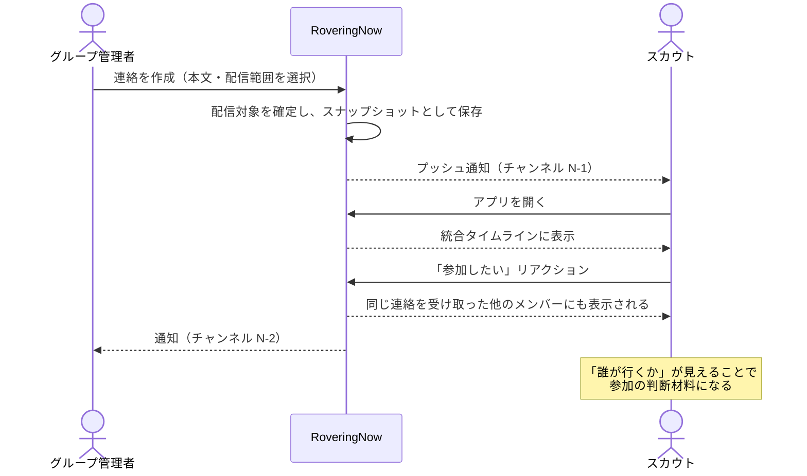

#### UC-08／UC-09：スタンプの用意と獲得

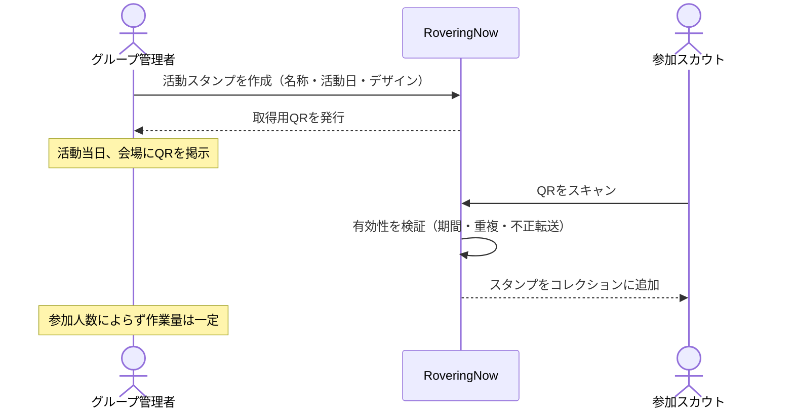

#### UC-10／UC-12：カードの交換と関係の解消

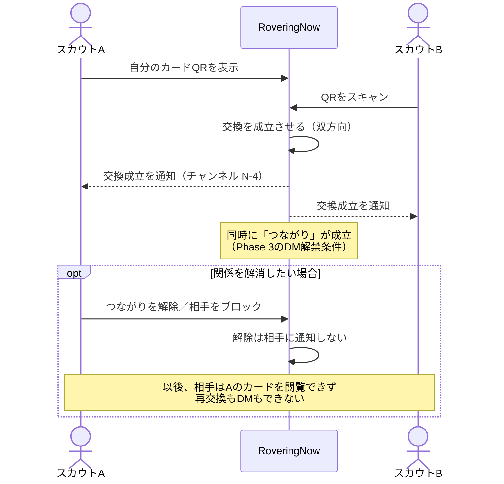

**交換は片方がスキャンすれば双方向に成立する。** 2人が交互にスキャンする手順は、初対面の場面では摩擦が大きすぎるためである。その代わり、**成立後にいつでも一方の操作で解消できる**ことをもって、同意の欠如を補償する。

---

## 7. 機能一覧と機能概要

### 7.1 機能一覧

| ID | 機能名 | 対応課題 | フェーズ |
|---|---|---|---|
| F-01 | 会員登録・認証 | 基盤 | MVP |
| F-02 | グループ作成 | 基盤 | MVP |
| F-03 | グループ検索・参加 | 基盤 | MVP |
| F-04 | グループ管理（メンバー管理・管理者任命） | 基盤 | MVP |
| F-05 | 親グループの設定と承認 | 基盤 | MVP |
| F-06 | 公式組織の認証 | 基盤 | MVP |
| F-07 | 連絡の投稿・編集・削除 | 課題1 | MVP |
| F-08 | 統合タイムライン | 課題1 | MVP |
| F-09 | コメント | 課題1 | MVP |
| F-10 | リアクションと参加意向の可視化 | 課題1・2 | MVP |
| F-11 | スタンプ作成 | 課題2 | MVP |
| F-12 | スタンプ獲得（QRスキャン） | 課題2 | MVP |
| F-13 | プロフィールカード編集 | 課題3 | MVP |
| F-14 | カード交換（QRスキャン） | 課題3 | MVP |
| F-15 | コレクション閲覧 | 課題2・3 | MVP |
| **F-16** | **関係の解消（脱退・つながり解除・ブロック）** | 基盤 | MVP |
| **F-17** | **管理者の交代（辞任・剥奪・オーナー移譲）** | 基盤 | MVP |
| F-18 | 通知 | 基盤 | MVP |
| F-19 | 通報 | 基盤 | MVP |
| F-20 | ローバーポート新着配信 | 課題4 | Phase 2 |
| F-21 | 匿名掲示板 | 課題5 | Phase 2 |
| F-22 | ダイレクトメッセージ | 課題3 | Phase 3 |

### 7.2 基盤機能

#### F-01 会員登録・認証

**誰でも登録できる。** 登録の時点ではローバースカウトであることを問わない。参入障壁を最小化する。

登録直後のユーザーは「無所属の登録ユーザー」状態となる。この状態でも**機能上の制限は設けない**（第8章参照）。

#### F-02 グループ作成

**誰でもグループを作成できる。** 作成者が**オーナー**となり、同時に管理者となる。

| 項目 | 必須 | 内容 |
|---|---|---|
| グループ名 | 必須 | **全国で一意**。重複は登録時に拒否する |
| 種別 | 必須 | 公式組織／プロジェクト／イベント／その他 |
| 参加方式 | 必須 | 招待制／参加申請制／フルオープン |
| 説明 | 任意 | |
| 期限 | 任意 | 設定した場合、期限到来後にアーカイブ状態へ移行する |
| 親グループ | 任意 | 設定には親側管理者の承認を要する（F-05） |

**グループ名の一意性について。** 全国で一意とすることで、名前がわかれば必ず1件に特定でき、参加先を間違えない。一方で「夏キャンプ2027」のような一般的な名称は早い者勝ちで埋まり、作成時の摩擦になる。これを緩和するため、**入力中にリアルタイムで重複を判定し、使用不可の場合は代替名を自動提案する**（例：`夏キャンプ2027` → `夏キャンプ2027（東京第1地区）`）。提案は候補にすぎず、利用者は自由な名称を入力できる。

**参加方式は作成者が選ぶ。**

| 参加方式 | 成立の流れ | 想定用途 |
|---|---|---|
| 招待制 | 管理者が招待 → 本人が承諾 | プロジェクトチーム等、メンバーが確定している集まり |
| 参加申請制 | 本人が申請 → 管理者が承認 | 公式組織等、所属を確認する必要がある集まり |
| フルオープン | 本人の操作のみで即参加 | イベント参加者等、広く受け入れる集まり |

#### F-03 グループ検索・参加

ユーザーはグループを検索し、参加方式に応じた手続きで参加する。1人が複数のグループへ同時に所属できる。

検索結果では、**認証バッジを持つグループを上位に表示する**。同名は存在しないが、類似した名称のグループが並ぶ場合に、正しい公式組織を選びやすくするためである。あわせて種別・親グループ・メンバー数を表示する。

**参加QRによる導線。** グループは参加用のQRを発行でき、掲示物や既存の連絡手段に貼ることができる。スキャンすると参加方式に応じた手続きへ直行する。グループ名が全国一意であるがゆえに「正式名称を知らないと検索で辿り着けない」という摩擦が生じるため、名前を知らなくても参加できる経路を用意する。このQRはスタンプ・カードと同じスキャナ（F-12・F-14）で読み取れる。

#### F-04 グループ管理

グループ管理者は、参加申請の承認・却下、メンバーの招待・除名、他メンバーへの管理者権限の付与を行える。

**管理者は「オーナー」と「オーナーまたは管理者が任命した者」で構成される。** アプリ運営がグループの管理者を任命することはない（休眠グループの復旧を除く。第9.4節）。

**オーナーは他の管理者から除名・権限剥奪されない。** これがないと、手伝いのために管理者権限を付与した相手にグループを乗っ取られる。認証バッジ付きの公式組織グループが乗っ取られた場合、その組織名義の偽の連絡が配下すべてに配信されうるため、この保護は必須である。

#### F-05 親グループの設定と承認

グループは、他のグループを親として設定できる。これによりグループツリーが構成され、上位グループから配下すべてへの配信が可能になる（F-07）。

**親グループの設定には、親側の管理者による承認を要する。** 誰でも自由に親を設定できると、無関係なグループが公式組織のツリーにぶら下がり、県連盟の「配下すべて」配信が意図しない相手に届いてしまうためである。設定は「子から申請 → 親が承認」の流れとし、**承認されるまでは親子関係を配信に反映しない**。

**上位グループによるツリーの可視化と経路の切断。** 承認は直上の親子関係についてのみ行われるが、配信は配下を再帰的にたどる。したがって、承認した子がさらに孫を承認すると、その孫は祖先の配信対象に自動的に加わる。祖先はこれを関知できない。

この穴を塞ぐため、次を定める。

- グループ管理者は、**自グループを起点とする配下ツリー全体（孫以降を含む）を一覧できる**
- 上位グループの管理者は、**自ツリー内の任意の子孫との配信経路を切断できる**。切断されたグループは配下配信の対象から外れる（グループ自体は存続する）
- 配下ツリーに新たなグループが加わった際、上位グループの管理者へ通知する（チャンネル N-6）

#### F-06 公式組織の認証

**グループの作成は誰でも自由に行える。** そのうえで、実在する公式組織であることをアプリ運営が確認したグループに、**認証バッジを付与する**。

この方式を採る理由は、作成の手軽さ（プロダクト原則2）と、正しい組織を見分けられること（課題1の前提）を同時に満たすためである。作成に承認を挟むと全国導入時に運営が詰まり、何も区別しなければ偽の公式組織を防げない。バッジは作成を一切妨げず、見分けだけを解決する。

**認証はグループ管理者からの申請に基づき、システム管理者が全件を審査する。** 認証の判断基準は運用ガイドラインとして事前に整備し、審査者による揺れを防ぐ（第12.3節）。

> **【運用上の留意】** 全件審査は運営に作業が集中する。認証は申請ベースであり全グループが対象になるわけではないが、全国公開直後に申請が集中することが見込まれる。審査待ちが長期化すると偽の公式組織が判別できない期間が生じるため、**審査の応答目標を運用ガイドラインに定め、体制規模を想定登録者数から見積もる**こと。

### 7.3 課題1・2に対応する機能（連絡）

#### F-07 連絡の投稿・編集・削除

**投稿できるのはグループ管理者のみ**とする。一般メンバーは投稿できない。

これは、タイムラインを「**確実に見るべき情報だけが並ぶ場所**」として維持するための判断である。全員が投稿できると重要な連絡が雑談に埋もれ、「連絡が届かない」という元の課題が再発する。雑談・相互交流は Phase 2 の掲示板が担う。

投稿時に**配信範囲**を選択する。

| 配信範囲 | 届く相手 |
|---|---|
| 自グループのみ | そのグループに所属するメンバー |
| 配下グループすべて | そのグループと、**承認済みかつ切断されていない親子関係**で配下にあるすべてのグループのメンバー |

「配下グループすべて」は、**配下を持つグループでのみ選択できる**。配下のないグループ（多くのプロジェクト・イベント）では選択肢に現れない。

**編集と削除。** 投稿者は自身の連絡を編集・削除できる。編集した場合は「編集済み」であることを表示する。

これは必須の機能である。集合時刻を誤って「配下すべて」に配信した場合、訂正手段がなければ誤情報が全配下のタイムラインに正しい情報として残り続ける。新規投稿による訂正では、元の連絡を見た人が訂正を見るとは限らない。

**アーカイブ状態・休眠状態のグループには投稿できない。**

#### F-08 統合タイムライン

所属するすべてのグループから届いた連絡を、**1本の時系列タイムライン**に統合して表示する。グループ単位のフィルタで絞り込むこともできる。

グループごとにチャンネルを分ける方式は採らない。ユーザーが各チャンネルを見に行く必要が生じ、見落としが増えるためである。「**アプリを開けば全部わかる**」状態を最優先する。

**アーカイブ状態のグループの連絡は、タイムラインから自動的に外れる**（グループのページからは閲覧できる）。期限付きグループが増えてもタイムラインが古い情報で埋まらないようにするための措置である。

#### F-09 コメント

連絡に対して、**全メンバーがコメントできる**。投稿権限を管理者に限定した分、双方向性はコメント欄で確保する。投稿者は自身のコメントを編集・削除できる。

コメントは全メンバーが書けるため、**アプリ内で最初に荒れる可能性がある領域**となる。このため通報機能（F-19）をMVPに含める。

#### F-10 リアクションと参加意向の可視化

連絡に対する1タップの反応。種別は「了解」「参加したい」等とする。

**「参加したい」を選んだ人の表示名とアバターを、同じ連絡を受け取ったメンバーに表示する。**

これは本アプリで唯一、**参加する「前」に働く仕掛け**である。スタンプ（F-11・F-12）は参加した後にしか報いないため、これだけでは課題2の半分しか解けない。誰が行くのかが見えることで参加の判断材料が生まれる。

出欠管理ではない点に注意する。人数の確定・申込・キャンセル管理は行わず（第4.5節）、あくまで意思表示の可視化にとどめる。表明した人は、いつでも取り消せる。

**既読管理機能は実装しない。** 既読の強制は手軽さを損ない、ユーザーに心理的負担を与えるためである。代わりにリアクション数を管理者に見せることで、伝達状況を推し量る手段とする。

> **設計上の注意：** リアクション数を管理者が見られることは、押す側にとって「見られている」という圧力になりうる。個人の押した／押さないの一覧を管理者に見せてはならない（「参加したい」のみ、全メンバーに対して公開される）。

### 7.4 課題2に対応する機能（スタンプ）

#### F-11 スタンプ作成

グループ管理者が活動ごとにスタンプを作成する。

| 項目 | 内容 |
|---|---|
| 名称 | 活動名 |
| 活動日 | 開催日 |
| デザイン | テンプレートから選択、または画像アップロード |
| 取得有効期間 | このスタンプを獲得できる期間 |
| 取得方式 | 会場QR／点呼（第7.4節 F-12） |

**デザインはテンプレート生成を主体とする。** 形・色・アイコン・活動名・日付を選ぶだけで生成できるため、デザインツールを持たない運営者でも作成でき、コレクション画面に並べたときの統一感も保たれる。上級者向けに画像アップロードも許可するが、この場合は不適切画像への通報・審査の対象となる。

イベント種別のグループとスタンプは相性がよい。**イベントグループを作り、そのグループがスタンプを発行する**という流れが自然に成立する。

#### F-12 スタンプ獲得（QRスキャン）

運営者が会場にQRを掲示し、**参加者が自分でスキャンして獲得する**。

運営者が参加者を1人ずつ認定する方式は採らない。その方式では運営者の作業量が参加人数に比例して増え、忙しい運営者ほど運用しなくなるためである（プロダクト原則3）。QR方式であれば運営者の作業は「掲示する」だけで、人数によらず一定である。

**不正取得への対策と、そのトレードオフ。** 掲示したQRは撮影・転送が可能であり、現地不在者も獲得できてしまう。「不正取得への耐性を持つこと」を機能要件として定めるが、**耐性を高める方式（時限で更新される動的QR等）は紙への印刷・掲示を不可能にし、運営者が端末を持って立ち続ける必要を生む**。これは決定8の唯一の採用理由（運営負担が人数によらず一定）を損なう。

このトレードオフは技術的な実現方式の問題ではなく、**運用形態の選択**であるため、基本設計で解く。本アプリでは**取得方式を2種類用意し、運営者が活動の性質に応じて選ぶ**こととする。

| 取得方式 | 方法 | 転送耐性 | 運営負担 | 想定用途 |
|---|---|---|---|---|
| **会場QR** | 静的QRを掲示し、参加者がスキャン | 低（有効期間の限定のみ） | 人数によらず一定 | 大規模集会、参加者を厳密に絞る必要がない活動 |
| **点呼** | 運営者・班長が参加者のカードQRを読み取る | **高**（読む側が現地にいることが前提） | 班単位で分担すれば1人あたり数名 | 参加者を確実に把握したい活動 |

点呼方式は、既存のカードQR（F-14）と手動付与の仕組みを再利用するため、新しい部品を必要としない。スカウトの班制度をそのままデジタル化した形でもある。

いずれの方式でも、運営者が事後に不正な獲得を取り消せる手段を用意する。

**グループに所属していなくてもスタンプを獲得できる。** これは意図的な設計であり、他組織の活動に参加したスカウトが記録を残せることは、むしろ課題3（組織を越えた交流）に資する。

### 7.5 課題3に対応する機能（カード）

#### F-13 プロフィールカード編集

| 項目 | 必須 | 内容 |
|---|---|---|
| 表示名 | 必須 | 本名でもニックネームでも可 |
| アバター画像 | 任意 | |
| 所属グループ | 任意 | 認証バッジ付きグループに所属している場合、本人の選択により表示できる |
| 自己紹介 | 任意 | 一言 |
| SNSリンク等 | 任意 | 外部サービスへのリンク |
| カードデザイン | 任意 | テンプレートから選択 |

**所属の表示は「あれば示す」のみとする。** 認証済みグループへの所属がある場合にのみ表示し、ない場合は何も表示しない。

かつて本設計は、無所属ユーザーに機能制限を設けない代償として「所属未確認」という表示を出す案をとっていた。しかしこの表示は、**所属を離れかけている人・組織と距離ができている人にこそ現れる**。判断材料を渡すつもりの表示が、当人にとっては烙印として働き、カードを人に見せられなくする。これはプロダクト原則7に反する。

肯定的な表示のみを行っても、「認証済み組織への所属が示されているか否か」という情報は相手に伝わるため、判断材料としての機能は保たれる。

**SNSリンクの取り扱い。** カードはスクリーンショットで容易に拡散しうるため、リンク掲載は任意とし、登録時にその旨を明示する。電話番号・住所・メールアドレスの掲載欄は設けない。

#### F-14 カード交換（QRスキャン）

一方がQRを表示し、他方がスキャンすることで**双方向に交換が成立**する。同時に両者の間に「**つながり**」が記録され、双方へ通知する。

このつながりを、Phase 3 で実装するDMの**解禁条件**とする。承認フローを別途設けず、「リアルで会ってカードを交換した相手とはメッセージを送れる」という一貫した体験にまとめる。

**片方向スキャンで成立させることの代償と、その補償。** この方式は初対面での摩擦を最小化するが、スキャンされた側の同意を経ずに関係が成立する。盗撮されたQRや、SNSに写り込んだQRによって、意図しない相手に表示名・アバター・所属（地域が推測できる）・SNSリンクが渡りうる。

したがって次を必須とする。

- 交換成立時に**双方へ通知**する（気づかないうちに渡ることを防ぐ）
- **いつでも一方の操作でつながりを解除できる**（F-16）
- **ブロックできる**（F-16）
- **カードQRにも不正利用対策を課す**（有効期限等。方式は詳細設計で決定）

**全国一斉導入における留意点。** 地域を絞った試験導入と異なり、全国同時では利用者が薄く広がるため、身近に交換相手がいない状況が生じやすい。全国規模の集会・大会が主要な交換機会になる想定で、そうした場での利用（イベントグループとの併用）を前提に設計する。

#### F-15 コレクション閲覧

獲得したスタンプと交換したカードを収める領域。第3.2節のコンセプトに基づき、**単一の領域として提供する**。

アーカイブ状態のグループから獲得したスタンプも、**そのまま残り続ける**。つながりを解除した相手のカードは、コレクションから取り除かれる。

### 7.6 基盤機能（関係の解消・管理者の交代）

本節の機能は、v2.0 の設計に全面的に欠落していたものである。参加・接続・投稿という順方向の操作のみが定義され、それを取り消す経路が存在しなかった。

#### F-16 関係の解消（脱退・つながり解除・ブロック）

| 操作 | 内容 | 相手への通知 |
|---|---|---|
| **グループからの脱退** | メンバーはいつでも脱退できる。以後、そのグループの連絡は届かない | なし |
| **つながりの解除** | 交換した相手との関係を解消する。相手のカードは双方のコレクションから消える | **なし** |
| **ブロック** | 相手からのカード交換・カード閲覧・（Phase 3の）DMを遮断する | なし |

**解除・ブロックを相手に通知しない**のは、通知が新たな軋轢を生むためである。同じ団や地区で顔を合わせ続ける関係において、「解除されたこと」が相手に伝わる設計は、機能を使えなくする。

**唯一の管理者は、後任を指名するまで脱退できない**（F-17）。脱退によってグループが管理者不在になることを防ぐ。

**オーナーは脱退できない**（決定45）。先にオーナーを移譲する必要がある。脱退を許すと、グループの所有者が非メンバーを指したまま、除名も権限剥奪もできない状態が残るためである。

#### F-17 管理者の交代（辞任・剥奪・オーナー移譲）

| 操作 | 実行できる者 | 制約 |
|---|---|---|
| 管理者の辞任 | 管理者本人 | 自分が唯一の管理者である場合、後任を指名しなければ辞任できない |
| 管理者権限の剥奪 | オーナー | オーナー自身の権限は剥奪されない |
| メンバーの除名 | 管理者 | **オーナーは除名できない** |
| オーナーの移譲 | オーナー | 移譲先は同じグループの管理者に限る |

**ローバースカウトは数年で総入れ替えする。** 26歳で対象年齢を外れる以上、管理者の交代は例外ではなく常態である。交代の経路がなければ、数年以内に管理者不在のグループが全国で大量に発生する。

管理者が不在になったグループの扱いは第9.4節（休眠状態）に定める。

### 7.7 基盤機能（通知・通報）

#### F-18 通知

第10章で詳述する。

#### F-19 通報

不適切な連絡・コメント・プロフィールカード・スタンプ画像・グループを、ユーザーが通報できる。処理フローは第12章で定める。

グループが誰でも作成できるため、**グループそのものが通報対象**に含まれる（なりすまし、不適切な名称、実体のない占拠等）。

### 7.8 共通エラー方針

異常系において利用者に何を返すかを定める。詳細な文言は詳細設計で定めるが、**方針は基本設計で確定する**。

| 失敗ケース | 利用者への提示 | 補償手段 |
|---|---|---|
| QRの有効期限切れ | 期限が切れている旨と、期限の日時を示す | グループ管理者への問い合わせ導線 |
| スタンプの重複獲得 | 既に獲得済みである旨と、獲得日時を示す | コレクションの該当スタンプへ遷移 |
| アーカイブ／休眠グループへの投稿 | 状態を示し、投稿できない理由を説明する | 管理者には再開の導線を示す |
| グループ名の同時作成競合 | 直前に使用された旨を示す | 代替名を再提案する |
| ブロック相手のカードQRをスキャン | **交換できない理由は示さない**（ブロックの事実を伝えない） | 一般的な失敗として扱う |
| 権限のない操作 | 操作できない旨を示す | 誰に依頼すればよいかを示す |
| 通知の配信失敗 | 利用者には表示しない | アプリ内通知一覧には必ず残す（第10.1節 原則4） |
| 親子関係の承認待ち | 申請中である旨と、承認者を示す | 配信には反映されないことを明示 |

**ブロックの事実を相手に伝えない**点は、F-16の方針（解除・ブロックを通知しない）と整合させるため、エラー表示のレベルでも徹底する。

### 7.9 Phase 2 以降の機能

#### F-20 ローバーポート新着配信（Phase 2）

ROVERPORT に新着記事が投稿された際、**全登録者へ即時にプッシュ通知**する。記事はアプリ内の一覧にも蓄積する。

**投稿頻度は月4〜5件程度**である（2026年5月〜8月の実測。RSS配信により確認）。この頻度であれば全登録者への即時通知が通知過多を招くことはなく、記事への誘導力を最大化する配信方針を採れる。

新着の取得手段としてRSS配信が実在し、稼働していることを確認済みである。

> **【要調整】** 技術的な取得手段は存在するため、残る課題は**RCJ（全国ローバースカウト会議）による利用許諾**である。記事タイトル・サムネイルの利用可否を含め、Phase 2 着手前に調整する（第12.6節）。

#### F-21 匿名掲示板（Phase 2）

グループの枠を越えて、知らないスカウト同士が交流できる場（課題5）。**利用者から見て完全に匿名**とする。匿名性の具体的な扱いは第12.2節の匿名性ポリシーで定める。

#### F-22 ダイレクトメッセージ（Phase 3）

つながりが成立している相手との個別メッセージ。ブロックされている相手には送れない。匿名ユーザー同士のDMも将来的に対象とし、第12.2節のポリシーを同様に適用する。

> **【要検討・Phase 3 着手前】** 匿名掲示板と匿名DMの組み合わせは、**インターネット異性紹介事業（いわゆる出会い系サイト規制法）**への該当性を検討する必要がある。該当する場合、届出義務と年齢確認義務が生じる。本アプリは生年月日を収集せず、「全員成人」という前提も申告すら求めていないため、該当と判断された場合は設計の変更を伴う。**法的評価は専門家の確認を要する。**

---

## 8. ロール・権限設計

### 8.1 ロール定義

| ロール | 定義 | 任命方法 |
|---|---|---|
| **システム管理者** | アプリ運営者。公式組織の認証、通報の一次対応、アカウント停止、休眠グループの復旧を行う | 運営内部で決定 |
| **オーナー** | グループの最終責任者。原則として作成者 | グループ作成、またはオーナーからの移譲 |
| **グループ管理者** | グループの運営者。連絡の投稿、メンバー管理、スタンプ作成を行う | オーナーまたは管理者が任命 |
| **メンバー** | グループに所属しているユーザー | 参加方式に応じた手続き |
| **登録ユーザー** | 登録済みで、どのグループにも所属していないユーザー | 登録時の初期状態 |

**グループ管理者・オーナーはグループごとの権限**である。あるグループのオーナーが、他グループに対しては単なるメンバーであることが通常である。

**アプリ運営はグループの管理者を任命しない。** グループの主権は作成者にあり、運営が行うのは認証、規約違反への対応、および管理者不在グループの復旧のみである。

### 8.2 権限マトリクス

凡例：✅ 可 ／ ⭕️ 所属グループに限り可 ／ ❌ 不可

| 操作 | システム管理者 | オーナー | グループ管理者 | メンバー | 登録ユーザー |
|---|:---:|:---:|:---:|:---:|:---:|
| グループの作成 | ✅ | ✅ | ✅ | ✅ | ✅ |
| グループの検索・参加 | ✅ | ✅ | ✅ | ✅ | ✅ |
| **グループからの脱退** | ⭕️ | ❌※5 | ⭕️※1 | ⭕️ | — |
| 参加申請の承認・却下 | ❌ | ⭕️ | ⭕️ | ❌ | ❌ |
| メンバーの招待 | ❌ | ⭕️ | ⭕️ | ❌ | ❌ |
| メンバーの除名 | ❌ | ⭕️ | ⭕️※2 | ❌ | ❌ |
| 管理者権限の付与 | ❌ | ⭕️ | ⭕️ | ❌ | ❌ |
| **管理者権限の剥奪** | ❌ | ⭕️ | ❌ | ❌ | ❌ |
| **管理者の辞任** | — | ❌※3 | ⭕️※1 | — | — |
| **オーナーの移譲** | ❌ | ⭕️ | ❌ | ❌ | ❌ |
| 親グループの設定申請 | ❌ | ⭕️ | ⭕️ | ❌ | ❌ |
| 親子関係の承認 | ❌ | ⭕️（親側） | ⭕️（親側） | ❌ | ❌ |
| **配下ツリーの閲覧** | ✅ | ⭕️ | ⭕️ | ❌ | ❌ |
| **配下経路の切断** | ❌ | ⭕️ | ⭕️ | ❌ | ❌ |
| 認証の申請 | ❌ | ⭕️ | ⭕️ | ❌ | ❌ |
| 認証バッジの付与・剥奪 | ✅ | ❌ | ❌ | ❌ | ❌ |
| 連絡の投稿 | ❌ | ⭕️ | ⭕️ | ❌ | ❌ |
| **連絡の編集・削除** | ❌ | ⭕️※4 | ⭕️※4 | ❌ | ❌ |
| 連絡の閲覧 | ⭕️ | ⭕️ | ⭕️ | ⭕️ | ❌ |
| コメントの投稿 | ⭕️ | ⭕️ | ⭕️ | ⭕️ | ❌ |
| **コメントの編集・削除** | ❌ | ⭕️※4 | ⭕️※4 | ⭕️※4 | ❌ |
| リアクション・参加意向の表明 | ⭕️ | ⭕️ | ⭕️ | ⭕️ | ❌ |
| スタンプの作成 | ❌ | ⭕️ | ⭕️ | ❌ | ❌ |
| スタンプの獲得 | ✅ | ✅ | ✅ | ✅ | ✅ |
| スタンプ獲得の取消 | ❌ | ⭕️ | ⭕️ | ❌ | ❌ |
| プロフィールカードの編集 | ✅ | ✅ | ✅ | ✅ | ✅ |
| カードの交換 | ✅ | ✅ | ✅ | ✅ | ✅ |
| **つながりの解除・ブロック** | ✅ | ✅ | ✅ | ✅ | ✅ |
| コレクションの閲覧 | ✅ | ✅ | ✅ | ✅ | ✅ |
| 通報 | ✅ | ✅ | ✅ | ✅ | ✅ |
| 通報の処理 | ✅ | ❌ | ❌ | ❌ | ❌ |
| 規約違反による投稿・グループの削除 | ✅ | ❌ | ❌ | ❌ | ❌ |
| **休眠グループの管理者再設定** | ✅ | ❌ | ❌ | ❌ | ❌ |
| アカウントの停止 | ✅ | ❌ | ❌ | ❌ | ❌ |
| 発信者情報の照合 | ✅ | ❌ | ❌ | ❌ | ❌ |

- ※1 自分が唯一の管理者である場合、後任を指名するまで脱退・辞任できない
- ※2 オーナーは除名できない
- ※3 オーナーは辞任ではなく「オーナーの移譲」を行う
- ※4 自分が投稿したものに限る
- ※5 **オーナーは脱退できない。** 先にオーナーを移譲する必要がある（決定45）

**システム管理者もグループの運営には介入しない。** 連絡の投稿やメンバー管理が ❌ となっているのはこのためである。運営の権限は、認証・通報対応・規約違反への措置・休眠グループの復旧に限定される。

**登録ユーザーに機能制限を設けない方針**に基づき、連絡の閲覧以外のすべての機能を無所属でも利用できる。連絡の閲覧のみ ❌ となっているのは権限制限ではなく、**所属していないグループの連絡は配信対象にそもそも含まれない**という配信ロジック上の帰結である。

---

## 9. 概念データモデル

本章は概念レベルの定義であり、物理的なテーブル設計・型・インデックス等は詳細設計で決定する。

### 9.1 ER図

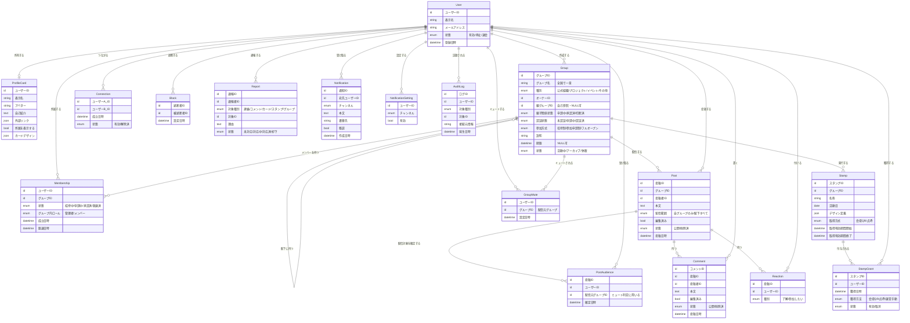

### 9.2 主要エンティティの補足

| エンティティ | 補足 |
|---|---|
| `Group` | **本アプリの中心概念**。恒久組織も一時的な集まりも同一エンティティで表す。親グループIDによる自己参照でツリーを構成し、**親子関係状態が「承認済」のもののみ配信に反映する**。「切断済」は上位グループが経路を切った状態 |
| `Membership` | ユーザーとグループの多対多を担う。参加方式に応じて「招待中」「申請中」を経て「承認済」に至る（フルオープンは直接「承認済」）。**脱退は削除ではなく「脱退済」状態への遷移**とし、過去の連絡・スタンプとの関係を保つ |
| `Post` | 配信範囲を保持する。**編集済みフラグと削除状態を持つ**ことで、訂正の履歴を利用者に示せる |
| `PostAudience` | **配信対象のスナップショット**。投稿時点で対象を確定して保存する（第9.3節）。`配信元グループID` を持つため、配下配信であっても「どのグループから来た連絡か」が特定でき、ミュート判定に使える |
| `Connection` | カード交換の結果として成立する双方向の関係。**解除は削除ではなく状態遷移**とし、同一相手との再交換や通報時の追跡に備える |
| `Block` | 一方向の遮断。ブロックされた側にはその事実を伝えない |
| `GroupMute` | **配信元グループに対して設定する**。自分が所属していない上位グループもミュート対象にできる（第10.2節） |
| `AuditLog` | **匿名性ポリシー（第12.2節）を成立させる基盤**。匿名投稿であっても発信者を追跡できるようにする。システム管理者のみが照合できる |

### 9.3 グループツリーと配信範囲の導出

各グループは固有の名称を持ち、階層上の位置づけは種別と親グループによって表す。

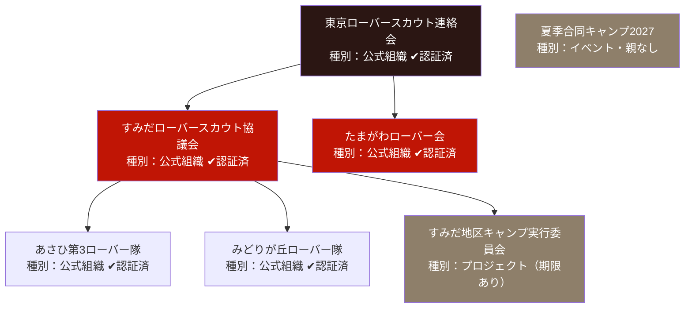

配信対象の決定規則は次のとおり。

| 投稿元 | 配信範囲 | 実際に届くメンバー |
|---|---|---|
| あさひ第3ローバー隊 | 自グループのみ | あさひ第3ローバー隊のメンバー |
| すみだローバースカウト協議会 | 自グループのみ | 同協議会に直接所属するメンバー |
| すみだローバースカウト協議会 | 配下すべて | 同協議会＋あさひ第3＋みどりが丘＋キャンプ実行委員会のメンバー |
| 東京ローバースカウト連絡会 | 配下すべて | 図中「夏季合同キャンプ2027」を除くすべてのグループのメンバー |
| 夏季合同キャンプ2027 | 自グループのみ | 同イベントのメンバー（親を持たないため配下配信は選択できない） |

規則は次の5点である。

1. **同一ユーザーが複数の対象グループに所属する場合でも、連絡は1件としてのみ届く**（重複排除する）
2. **親子関係が「承認済」のもののみ、配下配信の経路として扱う**。申請中および切断済の関係は配信に影響しない
3. **アーカイブ状態・休眠状態のグループは配信対象から除外する**
4. **配信対象は投稿時点で確定し、以後変化しない**（`PostAudience` として保存する）。投稿後にツリーへ加わったグループのメンバーに過去の連絡が遡って届くことはなく、通知した相手と閲覧できる相手が常に一致する
5. **各配信対象者について「どのグループ経由で届いたか」を記録する**。これによりミュート判定が可能になる

この構造により、スカウトは団ローバー隊に所属するだけで、地区・県連盟の連絡も自動的に受け取れる。**課題1（上位組織から末端への伝達不全）は、この配信規則によって構造的に解決される。**

同時に、プロジェクトやイベントのグループも同じツリーに組み込めるため、「地区の下のキャンプ実行委員会」のような実態をそのまま表現でき、上位組織からの連絡もそこへ届く。

### 9.4 グループのライフサイクル

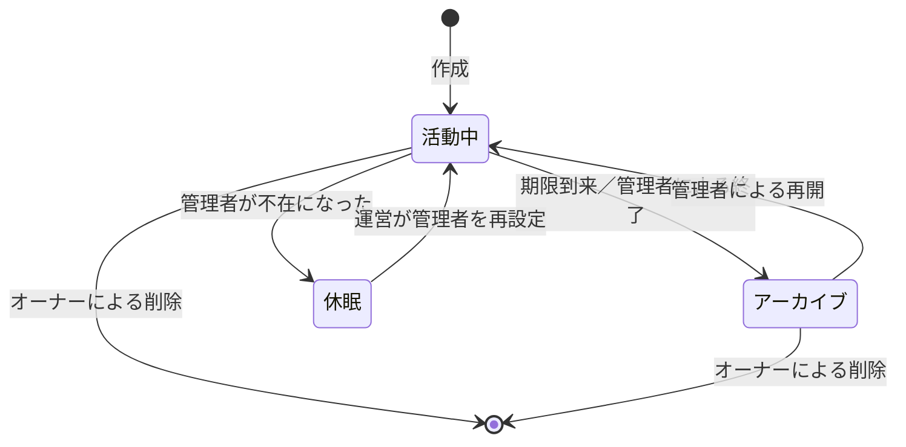

| 状態 | 連絡の投稿 | タイムライン表示 | 過去の連絡の閲覧 | 獲得済みスタンプ | 配下配信の経路 |
|---|:---:|:---:|:---:|:---:|:---:|
| 活動中 | 可 | 表示 | 可 | 保持 | 有効 |
| アーカイブ | 不可 | 非表示 | 可 | **保持** | 無効 |
| 休眠 | 不可 | 非表示 | 可 | **保持** | 無効 |

**アーカイブは削除ではない。** 期限付きのプロジェクトやイベントが終了しても、そこで交わされた連絡と獲得したスタンプは残る。活動の記録が蓄積されることが本アプリの価値（プロダクト原則の「残る」）であるため、期限の到来によって記録が失われてはならない。

**休眠状態は、グループ名の永久ロックを防ぐための仕組みである。** 唯一の管理者が退会・アカウント停止となった場合、そのグループは投稿・承認・認証申請のすべてが不能になる。グループ名は全国で一意であるため、放置すると**その組織名が誰にも使えないまま永久に占有される**。

したがって次を定める。

- 管理者が1人も存在しない状態が一定期間続いたグループを「休眠」とする
- 休眠グループのメンバーは、運営に対して管理者の再設定を申し出ることができる
- システム管理者は、申し出に基づき当該グループのメンバーから新たなオーナーを設定できる
- メンバーが誰も存在しない休眠グループについては、名称の解放を検討できる（第12.3節）

---

## 10. 通知設計

> **本章は、本アプリにおいて最も重要な設計対象である。**
>
> 本アプリは通知によって成立する。同時に、通知は本アプリが失敗する最大の要因でもある。通知が過多になればユーザーは通知を切り、通知が切られた瞬間に最重要機能である連絡（F-07・F-08）が機能しなくなるためである。

### 10.1 設計原則

1. **チャンネルを分離する。** 通知は種別ごとに独立したチャンネルとし、ユーザーが個別にON/OFFできる。あるチャンネルをOFFにしても、他チャンネルは影響を受けない
2. **連絡チャンネル（N-1）を最優先で保護する。** 他のどのチャンネルも、連絡チャンネルの音量を侵食してはならない
3. **N-1の内部にも音量調整を用意する。** チャンネル単位のON/OFFだけでは粒度が粗い。**配信元グループ単位のミュート**を併せて提供する
4. **プッシュを逃しても追える。** すべての通知はアプリ内の通知一覧にも残す。プッシュは補助手段であり、唯一の伝達経路にしない
5. **通知には必ず遷移先がある。** 通知をタップして到達する画面を持たない通知は作らない

### 10.2 通知チャンネル一覧

| ID | チャンネル | 発火条件 | 配信対象 | 既定 | OFF可 |
|---|---|---|---|:---:|:---:|
| **N-1** | **グループからの連絡** | 連絡が投稿された | 配信対象者 | ON | 可（＋配信元グループ単位ミュート） |
| N-2 | コメント・リアクション | 自分の連絡にコメント／リアクションが付いた | 連絡の投稿者 | ON | 可 |
| N-3 | スタンプ | スタンプを獲得した | 獲得者 | ON | 可 |
| N-4 | カード交換 | カード交換が成立した | 交換した双方 | ON | 可 |
| N-5 | グループ参加 | 招待された／申請された／承認・却下された | 対象者・グループ管理者 | ON | 可 |
| N-6 | グループ管理 | 親子関係の申請・承認、**配下ツリーへの新規追加**、認証バッジの付与、管理者の交代 | グループ管理者 | ON | 可 |
| N-7 | ローバーポート新着 | 新着記事を検知した（月4〜5件程度） | 全登録者 | ON | 可 |
| N-8 | 運営からのお知らせ | システム管理者が配信した | 全登録者 | ON | 不可 |

### 10.3 通知量に対する防御

本アプリにおける通知過多のリスクは、**2つの異なる経路**から生じる。当初の設計は前者にのみ対処しており、後者への防御が欠けていた。

| | 経路A：外部由来 | 経路B：**内部由来** |
|---|---|---|
| 発生源 | N-7 ローバーポート | **N-1 の配下配信** |
| 実際の量 | 月4〜5件（実測） | 県連盟・地区が配下配信を常用すると日に数通 |
| 防御 | チャンネル分離（原則1） | **配信元グループ単位のミュート**（原則3） |

**経路Bが本命のリスクである。** ローバーポートの投稿頻度は実測で月4〜5件にとどまり、通知量として問題にならない。一方、複数の階層に所属するユーザーには、団・地区・県連盟・プロジェクト・イベントのすべてから連絡が届く。

**ミュートは「配信元グループ」に対して設定する。** 所属グループに対して設定するのではない。

この違いは決定的である。県連盟からの連絡は、ユーザーが所属していない県連盟グループから配下配信で届く。ミュートが所属グループ基準であれば、県連盟の連絡を静かにするには自分が所属する団グループをミュートするしかなく、**団の連絡まで消えてしまう**。配信元基準であれば、県連盟だけを静かにして団の連絡は受け取り続けられる。

これを可能にするため、`PostAudience` は配信対象者ごとに「どのグループ経由で届いたか」を保持する（第9.3節 規則5）。

N-8のみOFF不可とするが、これは障害告知・規約変更・セキュリティ通知など、運営上どうしても届ける必要がある内容に限って使用する。日常的な告知には使用しない。

### 10.4 オンボーディングにおける通知許諾

本アプリはWEBアプリとして提供するため、**iOS環境ではホーム画面に追加されない限りプッシュ通知が届かない**（第14章）。通知が生命線である本アプリにとって、これは重大な制約である。

したがって初回オンボーディングにおいて、次を**必須の導線**として設計する。

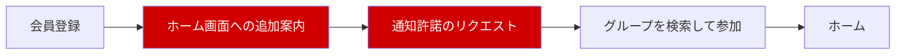

赤い工程はスキップ可能とするが、スキップした場合は**通知が届かないことを明示**し、後から設定画面で実行できる導線を常設する。また、ホーム画面未追加のユーザーに対しては、アプリ内に恒常的な案内を表示する。

**プッシュ以外の到達経路。** 原則4に基づき、プッシュを唯一の経路にしない。連絡には任意で日時を設定でき、利用者は端末の標準カレンダーへ登録できる。これにより、プッシュが届かない環境でもOS標準の予定通知が第二の到達経路として働く。

---

## 11. 画面一覧・画面遷移

### 11.1 情報アーキテクチャ

グローバルナビゲーションは5タブとする。

| 位置 | タブ | 役割 |
|---|---|---|
| 1 | ホーム | 統合タイムライン |
| 2 | コレクション | スタンプとカード |
| 3 | **スキャン** | **QRスキャナ（中央）** |
| 4 | 通知 | 通知一覧 |
| 5 | マイページ | プロフィール・グループ・設定 |

**QRスキャナを中央タブに配置する。** QRはスタンプ獲得（F-12）・カード交換（F-14）・**グループ参加**（F-03）の共通の入口であり、活動の現場で最も素早く到達できる必要があるためである。スキャンしたQRの種類をアプリが判別し、適切な処理へ分岐させる。ユーザーは用途の違いを意識しない。

### 11.2 画面一覧

| ID | 画面名 | 主な役割 | フェーズ |
|---|---|---|---|
| S-01 | サインアップ／ログイン | 会員登録・認証 | MVP |
| S-02 | オンボーディング | ホーム画面追加案内・通知許諾・グループ検索 | MVP |
| S-03 | ホーム（統合タイムライン） | 全所属グループの連絡を時系列表示 | MVP |
| S-04 | グループフィルタ | タイムラインをグループで絞り込む | MVP |
| S-05 | 連絡詳細 | 本文・コメント・リアクション・参加意向の一覧 | MVP |
| S-06 | 連絡作成・編集 | 本文入力・配信範囲選択・訂正（管理者のみ） | MVP |
| S-07 | グループ検索 | グループを探して参加 | MVP |
| S-08 | グループ詳細 | グループ情報・メンバー数・参加・脱退・ミュート設定 | MVP |
| S-09 | グループ作成 | 名称・種別・参加方式・期限の設定 | MVP |
| S-10 | グループ管理 | メンバー管理・招待・親グループ設定・認証申請（管理者のみ） | MVP |
| S-11 | **配下ツリー** | 自グループ以下のツリー閲覧・経路の切断（管理者のみ） | MVP |
| S-12 | **管理者管理** | 任命・剥奪・辞任・オーナー移譲（管理者のみ） | MVP |
| S-13 | スタンプ作成 | 名称・活動日・デザイン・取得方式の設定（管理者のみ） | MVP |
| S-14 | スタンプQR表示 | 会場掲示用のQR（管理者のみ） | MVP |
| S-15 | 点呼モード | 参加者のカードQRを読み取って付与（管理者のみ） | MVP |
| S-16 | QRスキャナ | スタンプ獲得・カード交換・グループ参加の共通入口 | MVP |
| S-17 | コレクション（スタンプ） | 獲得スタンプの一覧 | MVP |
| S-18 | コレクション（カード） | 交換したカードの一覧 | MVP |
| S-19 | カード詳細 | 交換した相手のカード・つながり解除・ブロック | MVP |
| S-20 | マイカード編集 | 自分のプロフィールカード編集・QR表示 | MVP |
| S-21 | 通知一覧 | すべての通知の履歴 | MVP |
| S-22 | 設定 | 通知設定・ブロック一覧・アカウント設定 | MVP |
| S-23 | 通報 | 不適切な内容の通報 | MVP |
| S-24 | 運営管理コンソール | 認証審査・通報対応・休眠グループ復旧（システム管理者のみ） | MVP |
| S-25 | ローバーポート一覧 | 新着記事の一覧 | Phase 2 |
| S-26 | 掲示板 | 匿名の書き込み | Phase 2 |
| S-27 | DM | 個別メッセージ | Phase 3 |

### 11.3 画面遷移概要

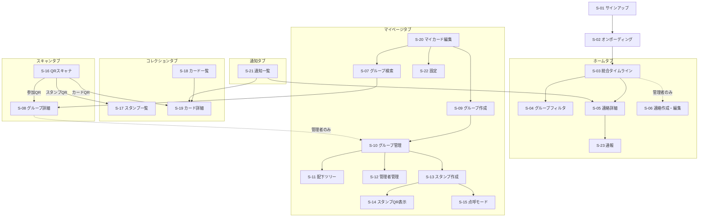

本アプリの画面遷移における要点は3つである。

1. **QRスキャナ（S-16）がQRの種別を自動判別**し、スタンプ獲得・カード交換・グループ参加に分岐する
2. **グループ作成（S-09）へ、管理者でなくても到達できる**。誰でもグループを作れることが機能として成立するには、作成への導線が特権的な場所に隠れていてはならない
3. **関係を解消する操作（S-08 脱退／S-19 解除・ブロック／S-22 ブロック一覧）が、それぞれの対象と同じ場所にある**。取り消しの導線を設定の奥に隠さない

---

## 12. 運用・モデレーション・導入方針

### 12.1 通報と対応フロー

**一次対応はアプリ運営（システム管理者）が行う。** グループ管理者には委譲しない。グループが誰でも作成できる以上、グループ管理者自身が通報対象となる場合があり、自己判断させられないためである。

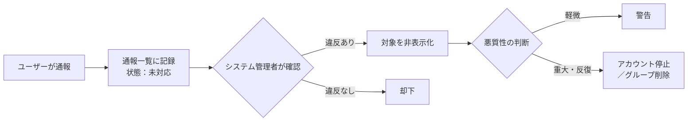

通報の対象は、連絡・コメント・プロフィールカード・スタンプ画像・**グループ**とする。Phase 2 以降は掲示板の書き込み、Phase 3 以降はDMも対象に加える。

**MVPで通報機能を実装する理由。** 匿名掲示板はPhase 2だが、MVPの時点でコメント（F-09）が全メンバーに開かれており、さらにグループを誰でも作成できる。アプリ内で最初に問題が起きる場所はコメント欄とグループ名であり、掲示板の実装を待つことはできない。

**体制規模は想定登録者数（KPI-1＝約1,170人）から見積もる。** クローズドβの通報頻度からの外挿は行わない（第4.4節）。

### 12.2 匿名性ポリシー

Phase 2 の匿名掲示板および Phase 3 の匿名DMは、「**利用者から見て完全に匿名だが、システムは発信者を追跡できる**」という設計をとる。これは厳密には匿名（Anonymity）ではなく、**仮名性（Pseudonymity）**である。

**この方針を採る理由。** 完全な匿名（システムも発信者を特定できない状態）は、誹謗中傷や違法な書き込みが発生した際に一切の対処ができない。日本においては**情報流通プラットフォーム対処法（情プラ法。2025年4月1日施行。旧称：プロバイダ責任制限法）**に基づく発信者情報の開示命令制度が存在し、これに応じる必要が現実に生じ得るため、追跡情報を保持していない状態は運営上のリスクとなる。他方、利用者に対して実名や所属を露出させれば、「知らない人と気軽に話す」という機能の目的そのものが失われる。仮名性は、この両者を成立させる唯一の解である。

ポリシーは以下の3点として明文化し、**利用規約およびプライバシーポリシーに記載する**。

**① 利用者に見せない情報**

| 情報 | 他の利用者からの可視性 |
|---|---|
| 実名・表示名 | 不可視 |
| 所属グループ | 不可視 |
| プロフィールカード | 不可視 |
| 同一人物が書いた複数の投稿の紐付け | 不可視（投稿間で発信者を同定できない） |

**② システムが保持する情報**

| 情報 | 保持 |
|---|---|
| 投稿とユーザーIDの対応 | 保持する |
| 接続元情報（IPアドレス・ポート番号・接続日時） | 保持する（`AuditLog`） |
| 保持期間 | **原則として無期限に保持する**（下記参照） |

**監査ログは原則として無期限に保持する。** 通信ログの保存期間を一般に義務づける日本の法令は存在しないため、保持期間は自ら定める必要がある。本アプリでは、開示命令への対応可能性を優先し、期限を設けない方針をとる。

ただし次の2点を条件とする。

1. **保持するのは記録であり、個人を特定する情報ではない。** 退会時には氏名・メールアドレス等を削除するため（第13.2節）、`AuditLog` は退会後、特定の個人と結びつかない記録として残る
2. **保管コストが運用上の制約となった場合は見直す。** 無期限保持は基盤サービスの能力に依存するため、詳細設計フェーズで実現可能性を確認し、困難な場合は保持期間を定める

**③ 誰がどんな条件で照合できるか**

| 項目 | 内容 |
|---|---|
| 照合できる者 | システム管理者のみ |
| 照合できる条件 | ①法令に基づく開示請求・開示命令を受けた場合、②重大な権利侵害・違法行為の疑いがある通報を受けた場合、③本人からの請求 |
| 手続 | 開示にあたっては発信者への意見照会を行う。照合の実施自体を記録に残し、恣意的な閲覧を防ぐ |

**グループ管理者は照合できない。** グループ内の匿名の書き込みが管理者に特定されうる状態では、心理的安全性が成立しないためである。

### 12.3 グループの認証と名称の保護

グループは誰でも作成でき、かつグループ名は全国で一意である。この2つの組み合わせは、**名称の占拠**という問題を生む。実在する組織と無関係な人物が `東京ローバースカウト連絡会` を先に作成すると、本来の組織がその名称を使えなくなる。

これを防ぐため、以下を定める。

| 項目 | 規定 |
|---|---|
| 認証の申請 | グループ管理者がシステム管理者に申請する |
| 認証の判断 | 申請者が当該組織の運営に実際に関与しているかを確認したうえで、システム管理者が付与する |
| **判断基準** | **運用ガイドラインとして事前に整備する**（詳細設計フェーズの必須成果物）。審査者による判断の揺れを防ぐ |
| **名称の移管** | なりすまし・実体のない名称占拠が確認された場合、システム管理者は当該グループから名称を解除し、正当な組織へ移管できる |
| **移管の要件** | ①**当該組織が所属する連盟等、アプリ運営の外部による正当性の確認**を得ること ②移管の前に占拠側へ通知し、異議申立ての機会を設けること ③実施記録を残すこと |
| 名称の解放 | メンバーが存在しない休眠グループについては、上記に準じて名称を解放できる |
| バッジの剥奪 | 認証後に要件を満たさなくなった場合、システム管理者はバッジを剥奪できる |

**名称移管の正当性について。** 同名または類似名の正当な組織が全国に併存する可能性は排除できない。その場合、アプリ運営が「どちらが正当な組織か」を裁定することになるが、これは連盟のガバナンス下にある組織に対する越権となりうる。したがって移管の判断は**運営の単独裁量では行わず、外部（連盟等）の確認を要件とする**。この合意形成は第12.6節の外部合意事項として扱う。

### 12.4 グループの乱立への対応

誰でもグループを作成できるため、実体のないグループが蓄積しうる。これに対しては、次の受動的な対処を基本とする。

- **能動的な削除は行わない。** 実体の有無を運営が判断することは現実的でなく、また誤削除の害が大きい
- **期限付きグループは自動でアーカイブされ、管理者不在のグループは休眠となる**ため、タイムラインを汚し続けることはない
- **検索では認証バッジ付きを上位に表示**し、メンバー数を併記することで、実体のないグループは自然に下位に沈む
- 明確な規約違反（なりすまし等）のみ、通報を起点に対処する

### 12.5 導入・定着計画

第14.1節の前提3（各グループに運用意思のある管理者が1名以上存在する）は、本プロジェクトで**最も重要かつ最も不確実な前提**である。これは技術ではなく導入運用の課題であり、以下を計画する。

| 項目 | 内容 |
|---|---|
| 管理者の確保 | クローズドβ参加グループを起点に、県連盟・地区の役員へ働きかける。全国公開時点で認証済みの公式組織が一定数存在する状態を作る |
| 管理者向け手引き | グループ作成から最初の連絡配信までを1枚で示す資料を用意する。ペルソナC（成人指導者）が単独で完了できる水準とする |
| サポート窓口 | 問い合わせ手段を設ける。運用主体と応答目標は運用ガイドラインで定める |
| **並行稼働** | 既存の連絡手段（メッセージアプリ等）を**直ちに停止しない**。本アプリで連絡が届くことが確認できるまで、両方で配信する期間を設ける。切替の判断は各グループに委ねる |
| 定着の判定 | KPI-3（稼働グループ数）を主指標とする |

**並行稼働を設計に織り込む理由。** 移行期に「本アプリだけに連絡を出したが誰も見ていなかった」という事故が1度でも起きると、そのグループは二度と本アプリを使わない。切替を急がせないことが、結果的に定着を早める。

### 12.6 外部合意が必要な事項

本設計には、アプリ運営の一存では成立せず、外部との合意を要する事項が含まれる。**いずれも該当フェーズの着手前に合意を得る必要がある。**

| # | 相手 | 事項 | 必要な時期 |
|---|---|---|---|
| 1 | 日本連盟／県連盟等 | **公式組織の認証と名称移管の正当性**（第12.3節）。第三者が組織名の帰属を判断することへの了解 | 全国公開前 |
| 2 | RCJ（全国ローバースカウト会議） | **ROVERPORT の記事取得・利用許諾**。タイトル・サムネイルの利用可否を含む（第7.9節 F-20） | Phase 2 着手前 |
| 3 | 協力グループ | クローズドβへの参加 | テスト完了後 |
| 4 | 法務専門家 | インターネット異性紹介事業への該当性（第7.9節 F-22） | Phase 3 着手前 |

#### アプリ運営の責任主体について

本プロジェクトは**同人制作（有志による自主開発）**として進行する。正式な承認および運営の責任主体（個人情報取扱事業者、利用規約の制定者）の確定は、**アプリケーションの完成後に稟議へ諮る**方針とする。

したがって上表の合意は、**開発フェーズをブロックしない**。ただし次の順序は守る必要がある。

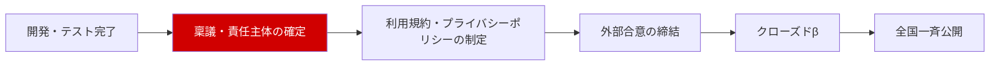

**実在の利用者を迎える前に、責任主体が確定していなければならない。** 個人情報を収集する以上、取扱事業者が不在のまま実運用に入ることはできない。クローズドβも実在の利用者を対象とするため、この工程より前に稟議を通す必要がある。

**設計上の含意。** 責任主体が未確定のまま設計を進めるため、**特定の運営体制に依存しない設計**とする。具体的には、運営作業（認証審査・通報対応）の担当者を人数や所属で固定せず、権限（システム管理者ロール）として抽象化しておく。稟議の結果どの組織が引き受けることになっても、設計を変更せずに済むようにする。

---

## 13. 非機能要件

### 13.1 セキュリティ

| 項目 | 要件 |
|---|---|
| 認証 | 本人以外がアカウントを利用できないこと。方式は詳細設計で決定する |
| 認可 | 第8.2節の権限マトリクスを、画面表示だけでなくサーバ側でも必ず検証すること |
| 配信範囲の担保 | 所属していないグループの連絡を取得できないこと |
| 親子関係の担保 | 承認されていない、または切断された親子関係が配信経路として使われないこと |
| オーナーの保護 | オーナーが他の管理者から除名・権限剥奪されないこと |
| グループ名の一意性 | 同時作成時にも重複が生じないこと |
| QRの不正利用対策 | 撮影・転送されたQRによってスタンプを獲得できないこと（会場QR方式では有効期間により限定。厳密な担保は点呼方式による） |
| カードQRの不正利用対策 | 盗撮されたカードQRによって無制限に交換が成立しないこと |
| ブロックの実効性 | ブロックされた相手が、カード閲覧・交換・DMのいずれも行えないこと |
| 通信 | すべての通信を暗号化すること |
| 監査 | 匿名投稿の発信者を追跡できる記録を保持すること（第12.2節） |

### 13.2 個人情報・プライバシー

| 項目 | 要件 |
|---|---|
| 収集する個人情報 | 表示名、メールアドレス、アバター画像、自己紹介、所属グループ、任意の外部リンク、接続元情報 |
| 収集しない情報 | 電話番号、住所、生年月日、日本連盟の登録番号 |
| **利用目的** | 特定し、プライバシーポリシーで公表すること |
| **開示等請求への対応** | 本人からの開示・訂正・利用停止の請求に応じる手続を定めること |
| **漏えい等の報告** | 漏えい等が生じた場合の個人情報保護委員会への報告および本人通知の手順を定めること |
| **委託先の監督** | 外部サービスへ処理を委託する場合の監督体制を定めること |
| **退会時のデータ取扱い** | 下表のとおり、**記録は残し、個人を特定する情報のみ削除する** |
| カードの拡散リスク | プロフィールカードがスクリーンショットで拡散しうることを、登録時および編集時に明示する |
| 準拠 | 個人情報保護法に準拠する。利用規約とプライバシーポリシーを整備する |

#### 退会時のデータ取扱い

活動の記録が蓄積されることは本アプリの中核的な価値であり、1人の退会によってグループの連絡履歴が虫食いになることは避けなければならない。他方、退会者の個人データを保持し続ける正当な理由はなく、個人情報保護法は**利用する必要がなくなった個人データを遅滞なく消去するよう努める**ことを求めている。漏えいが生じた際の被害範囲も広がる。

そこで、**記録は残し、個人を特定する情報のみを削除する**方針をとる。

| 対象 | 退会時の扱い |
|---|---|
| 氏名・表示名・メールアドレス・アバター画像・自己紹介・外部リンク | **削除する** |
| プロフィールカード | **削除する**（他者のコレクションからも消える） |
| 投稿した連絡・コメント | **残す**。投稿者は「退会したユーザー」として表示する |
| 獲得したスタンプ | 本人の記録としては削除する。グループ側の獲得件数は残す |
| つながり | 解除する |
| 監査ログ（`AuditLog`） | **残す**（第12.2節）。個人特定情報が削除された後は、特定の個人と結びつかない記録となる |
| 所属していたグループ | 脱退として扱う |
| **作成したグループ（オーナーだった場合）** | グループは残る。管理者が他にいなければ**休眠状態へ移行**し、運営による復旧の対象となる（第9.4節） |

**オーナーの退会がグループを道連れにしてはならない。** グループ名は全国で一意であるため、退会に伴ってグループが失われると、その組織名が使えなくなる。休眠状態への移行によってこれを防ぐ。

### 13.3 可用性・性能

> **【仮置き】** 具体的な数値目標は、クローズドβの結果を踏まえて確定する。

| 項目 | 要件（仮） |
|---|---|
| 想定規模 | 登録者1,000〜1,500人規模（KPI-1に基づく。母数は全国のローバースカウト5,862人） |
| タイムライン表示 | 通常時2秒以内に初期表示されること |
| QRスキャンから結果表示まで | 3秒以内。活動現場で列ができない水準を保つこと |
| 通知の到達 | 連絡投稿から1分以内にプッシュが配信されること |
| 配下配信の処理 | 上位グループから多数の配下へ配信する場合も、投稿操作を待たせないこと（配信対象の確定を非同期に行うなど） |
| 稼働率 | 計画停止を除き99%以上 |

### 13.4 対応環境・アクセシビリティ

| 項目 | 要件 |
|---|---|
| **提供形態** | **WEBアプリ（PWA）で確定する。** 第14.2節 制約1を受け入れる |
| 対応ブラウザ | iOS Safari / Android Chrome の最新2バージョン |
| 画面サイズ | スマートフォン縦画面を主対象とする。管理機能はPC表示にも対応する |
| オフライン | 対象外。通信環境のない場所での利用は想定しない |
| 文字サイズ | 端末の文字サイズ設定に追随すること |
| 色 | 色のみで情報を伝えないこと。**認証バッジは色以外の形状でも判別できること** |

### 13.5 運用・監視

稼働率99%を掲げる以上、それを維持する運用の設計が必要である。

| 項目 | 要件 |
|---|---|
| 監視対象 | サービスの死活、通知配信の成否、配下配信の処理遅延、エラー発生率 |
| 障害の検知 | 監視により自動検知し、運営へ通知すること |
| 障害の告知 | 利用者への告知はチャンネル N-8（運営からのお知らせ）を用いる。**アプリ自体が停止している場合の代替告知手段**を別途定めること |
| バックアップ | 取得頻度と保管世代を定めること |
| 復旧目標 | RPO（許容データ損失時間）とRTO（許容復旧時間）を定めること。**数値は詳細設計で確定してよいが、対象範囲は基本設計で定める** |
| 復旧対象 | ユーザー、グループ、所属、連絡、コメント、スタンプ獲得、つながり、監査ログ |
| 運用ログ | 障害調査のためのログを、匿名性追跡用の `AuditLog` とは別に保持すること |
| データ保持期間 | 種別ごとに定めること（第12.2節・第13.2節と整合させる） |

---

## 14. 制約・前提／対象外事項

### 14.1 前提条件

| # | 前提 | 検証状況 |
|---|---|---|
| 1 | ユーザーは全員成人（18歳以上）である | **未検証**。生年月日を収集しないため申告すら得ていない（第7.9節 F-22の論点） |
| 2 | ユーザーはスマートフォンを所持し、日常的に利用している | 妥当 |
| 3 | 各グループに、アプリを運用する意思のある管理者が1名以上存在する | **最も不確実**。第12.5節で対処 |
| 4 | 公式組織のグループ名は、実際の組織固有の名称と対応づけられる | **未検証**。同名・類似名の併存可能性がある（第12.3節） |

### 14.2 制約事項

**制約1：iOS における Web Push の制限**

WEBアプリとして提供するため、iOS環境では**ホーム画面に追加されない限りプッシュ通知が届かない**（iOS 16.4以降の Web Push の仕様による。2026年8月時点で有効）。

**この制約を受け入れ、提供形態をWEBアプリで確定する**（第13.4節）。提供形態は技術選定ではなくプロダクト形態の判断であるため、基本設計で確定し、詳細設計で覆さない。対応として、オンボーディングでホーム画面追加を必須導線とし（第10.4節）、カレンダー登録を第二の到達経路として用意する。

**制約2：会場QRの転送による不正取得**

会場に掲示した静的QRは撮影・転送が可能であり、現地不在者がスタンプを獲得しうる。**転送耐性と運営負担は原理的にトレードオフの関係にある**ため、取得方式を2種類用意して運営者に選択させる（第7.4節 F-12）。

**制約3：グループ名の全国一意による作成時の摩擦**

一般的な名称は早い者勝ちで埋まる。リアルタイムの重複判定と代替名の自動提案、および参加QRによる検索の迂回によって緩和するが、摩擦を完全に除去することはできない（第7.2節 F-02）。

**制約4：ROVERPORT の利用許諾**

新着記事の取得手段（RSS配信）は実在し稼働していることを確認済みである。残る制約は技術ではなく、**RCJによる利用許諾**である（第12.6節）。

### 14.3 対象外事項

第4.5節に定義したとおり。

### 14.4 未決事項一覧

**詳細設計の開始をブロックする未決事項はない。**

| # | 項目 | 影響範囲 | 期限 |
|---|---|---|---|
| 1 | 認証の判断基準（運用ガイドライン） | 第12.3節 | 詳細設計フェーズ |
| 2 | 障害時の代替告知手段 | 第13.5節 | 詳細設計フェーズ |
| 3 | RPO / RTO の数値 | 第13.5節 | 詳細設計フェーズ |
| 4 | 監査ログの無期限保持の実現可能性 | 第12.2節 | 詳細設計フェーズ |
| 5 | **アプリ運営の責任主体（稟議）** | 第12.6節。外部合意・規約制定の前提 | **開発完了後・クローズドβ前** |
| 6 | 利用規約・プライバシーポリシーの制定 | 第12.2節・第13.2節 | 責任主体の確定後 |
| 7 | KPIの数値目標 | 第1.3節 | クローズドβ後 |
| 8 | 性能要件の数値目標 | 第13.3節 | クローズドβ後 |
| 9 | ROVERPORT の利用許諾 | 第7.9節 F-20 | Phase 2 着手前 |
| 10 | インターネット異性紹介事業への該当性 | 第7.9節 F-22 | Phase 3 着手前 |

---

## 15. 意思決定履歴

| # | 項目 | 決定 | 日付 | 理由 |
|---|---|---|---|---|
| 1 | MVPスコープ | 機能1（連絡）＋2（スタンプ）＋3（カード交換） | 2026-08-16 | QRという共通基盤を一度に構築できる |
| 2 | 参加方法 | 誰でも登録可。グループへの参加は方式に従う | 2026-08-16 | 参入障壁を最小化する |
| 3 | 無所属ユーザーの権限 | 制限なし | 2026-08-16 | 機能制限を課さない。判断材料の提示方法は決定38で改訂 |
| 4 | 連絡の見え方 | 統合タイムライン＋グループフィルタ | 2026-08-16 | 「アプリを開けば全部わかる」を成立させる |
| 5 | 投稿権限 | 投稿はグループ管理者のみ／コメントは全メンバー可 | 2026-08-16 | タイムラインの信頼性を守りつつ一方通行にしない |
| 6 | 既読管理 | 実装しない。リアクションで代替 | 2026-08-16 | 手軽さを壊さずに伝達状況を推し量る |
| 7 | グループの階層 | 親グループIDを1つ持つツリー構造＋配信範囲の選択 | 2026-08-16 | 団に所属すれば上位組織の連絡も届き、課題1を根本解決する |
| 8 | スタンプ付与 | 会場でQRを掲示し参加者がスキャン | 2026-08-16 | 運営負担が人数によらず一定。決定39で方式を追加 |
| 9 | スタンプのデザイン | テンプレート生成主体＋画像アップロードも許可 | 2026-08-16 | 誰でも作れて統一感を保ちつつ自由度も残す |
| 10 | プロフィールカードの情報 | 表示名・所属・自己紹介・アバター＋SNSリンク等を任意で | 2026-08-16 | 交流のきっかけとして十分な情報量を確保する |
| 11 | つながりの定義 | カード交換した相手＝つながり。Phase 3のDM解禁条件 | 2026-08-16 | 承認フローを二重に作らない |
| 12 | 匿名性ポリシー | 仮名性（UI上は匿名／内部的に追跡可能） | 2026-08-16 | 心理的安全性と追跡責任を両立する |
| 13 | ローバーポート通知 | 新着時に全登録者へ即時プッシュ | 2026-08-16 | 記事への誘導力を最大化する。**実測で月4〜5件であり通知過多にならないことを確認**（2026-08-17） |
| 14 | 通知チャンネル | 種別ごとに独立したチャンネルとしてON/OFF可能 | 2026-08-16 | 外部由来の通知から連絡を守る |
| 15 | 通報機能 | MVPに含める | 2026-08-16 | コメントが全メンバー可であり、グループも誰でも作成できるため |
| 16 | カード交換の成立条件 | 片方がスキャンすれば双方向に成立 | 2026-08-16 | 初対面で交互スキャンは摩擦が大きすぎる。同意の欠如は決定30で補償 |
| ~~17~~ | ~~グループの登録主体~~ | ~~システム管理者が登録・初代管理者を任命~~ → **決定19により撤回** | 2026-08-16 | 全国一斉導入では登録対象が数百規模となり破綻するため |
| 18 | QRスキャナの配置 | ナビゲーション中央に単一のスキャナ、種別は自動判別 | 2026-08-16 | 活動現場で最速で到達できる必要がある |
| 19 | グループ概念への再定義 | 「組織」を「グループ」に改称し、誰でも作成できるようにする | 2026-08-16 | 恒久組織のみでは一時的な集まりがアプリ外で運用され、連絡が再び分散する |
| 20 | 公式組織の区別 | 認証バッジ制。運営が全件を審査する | 2026-08-16 | 作成を妨げず見分けだけを解決する。審査基準の整備は決定41 |
| 21 | グループ名の一意性 | 全グループで全国一意 | 2026-08-16 | 名前がわかれば1件に特定でき、参加先を間違えない |
| 22 | 親グループの設定 | 親側管理者の承認を要する | 2026-08-16 | 無関係なグループが公式ツリーにぶら下がるのを防ぐ。祖先の防御は決定31 |
| 23 | グループのライフサイクル | 期限到来後はアーカイブ（投稿不可・閲覧可・スタンプ保持） | 2026-08-16 | 記録が失われては本アプリの価値が損なわれる |
| 24 | グループ単位ミュート | チャンネルON/OFFに加えて提供 | 2026-08-16 | 所属数が増えるとチャンネル単位では粒度が粗い。基準は決定32で改訂 |
| 25 | 展開規模 | 全国一斉導入。事前にクローズドβを実施 | 2026-08-16 | 全国一斉では問題を全ユーザーが同時に踏むため |
| 26 | モデレーション体制 | アプリ運営が一次対応。グループ管理者には委譲しない | 2026-08-16 | グループ管理者自身が通報対象になり得るため |
| 27 | 名称の保護 | 名称占拠時、運営が正当な組織へ移管できる | 2026-08-16 | 「誰でも作成可」と「全国一意」の組合せが占拠を可能にするため。要件は決定40で追加 |
| 28 | 対象年齢 | **18〜26歳**（日本連盟の公式区分は18歳以上25歳以下） | 2026-08-17 | 公式区分からの**意図的な拡張**。登録を離れた直後の層こそ課題2が顕在化するため、接点を失わない |
| **29** | **逆方向操作の整備** | 脱退・つながり解除・ブロック・連絡/コメントの編集削除を新設する | 2026-08-17 | v2.0は参加・接続・投稿の順方向のみを定義しており、取り消す経路が皆無だった。誤送信を訂正できず、意図しないつながりを切れない状態は運用に耐えない |
| **30** | **カード交換の同意の補償** | 成立時に双方へ通知し、いつでも一方の操作で解除・ブロックできる。カードQRにも不正利用対策を課す | 2026-08-17 | 片方向スキャン（決定16）は同意を経ずに関係が成立する。盗撮QRによる個人情報の取得とストーキングの経路になりうるため、事後の解消手段で補償する |
| **31** | **上位グループの防御** | 管理者は配下ツリー全体を閲覧でき、任意の子孫との経路を切断できる。新規追加時に通知する | 2026-08-17 | 親子承認（決定22）は直上1段しか効かないが、配信は再帰的にたどる。祖先が関知しないまま配信対象が拡大する穴を塞ぐ |
| **32** | **ミュートの基準変更** | グループ単位ミュートを「所属グループ基準」から「**配信元グループ基準**」へ変更する | 2026-08-17 | 配下配信は所属していない上位グループから届くため、所属基準では上位の連絡を止められず、止めようとすると自分の団の連絡まで消える |
| **33** | **配信対象のスナップショット** | 連絡の配信対象は投稿時点で確定し、以後変化しない | 2026-08-17 | ツリーは時間で変わる。都度導出では、後から追加されたグループのメンバーに過去の連絡が遡って見え、通知した相手と閲覧できる相手が食い違う |
| **34** | **管理者の交代とオーナー** | オーナー（原則として作成者）を定め、除名・権限剥奪から保護する。唯一の管理者は後任指名まで脱退・辞任できない | 2026-08-17 | 手伝いに任命した管理者による乗っ取りを防ぐ。認証済み公式組織が乗っ取られると偽の連絡が全配下に届く |
| **35** | **休眠状態** | 管理者不在のグループを休眠とし、メンバーの申し出により運営が管理者を再設定できる | 2026-08-17 | ローバーは数年で総入れ替えする。管理者不在＋全国一意により、組織名が永久にロックされる事態を防ぐ |
| **36** | **参加意向の可視化** | 「参加したい」を押した人を、同じ連絡を受け取ったメンバーに表示する | 2026-08-17 | スタンプは参加した「後」にしか報いない。参加する「前」に働く仕掛けがなく、連絡は届くが人が動かない状態だった。出欠管理には踏み込まない |
| **37** | **提供形態の確定** | WEBアプリ（PWA）で確定する。詳細設計で覆さない | 2026-08-17 | 提供形態は技術選定ではなくプロダクト形態の判断。第13.4節で確定としながら第14.2節で先送りする自己矛盾を解消する |
| **38** | **「所属未確認」表示の廃止** | 認証済みグループへの所属がある場合のみ表示し、ない場合は何も表示しない | 2026-08-17 | 判断材料を渡すための表示が、所属を離れかけている人にとって烙印として働き、カードを見せられなくする。肯定的表示のみでも判断材料としては機能する |
| **39** | **スタンプ取得方式の二本立て** | 会場QR（転送耐性:低／運営負担:一定）と点呼（転送耐性:高／班単位で分担）を用意し、運営者が選ぶ | 2026-08-17 | 転送耐性と運営負担は原理的にトレードオフ。詳細設計で「両立不能」と判明すると基本設計へ差し戻しになるため、ここで解く |
| **40** | **名称移管の外部確認要件** | 移管には連盟等、アプリ運営の外部による正当性の確認を要する。異議申立ての機会を設ける | 2026-08-17 | 同名の正当な組織が併存しうる。運営の単独裁量による裁定は、連盟のガバナンス下にある組織に対して越権となりうる |
| **41** | **認証基準の事前整備** | 認証の判断基準を運用ガイドラインとして詳細設計フェーズの必須成果物とする | 2026-08-17 | 全件審査（決定20）を維持する以上、審査者による揺れと審査待ちの長期化が偽公式組織の放置につながる |
| **42** | **プロジェクトの位置づけと責任主体** | **同人制作（有志による自主開発）**として進行し、正式な承認と責任主体の確定は**開発完了後に稟議へ諮る**。ただし実在の利用者を迎える前（クローズドβ前）には確定していること | 2026-08-17 | 責任主体の確定を待つと開発が始められない。一方、個人情報を収集する以上、取扱事業者が不在のまま実運用に入ることはできない。設計は特定の運営体制に依存させず、権限として抽象化する |
| **43** | **データの保持方針** | **原則として無期限に保持する。** ただし退会時には個人を特定する情報のみ削除し、投稿・監査ログ等の記録は残す | 2026-08-17 | 活動の記録が蓄積されることが本アプリの価値であり、退会による虫食いは避けたい。他方、退会者の個人データを保持し続ける正当な理由はなく、個人情報保護法は不要となった個人データの消去を求めている。記録と個人特定情報を分けることで両立する |
| **44** | **オーナー退会時のグループの存続** | オーナーが退会してもグループは残る。管理者が他にいなければ休眠状態へ移行し、運営による復旧の対象とする | 2026-08-17 | グループ名は全国一意であるため、退会に伴ってグループが失われるとその組織名が使えなくなる |
| **45** | **オーナーの脱退** | オーナーはグループから脱退できない。先にオーナーを移譲する必要がある | 2026-08-17 | 脱退を許すと `owner_user_id` が非メンバーを指し、除名も権限剥奪もできない状態が残る。運営以外の誰にも直せなくなるため、移譲を経る経路のみを認める（工程2の実装時に発見） |

---

## 付録：開発背景と機能の対応

本書が開発背景をすべて網羅していることを示す。

| 開発背景 | 対応する課題 | 対応する機能 | フェーズ |
|---|---|---|---|
| **背景1**：組織からの情報伝達が機能していない | 課題1 | F-07 連絡の投稿・編集・削除 / F-08 統合タイムライン / F-09 コメント / F-10 リアクション | MVP |
| **背景2**：活動への参加意欲の低下 | 課題2 | F-10 参加意向の可視化 / F-11 スタンプ作成 / F-12 スタンプ獲得 / F-15 コレクション閲覧 | MVP |
| **背景3**：ローバースカウト同士の交流促進 | 課題3 | F-13 プロフィールカード編集 / F-14 カード交換 / F-15 コレクション閲覧 / F-22 DM | MVP・Phase 3 |
| **背景4**：ローバーポートのアクティブユーザー不足 | 課題4 | F-20 ローバーポート新着配信 | Phase 2 |
| **背景5**：知らない人と交流する場がない | 課題5 | F-21 匿名掲示板 / F-22 DM | Phase 2・3 |
| （基盤：全背景に共通して必要） | — | F-01 会員登録・認証 / F-02 グループ作成 / F-03 グループ検索・参加 / F-04 グループ管理 / F-05 親グループの設定 / F-06 公式組織の認証 / F-16 関係の解消 / F-17 管理者の交代 / F-18 通知 / F-19 通報 | MVP |

上表のとおり、**開発背景1〜5のすべてが課題および機能に対応づいている**。また、逆方向についても、いずれの背景にも紐づかない機能は存在しない（F-01〜F-06・F-16〜F-19 は、いずれかの背景を実現するために不可欠な基盤機能である）。
