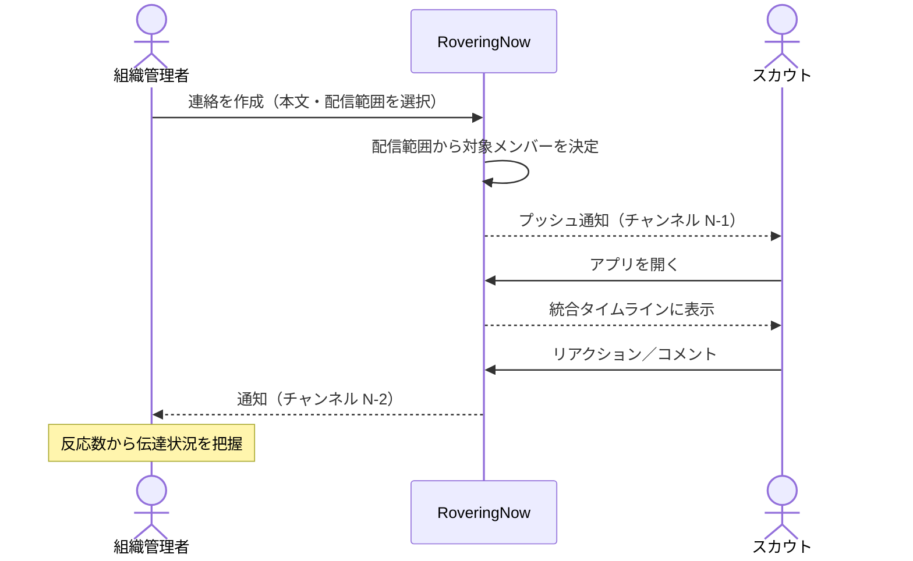
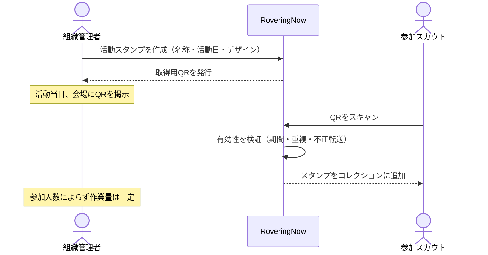
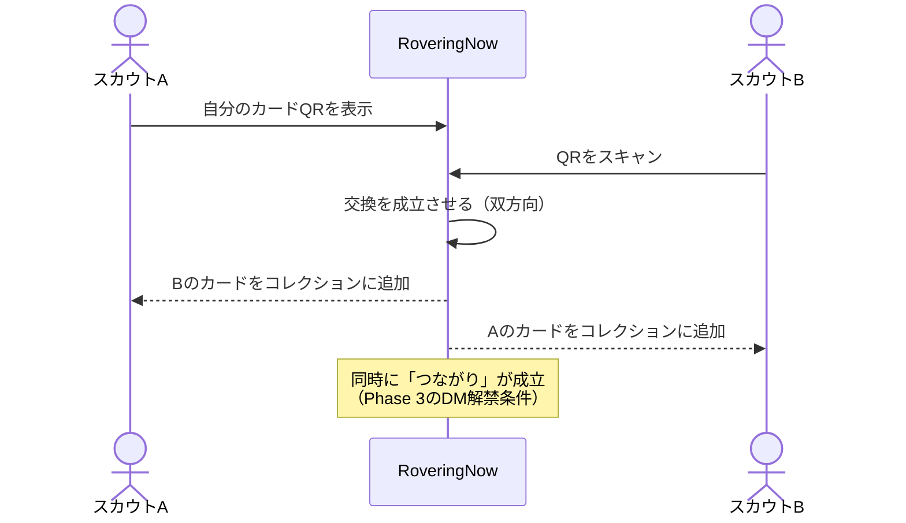
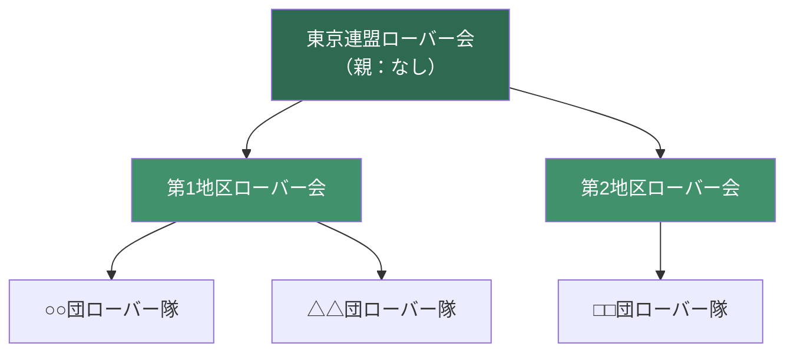
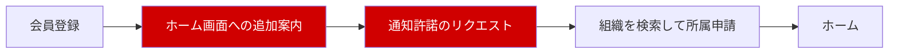
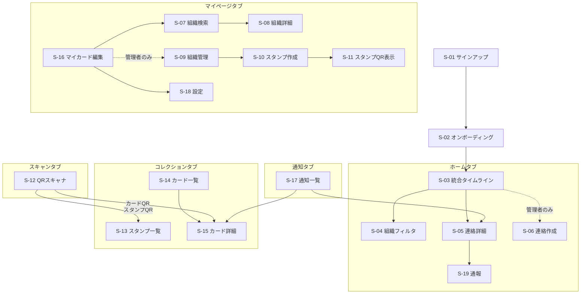
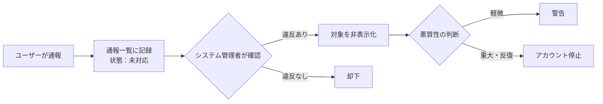

# RoveringNow 基本設計書

| 項目 | 内容 |
|---|---|
| 文書名 | RoveringNow 基本設計書 |
| バージョン | 1.0 |
| 作成日 | 2026-08-16 |
| 最終更新日 | 2026-08-16 |
| ステータス | レビュー中 |
| 対象フェーズ | 基本設計 |

### 本書の位置づけ

本書は開発工程（基本設計 → 詳細設計 → 実装 → テスト）における**基本設計フェーズの成果物**であり、以降の全工程を規定する。

本書が定義するのは「**何を作るか**」（機能・体験・データの概念・運用ルール）までである。「**どう作るか**」に属する事項 — 言語・フレームワーク・データベース製品・インフラ・API仕様・テーブル定義 — は、すべて**詳細設計フェーズの領分**として意図的に記述しない。

本書と実装が食い違った場合は、**本書を正とする**。実装都合で仕様を変える必要が生じた場合は、実装より先に本書を改訂し、第15章の意思決定履歴に理由を記録する。

---

## 目次

1. [プロジェクト概要](#1-プロジェクト概要)
2. [ターゲットユーザーとペルソナ](#2-ターゲットユーザーとペルソナ)
3. [プロダクトコンセプト](#3-プロダクトコンセプト)
4. [スコープとリリース計画](#4-スコープとリリース計画)
5. [用語定義](#5-用語定義)
6. [主要ユースケース](#6-主要ユースケース)
7. [機能一覧と機能概要](#7-機能一覧と機能概要)
8. [ロール・権限設計](#8-ロール権限設計)
9. [概念データモデル](#9-概念データモデル)
10. [通知設計](#10-通知設計)
11. [画面一覧・画面遷移](#11-画面一覧画面遷移)
12. [運用・モデレーション方針](#12-運用モデレーション方針)
13. [非機能要件](#13-非機能要件)
14. [制約・前提／対象外事項](#14-制約前提対象外事項)
15. [意思決定履歴](#15-意思決定履歴)

---

## 1. プロジェクト概要

### 1.1 背景

日本のボーイスカウト運動には、18歳から25歳を対象とする「**ローバースカウト**」部門が存在する。学業・就職・転居といったライフステージの変化が最も激しい年代であり、他部門と比べて活動の継続が難しい。

現在、この年代の活動には次の4つの課題がある。

**課題1：組織からメンバーへの情報伝達が機能していない**
ローバースカウトは団・地区・県連盟といった複数の組織に同時に所属するが、それぞれの連絡手段が分散しており（口頭・メール・個別のSNS・紙）、必要な情報が末端のスカウトまで届いていない。特に**上位組織から末端スカウトへの伝達**が弱く、地区や県連盟が企画した活動の存在自体を知らないまま機会を逃すケースが生じている。

**課題2：活動への参加意欲が年々低下している**
参加しても何も残らない。活動の履歴が個人の手元に蓄積されず、続けることへの手応えが得にくい。

**課題3：ローバースカウト同士の交流が乏しい**
所属組織を越えた横のつながりが生まれにくく、活動で出会っても関係が続かない。

**課題4：全国ブログ「ローバーポート」のアクティブユーザーが少ない**
全国の多数のローバー組織がアカウントを持ち活動報告を投稿しているが、読み手が集まらず、書き手の意欲も維持されにくい。

### 1.2 目的

上記4課題を、ローバースカウト世代が日常的に使うモバイル体験の上で一体的に解決する。

課題は独立していない。**課題1が解決しなければ課題2〜4も解決しない**。情報が届かない状態では、活動への参加自体が起こらず、交流も生まれず、記事も読まれないからである。したがって本アプリは、**情報伝達（課題1）を土台**とし、その上に参加動機づけ（課題2）と横のつながり（課題3・4）を積み上げる構造をとる。

### 1.3 ゴールと成功指標

> **【未決・仮置き】** 数値目標は展開規模（試験導入か全国展開か）の決定後に確定する。以下は「特定の県連盟または地区での試験導入 → 全国展開」を前提とした仮案である。

| # | 指標 | 対応課題 | 試験導入フェーズの目標（仮） |
|---|---|---|---|
| KPI-1 | 導入組織における登録率（登録者数 ÷ 対象スカウト数） | 課題1 | 70% |
| KPI-2 | 週次アクティブ率（WAU ÷ 登録者数） | 課題1 | 50% |
| KPI-3 | 連絡投稿への到達率（配信対象のうちアプリを開いた割合） | 課題1 | 60% |
| KPI-4 | 1人あたりの年間スタンプ獲得数 | 課題2 | 4個 |
| KPI-5 | 1人あたりの累計カード交換数 | 課題3 | 5枚 |
| KPI-6 | ローバーポートへのアプリ経由流入数 | 課題4 | 記事あたり従来比200% |

**KPI-1とKPI-2を最上位の指標**とする。この2つが満たされない限り、他の指標を改善しても意味を持たないためである。

---

## 2. ターゲットユーザーとペルソナ

### 2.1 対象ユーザー

| 区分 | 対象 | 想定年齢 |
|---|---|---|
| 主対象 | ローバースカウト | 18〜25歳 |
| 主対象 | ローバー組織の運営スカウト（役員等） | 18〜25歳 |
| 副次対象 | ローバー隊長・隊指導者等、組織運営に関わる成人指導者 | 26歳以上 |

> **【要確認】** 本書はローバースカウトの年齢範囲を18〜25歳として記述している。日本連盟の規程と差異がある場合は本節を改訂する。

**全ユーザーが成人**である点は、設計上重要な前提となる。未成年保護に特有の要件（保護者同意、利用時間制限等）は本アプリの対象外とする。ただし副次対象として成人指導者が組織管理者になり得るため、**組織管理者＝ローバー世代とは限らない**前提で管理画面を設計する。

### 2.2 ペルソナ

**ペルソナA：一般ローバースカウト**
大学2年生・20歳。団のローバー隊と地区ローバー会に所属。所属先の連絡がどこに来るのか把握しきれておらず、活動を知らないまま過ぎることがある。参加した活動が記録として残ることに価値を感じるが、記録のために手間をかける気はない。

*このペルソナに対する設計上の含意：情報は取りに行かせず、届ける。記録は自動で残す。*

**ペルソナB：運営スカウト**
社会人1年目・23歳。地区ローバー会の役員として活動を企画し、参加を呼びかける立場。連絡手段が分散しているため何度も同じ内容を送り、それでも「聞いていない」と言われる。多忙で、運営作業に割ける時間は限られる。

*このペルソナに対する設計上の含意：投稿は数十秒で終わること。運営作業の負担が参加人数に比例して増えないこと。*

**ペルソナC：成人指導者**
40代・ローバー隊長。スマートフォンは使うが最新のSNSには不慣れ。組織の管理者として所属承認等を担当する。

*このペルソナに対する設計上の含意：管理機能は説明なしで操作できる水準にする。*

---

## 3. プロダクトコンセプト

> ### 連絡が届き、活動が記録され、仲間が集まる
> **— ローバースカウトのためのデジタル手帳**

本アプリは3本の柱で構成される。

| 柱 | 意味 | 対応課題 |
|---|---|---|
| **届く** | 所属するすべての組織からの連絡が、一つの場所に確実に届く | 課題1・4 |
| **残る** | 参加した活動が、集めるほど厚みを増す記録として自動的に蓄積する | 課題2 |
| **繋がる** | 活動で出会った仲間が、記録として手元に残り関係が続く | 課題3 |

### 3.1 「コレクション」という単一のメンタルモデル

本アプリの中核的な設計判断として、**活動スタンプと交換したプロフィールカードを、別々の機能として提示しない**。

ユーザーから見れば、どちらも「**活動していると集まっていくもの**」という同一の体験である。両者を `コレクション` という一つの領域に統合することで、アプリの人格が明確になる。

```
コレクション ＝ 自分がどこへ行ったか（スタンプ） ＋ 誰と会ったか（カード）
             ＝ ローバースカウトとしての活動の軌跡
```

これは物理的な**スカウト手帳のデジタル版**にあたる。「連絡アプリにゲーム機能が付いている」のではなく、「活動の軌跡が貯まっていく手帳であり、そこに連絡も届く」という位置づけを、画面構成とコンセプトの両面で一貫させる。

### 3.2 プロダクトが守るべき原則

以下は、以降の設計判断で迷いが生じた際の判断基準とする。

1. **連絡が届くことを何よりも優先する。** 他のどの機能も、連絡の到達を妨げてはならない
2. **運営者の作業量を、参加人数に比例させない。** 比例する運用は必ず続かなくなる
3. **記録のためにユーザーへ手間を要求しない。** 記録は活動の副産物として自動的に残る
4. **タイムラインの信頼性を守る。** 「見なくてもよい情報」を混ぜない

---

## 4. スコープとリリース計画

### 4.1 リリースフェーズ

| フェーズ | 含む機能 | 狙い |
|---|---|---|
| **MVP（Phase 1）** | 組織連絡・スタンプ・カード交換・通知基盤・通報 | 課題1と2を解決し、課題3の起点を作る |
| **Phase 2** | ローバーポート新着配信・匿名掲示板 | 課題4を解決し、組織を越えた交流の場を作る |
| **Phase 3** | ダイレクトメッセージ（実名／匿名） | 課題3を深める |

### 4.2 MVPの範囲

MVPには機能1（連絡）・機能2（スタンプ）・機能3（カード交換）の3機能に加え、これらを支える基盤（認証・組織管理・通知・通報）を含む。

3機能を同時に対象とする理由は、**QRスキャンが機能2と機能3の共通基盤**であり、分割するとかえって非効率になるためである。

### 4.3 MVP内部の実装順序

MVPが3機能に及ぶことで開発量は当初想定の約2倍になる。ウォーターフォールで一括リリースする以上、リリース前に価値を検証する機会がない点がリスクとなる。

これを緩和するため、**実装フェーズ内部でも次の順序を守る**。

```
[1] 認証・組織管理・通知基盤   ← すべての土台
        ↓
[2] 連絡機能（機能1）          ← ここで一度、実組織に触ってもらう
        ↓
[3] スタンプ機能（機能2）      ← QR基盤をここで構築
        ↓
[4] カード交換機能（機能3）    ← QR基盤を再利用
```

**[2] が完了した時点で、協力組織に実際に触ってもらう機会を設ける**。ここで得た指摘を [3][4] の実装、および詳細設計の改訂に反映する。この検証機会の確保を、実装計画上の必須項目とする。

### 4.4 対象外事項

以下は本アプリの対象外とする（将来的な検討を妨げるものではないが、Phase 3までのスコープに含めない）。

- イベントの出欠管理・参加申込
- 会費・金銭の授受
- 進級課目・技能章など日本連盟の公式記録との連携
- 動画投稿・ライブ配信
- ローバースカウト以外の部門（ビーバー〜ベンチャー）への対応
- 日本国外のスカウト組織への対応

---

## 5. 用語定義

### 5.1 スカウト運動の用語

> **【要確認】** 組織階層の呼称および構造は、日本連盟の実態にあわせて確定する必要がある。

| 用語 | 定義 |
|---|---|
| ローバースカウト | ボーイスカウト運動における18〜25歳を対象とした部門、およびその所属者 |
| 団 | 地域を基盤とするスカウト運動の基本単位 |
| 地区 | 複数の団によって構成される組織単位 |
| 県連盟 | 都道府県単位の連盟組織 |
| 日本連盟 | 全国を統括する連盟組織 |
| ローバー隊 | 団に設置されるローバースカウトの隊 |
| ローバー会 | 地区・県連盟等の単位で組織されるローバースカウトの集まり |
| ローバーポート | 全国のローバー組織がアカウントを持ち、活動報告を投稿しているブログ |

### 5.2 本アプリの用語

| 用語 | 定義 |
|---|---|
| **組織** | 本アプリ上で連絡の発信主体となる単位。団ローバー隊・地区ローバー会・県連ローバー会等が該当する。親組織を1つ持つことができる |
| **所属** | ユーザーと組織の関係。ユーザーの申請と組織管理者の承認によって成立する。1人が複数組織に所属できる |
| **連絡** | 組織管理者が投稿する情報。本アプリにおける投稿の唯一の形式 |
| **配信範囲** | 連絡を届ける対象の指定。「自組織のみ」または「配下組織すべて」から選ぶ |
| **タイムライン** | 所属するすべての組織から届いた連絡を時系列で並べた一覧 |
| **スタンプ** | 活動への参加を証明する記録。組織管理者が活動ごとに作成する |
| **プロフィールカード** | ユーザーが自分自身を表現するカード。QRを介して他者と交換する |
| **つながり** | プロフィールカードを交換した相手との関係。Phase 3のDM解禁条件となる |
| **コレクション** | 獲得したスタンプと交換したカードを収める領域 |

---

## 6. 主要ユースケース

### 6.1 ユースケース一覧

| ID | ユースケース | 主アクター | 対応課題 | フェーズ |
|---|---|---|---|---|
| UC-01 | ユーザーが組織に所属申請する | 登録ユーザー | 基盤 | MVP |
| UC-02 | 組織管理者が所属申請を承認する | 組織管理者 | 基盤 | MVP |
| UC-03 | 組織管理者が連絡を配信する | 組織管理者 | 課題1 | MVP |
| UC-04 | スカウトが連絡を受け取り反応する | メンバー | 課題1 | MVP |
| UC-05 | 組織管理者が活動スタンプを用意する | 組織管理者 | 課題2 | MVP |
| UC-06 | スカウトが活動でスタンプを獲得する | 全ユーザー | 課題2 | MVP |
| UC-07 | スカウト同士がプロフィールカードを交換する | 全ユーザー | 課題3 | MVP |
| UC-08 | スカウトがコレクションを振り返る | 全ユーザー | 課題2・3 | MVP |
| UC-09 | ユーザーが不適切な内容を通報する | 全ユーザー | 基盤 | MVP |
| UC-10 | スカウトがローバーポートの新着記事を読む | 全ユーザー | 課題4 | Phase 2 |
| UC-11 | スカウトが匿名で掲示板に書き込む | 全ユーザー | 課題3 | Phase 2 |

### 6.2 中核ユースケースの流れ

#### UC-03／UC-04：連絡の配信と受信



#### UC-05／UC-06：スタンプの用意と獲得



#### UC-07：カードの交換



**片方がスキャンすれば双方向に成立する**設計とする。2人が交互にスキャンする手順は、初対面の場面では摩擦が大きすぎるためである。

---

## 7. 機能一覧と機能概要

### 7.1 機能一覧

| ID | 機能名 | 対応課題 | フェーズ |
|---|---|---|---|
| F-01 | 会員登録・認証 | 基盤 | MVP |
| F-02 | 組織の検索・所属申請 | 基盤 | MVP |
| F-03 | 組織管理（メンバー承認・管理者任命） | 基盤 | MVP |
| F-04 | 連絡の投稿 | 課題1 | MVP |
| F-05 | 統合タイムライン | 課題1 | MVP |
| F-06 | コメント | 課題1 | MVP |
| F-07 | リアクション | 課題1 | MVP |
| F-08 | スタンプ作成 | 課題2 | MVP |
| F-09 | スタンプ獲得（QRスキャン） | 課題2 | MVP |
| F-10 | プロフィールカード編集 | 課題3 | MVP |
| F-11 | カード交換（QRスキャン） | 課題3 | MVP |
| F-12 | コレクション閲覧 | 課題2・3 | MVP |
| F-13 | 通知 | 基盤 | MVP |
| F-14 | 通報 | 基盤 | MVP |
| F-15 | ローバーポート新着配信 | 課題4 | Phase 2 |
| F-16 | 匿名掲示板 | 課題3 | Phase 2 |
| F-17 | ダイレクトメッセージ | 課題3 | Phase 3 |

### 7.2 基盤機能

#### F-01 会員登録・認証

**誰でも登録できる。** 登録の時点ではローバースカウトであることを問わない。所属組織の承認だけを管理者が行う二段構えとし、参入障壁を最小化する。

登録直後のユーザーは「無所属の登録ユーザー」状態となる。この状態でも**機能上の制限は設けない**（第8章参照）。

#### F-02 組織の検索・所属申請

ユーザーは組織を検索し、所属を申請する。承認されるまでの状態は「申請中」として扱う。1人が複数の組織へ同時に申請・所属できる。

#### F-03 組織管理

組織管理者は、所属申請の承認・却下、メンバーの除名、他メンバーへの管理者権限の付与を行える。

組織そのものの新規登録と、初代管理者の任命は、**システム管理者（アプリ運営）が行う**。誰でも組織を作れる状態にすると、実在しない組織や重複した組織が乱立し、ユーザーがどれに申請すべきか判断できなくなるためである。

### 7.3 課題1に対応する機能（連絡）

#### F-04 連絡の投稿

**投稿できるのは組織管理者のみ**とする。一般メンバーは投稿できない。

これは、タイムラインを「**確実に見るべき情報だけが並ぶ場所**」として維持するための判断である。全員が投稿できると重要な連絡が雑談に埋もれ、「連絡が届かない」という元の課題が再発する。雑談・相互交流は Phase 2 の掲示板が担う。

投稿時に**配信範囲**を選択する。

| 配信範囲 | 届く相手 |
|---|---|
| 自組織のみ | その組織に所属する承認済みメンバー |
| 配下組織すべて | その組織と、その配下にあるすべての組織の承認済みメンバー |

配下組織への配信は**組織ツリーを再帰的にたどる**（第9.3節参照）。これにより、地区ローバー会が配信した連絡が地区内の各団ローバー隊メンバー全員へ自動的に届く。スカウトは団に所属するだけで上位組織の情報も受け取れるため、課題1が構造的に解決される。

#### F-05 統合タイムライン

所属するすべての組織から届いた連絡を、**1本の時系列タイムライン**に統合して表示する。組織単位のフィルタで絞り込むこともできる。

組織ごとにチャンネルを分ける方式は採らない。ユーザーが各チャンネルを見に行く必要が生じ、見落としが増えるためである。「**アプリを開けば全部わかる**」状態を最優先する。

#### F-06 コメント

連絡に対して、**全メンバーがコメントできる**。投稿権限を管理者に限定した分、双方向性はコメント欄で確保する。

コメントは全メンバーが書けるため、**アプリ内で最初に荒れる可能性がある領域**となる。このため通報機能（F-14）をMVPに含める。

#### F-07 リアクション

連絡に対する1タップの反応（既読・了解・参加したい 等）。

**既読管理機能は実装しない。** 既読の強制はTwitterのような手軽さを損ない、ユーザーに心理的負担を与えるためである。代わりにリアクション数を運営者に見せることで、伝達状況を推し量る手段とする。厳密な既読把握はできないが、手軽さとのトレードオフとしてこちらを選ぶ。

### 7.4 課題2に対応する機能（スタンプ）

#### F-08 スタンプ作成

組織管理者が活動ごとにスタンプを作成する。

| 項目 | 内容 |
|---|---|
| 名称 | 活動名 |
| 活動日 | 開催日 |
| デザイン | テンプレートから選択、または画像アップロード |
| 取得有効期間 | このスタンプを獲得できる期間 |

**デザインはテンプレート生成を主体とする。** 形・色・アイコン・活動名・日付を選ぶだけで生成できるため、デザインツールを持たない運営者でも作成でき、コレクション画面に並べたときの統一感も保たれる。上級者向けに画像アップロードも許可するが、この場合は不適切画像への通報・審査の対象となる。

#### F-09 スタンプ獲得（QRスキャン）

運営者が会場にQRを掲示し、**参加者が自分でスキャンして獲得する**。

運営者が参加者を1人ずつ認定する方式は採らない。その方式では運営者の作業量が参加人数に比例して増え、忙しい運営者ほど運用しなくなるためである（プロダクト原則2）。QR方式であれば運営者の作業は「掲示する」だけで、人数によらず一定である。

なお、この方式は**QRを撮影して転送すれば現地不在者も獲得できる**という弱点を持つ。したがって「**不正取得への耐性を持つこと**」を機能要件として定める（具体的な実現方式は詳細設計で決定する）。あわせて、運営者が事後に不正な獲得を取り消せる手段を用意する。

**無所属の登録ユーザーもスタンプを獲得できる。** これは意図的な設計であり、他組織の活動に参加したスカウトが記録を残せることは、むしろ課題3（組織を越えた交流）に資する。

### 7.5 課題3に対応する機能（カード）

#### F-10 プロフィールカード編集

| 項目 | 必須 | 内容 |
|---|---|---|
| 表示名 | 必須 | 本名でもニックネームでも可 |
| アバター画像 | 任意 | |
| 所属組織 | 自動 | 承認済みの所属から表示。無所属の場合は「所属未確認」と表示する |
| 自己紹介 | 任意 | 一言 |
| SNSリンク等 | 任意 | 外部サービスへのリンク |
| カードデザイン | 任意 | テンプレートから選択 |

**「所属未確認」表示について。** 無所属ユーザーにも機能上の制限は設けないため、スカウトであるかが確認できない相手ともカード交換が成立しうる。これに対し制限を課すのではなく、**カード上に所属状況を表示して判断材料をユーザーに渡す**方針をとる。

**SNSリンクの取り扱い。** カードはスクリーンショットで容易に拡散しうるため、リンク掲載は任意とし、登録時にその旨を明示する。電話番号・住所・メールアドレスの掲載欄は設けない。

#### F-11 カード交換（QRスキャン）

一方がQRを表示し、他方がスキャンすることで**双方向に交換が成立**する。同時に両者の間に「**つながり**」が記録される。

このつながりを、Phase 3 で実装するDMの**解禁条件**とする。承認フローを別途設けず、「リアルで会ってカードを交換した相手とはメッセージを送れる」という一貫した体験にまとめる。

#### F-12 コレクション閲覧

獲得したスタンプと交換したカードを収める領域。第3.1節のコンセプトに基づき、**単一の領域として提供する**。

### 7.6 基盤機能（通知・通報）

#### F-13 通知

第10章で詳述する。

#### F-14 通報

不適切な連絡・コメント・プロフィールカード・スタンプ画像を、ユーザーが通報できる。処理フローは第12章で定める。

### 7.7 Phase 2 以降の機能

#### F-15 ローバーポート新着配信（Phase 2）

ローバーポートに新着記事が投稿された際、**全登録者へ即時にプッシュ通知**する。記事はアプリ内の一覧にも蓄積する。

この配信方針は**通知量が過大になるリスク**を持つ。全国の多数の組織が投稿するため通知が頻発し、ユーザーが通知全体をOFFにしてしまえば、最重要である連絡（F-05）が届かなくなる。

このリスクは、**通知チャンネルの分離**（第10章）によって構造的に回避する。ローバーポート通知と組織からの連絡は独立したチャンネルであり、前者をOFFにしても後者は届き続ける。

> **【要調査】** ローバーポートからの新着検知方式（RSS等の提供有無）および、記事タイトル・サムネイルの利用可否は、詳細設計フェーズで確認する。運営主体との調整が必要になる可能性がある。

#### F-16 匿名掲示板（Phase 2）

組織の枠を越えて、知らないスカウト同士が交流できる場。**利用者から見て完全に匿名**とする。匿名性の具体的な扱いは第12.2節の匿名性ポリシーで定める。

#### F-17 ダイレクトメッセージ（Phase 3）

つながりが成立している相手との個別メッセージ。匿名ユーザー同士のDMも将来的に対象とし、第12.2節のポリシーを同様に適用する。

---

## 8. ロール・権限設計

### 8.1 ロール定義

| ロール | 定義 | 任命方法 |
|---|---|---|
| **システム管理者** | アプリ運営者。組織の登録、初代管理者の任命、通報の一次対応を行う | 運営内部で決定 |
| **組織管理者** | 組織の運営スカウト。連絡の投稿、所属承認、スタンプ作成を行う | システム管理者、または同組織の既存管理者が任命 |
| **メンバー** | 組織に所属を承認されたユーザー | 組織管理者の承認 |
| **登録ユーザー** | 登録済みで、どの組織にも所属承認されていないユーザー | 登録時の初期状態 |

**組織管理者は組織ごとの権限**である。ある組織の管理者が、他組織に対しては単なるメンバーであることが通常である。

### 8.2 権限マトリクス

凡例：✅ 可 ／ ⭕️ 所属組織に限り可 ／ ❌ 不可

| 操作 | システム管理者 | 組織管理者 | メンバー | 登録ユーザー |
|---|:---:|:---:|:---:|:---:|
| 組織の新規登録 | ✅ | ❌ | ❌ | ❌ |
| 初代管理者の任命 | ✅ | ❌ | ❌ | ❌ |
| 組織の検索・所属申請 | ✅ | ✅ | ✅ | ✅ |
| 所属申請の承認・却下 | ✅ | ⭕️ | ❌ | ❌ |
| メンバーの除名 | ✅ | ⭕️ | ❌ | ❌ |
| 管理者権限の付与 | ✅ | ⭕️ | ❌ | ❌ |
| 連絡の投稿 | ✅ | ⭕️ | ❌ | ❌ |
| 連絡の閲覧 | ✅ | ⭕️ | ⭕️ | ❌ |
| コメントの投稿 | ✅ | ⭕️ | ⭕️ | ❌ |
| リアクション | ✅ | ⭕️ | ⭕️ | ❌ |
| スタンプの作成 | ✅ | ⭕️ | ❌ | ❌ |
| スタンプの獲得 | ✅ | ✅ | ✅ | ✅ |
| スタンプ獲得の取消 | ✅ | ⭕️ | ❌ | ❌ |
| プロフィールカードの編集 | ✅ | ✅ | ✅ | ✅ |
| カードの交換 | ✅ | ✅ | ✅ | ✅ |
| コレクションの閲覧 | ✅ | ✅ | ✅ | ✅ |
| 通報 | ✅ | ✅ | ✅ | ✅ |
| 通報の処理 | ✅ | ❌ | ❌ | ❌ |
| 投稿の削除 | ✅ | ⭕️ | ❌ | ❌ |
| アカウントの停止 | ✅ | ❌ | ❌ | ❌ |
| 発信者情報の照合 | ✅ | ❌ | ❌ | ❌ |

**登録ユーザーに機能制限を設けない方針**に基づき、連絡の閲覧以外のすべての機能を無所属でも利用できる。連絡の閲覧のみ ❌ となっているのは権限制限ではなく、**所属していない組織の連絡は配信対象にそもそも含まれない**という配信ロジック上の帰結である。

---

## 9. 概念データモデル

本章は概念レベルの定義であり、物理的なテーブル設計・型・インデックス等は詳細設計で決定する。

### 9.1 ER図

```mermaid
erDiagram
    User ||--o| ProfileCard : "所有する"
    User ||--o{ Membership : "所属する"
    Organization ||--o{ Membership : "メンバーを持つ"
    Organization ||--o{ Organization : "配下に持つ"
    Organization ||--o{ Post : "配信する"
    Organization ||--o{ Stamp : "発行する"
    User ||--o{ Post : "投稿する"
    Post ||--o{ Comment : "持つ"
    Post ||--o{ Reaction : "持つ"
    User ||--o{ Comment : "書く"
    User ||--o{ Reaction : "付ける"
    Stamp ||--o{ StampGrant : "付与される"
    User ||--o{ StampGrant : "獲得する"
    User ||--o{ Connection : "つながる"
    User ||--o{ Report : "通報する"
    User ||--o{ Notification : "受け取る"
    User ||--o{ NotificationSetting : "設定する"
    User ||--o{ AuditLog : "記録される"

    User {
        id ユーザーID
        string 表示名
        string メールアドレス
        enum 状態 "有効/停止"
        datetime 登録日時
    }
    Organization {
        id 組織ID
        string 組織名
        id 親組織ID "自己参照・NULL可"
        enum 種別 "県連盟/地区/団/その他"
        string 説明
    }
    Membership {
        id ユーザーID
        id 組織ID
        enum 状態 "申請中/承認済/却下"
        enum 組織内ロール "管理者/メンバー"
        datetime 申請日時
        datetime 承認日時
    }
    Post {
        id 投稿ID
        id 組織ID
        id 投稿者ID
        text 本文
        enum 配信範囲 "自組織のみ/配下すべて"
        datetime 投稿日時
    }
    Comment {
        id コメントID
        id 投稿ID
        id 投稿者ID
        text 本文
        datetime 投稿日時
    }
    Reaction {
        id 投稿ID
        id ユーザーID
        enum 種別
    }
    Stamp {
        id スタンプID
        id 組織ID
        string 名称
        date 活動日
        json デザイン定義 "テンプレート種別+パラメータ or 画像"
        datetime 取得有効期間開始
        datetime 取得有効期間終了
    }
    StampGrant {
        id スタンプID
        id ユーザーID
        datetime 獲得日時
        enum 獲得方法 "QR/運営手動"
        enum 状態 "有効/取消"
    }
    ProfileCard {
        id ユーザーID
        string 表示名
        string アバター
        text 自己紹介
        json 外部リンク "任意・複数"
        json カードデザイン
    }
    Connection {
        id ユーザーA_ID
        id ユーザーB_ID
        datetime 成立日時
        enum 成立方法 "カード交換"
    }
    Report {
        id 通報ID
        id 通報者ID
        enum 対象種別 "連絡/コメント/カード/スタンプ"
        id 対象ID
        text 理由
        enum 状態 "未対応/対応中/対応済/却下"
    }
    Notification {
        id 通知ID
        id 宛先ユーザーID
        enum チャンネル
        text 本文
        string 遷移先
        bool 既読
        datetime 作成日時
    }
    NotificationSetting {
        id ユーザーID
        enum チャンネル
        bool 有効
    }
    AuditLog {
        id ログID
        id ユーザーID
        enum 対象種別
        id 対象ID
        string 接続元情報
        datetime 発生日時
    }
```



### 9.2 主要エンティティの補足

| エンティティ | 補足 |
|---|---|
| `Organization` | **親組織IDによる自己参照でツリーを構成する**。親が NULL の組織が最上位（県連盟等）となる |
| `Membership` | ユーザーと組織の多対多を担う。承認状態と組織内ロールの両方を保持する |
| `Post` | 配信範囲を保持する。実際の配信対象は組織ツリーから導出する（第9.3節） |
| `Connection` | カード交換の結果として成立する双方向の関係。Phase 3 のDM解禁判定に用いる |
| `AuditLog` | **匿名性ポリシー（第12.2節）を成立させる基盤**。匿名投稿であっても発信者を追跡できるようにする。システム管理者のみが照合できる |

### 9.3 組織ツリーと配信範囲の導出



配信対象の決定規則は次のとおり。

| 投稿元 | 配信範囲 | 実際に届くメンバー |
|---|---|---|
| ○○団ローバー隊 | 自組織のみ | ○○団ローバー隊の承認済みメンバー |
| 第1地区ローバー会 | 自組織のみ | 第1地区ローバー会に直接所属する承認済みメンバー |
| 第1地区ローバー会 | 配下すべて | 第1地区ローバー会＋○○団＋△△団の承認済みメンバー |
| 東京連盟ローバー会 | 配下すべて | 図中すべての組織の承認済みメンバー |

**同一ユーザーが複数の対象組織に所属する場合でも、連絡は1件としてのみ届く**（重複排除する）。

この構造により、スカウトは団ローバー隊に所属するだけで、地区・県連盟の連絡も自動的に受け取れる。**課題1（上位組織から末端への伝達不全）は、この配信規則によって構造的に解決される。**

---

## 10. 通知設計

> **本章は、本アプリにおいて最も重要な設計対象である。**
>
> 本アプリは通知によって成立する。同時に、通知は本アプリが失敗する最大の要因でもある。通知が過多になればユーザーは通知を切り、通知が切られた瞬間に最重要機能である連絡（F-05）が機能しなくなるためである。

### 10.1 設計原則

1. **チャンネルを分離する。** 通知は種別ごとに独立したチャンネルとし、ユーザーが個別にON/OFFできる。あるチャンネルをOFFにしても、他チャンネルは影響を受けない
2. **連絡チャンネルを最優先で保護する。** 他のどのチャンネルも、連絡チャンネルの音量を侵食してはならない
3. **プッシュを逃しても追える。** すべての通知はアプリ内の通知一覧にも残す。プッシュは補助手段であり、唯一の伝達経路にしない
4. **通知には必ず遷移先がある。** 通知をタップして到達する画面を持たない通知は作らない

### 10.2 通知チャンネル一覧

| ID | チャンネル | 発火条件 | 配信対象 | 既定 | OFF可 |
|---|---|---|---|:---:|:---:|
| **N-1** | **組織からの連絡** | 連絡が投稿された | 配信範囲に含まれる承認済みメンバー | ON | 可 |
| N-2 | コメント・リアクション | 自分の連絡にコメント／リアクションが付いた | 連絡の投稿者 | ON | 可 |
| N-3 | スタンプ | スタンプを獲得した | 獲得者 | ON | 可 |
| N-4 | カード交換 | カード交換が成立した | 交換した双方 | ON | 可 |
| N-5 | 所属申請 | 申請された／承認・却下された | 組織管理者／申請者 | ON | 可 |
| N-6 | ローバーポート新着 | 新着記事を検知した | **全登録者** | ON | 可 |
| N-7 | 運営からのお知らせ | システム管理者が配信した | 全登録者 | ON | 不可 |

**N-1が最重要チャンネル**である。N-6（ローバーポート）は全登録者への即時配信という最も通知量の多いチャンネルだが、N-1とは独立しているため、ユーザーがN-6をOFFにしてもN-1は届き続ける。**この分離が、第7.7節で述べたリスクに対する構造的な回避策である。**

N-7のみOFF不可とするが、これは障害告知・規約変更・セキュリティ通知など、運営上どうしても届ける必要がある内容に限って使用する。日常的な告知には使用しない。

### 10.3 オンボーディングにおける通知許諾

本アプリはWEBアプリとして提供されるため、**iOS環境ではホーム画面に追加されない限りプッシュ通知が届かない**（第14章）。通知が生命線である本アプリにとって、これは致命的な制約となる。

したがって初回オンボーディングにおいて、次を**必須の導線**として設計する。



赤い工程はスキップ可能とするが、スキップした場合は**通知が届かないことを明示**し、後から設定画面で実行できる導線を常設する。また、ホーム画面未追加のユーザーに対しては、アプリ内に恒常的な案内を表示する。

---

## 11. 画面一覧・画面遷移

### 11.1 情報アーキテクチャ

グローバルナビゲーションは5タブとする。

| 位置 | タブ | 役割 |
|---|---|---|
| 1 | ホーム | 統合タイムライン |
| 2 | コレクション | スタンプとカード |
| 3 | **スキャン** | **QRスキャナ（中央）** |
| 4 | 通知 | 通知一覧 |
| 5 | マイページ | プロフィール・組織・設定 |

**QRスキャナを中央タブに配置する。** QRはスタンプ獲得（F-09）とカード交換（F-11）の共通の入口であり、活動の現場で最も素早く到達できる必要があるためである。スキャンしたQRの種類をアプリが判別し、適切な処理へ分岐させる。ユーザーは「スタンプ用」「カード用」を意識しない。

### 11.2 画面一覧

| ID | 画面名 | 主な役割 | フェーズ |
|---|---|---|---|
| S-01 | サインアップ／ログイン | 会員登録・認証 | MVP |
| S-02 | オンボーディング | ホーム画面追加案内・通知許諾・組織検索 | MVP |
| S-03 | ホーム（統合タイムライン） | 全所属組織の連絡を時系列表示 | MVP |
| S-04 | 組織フィルタ | タイムラインを組織で絞り込む | MVP |
| S-05 | 連絡詳細 | 本文・コメント・リアクション | MVP |
| S-06 | 連絡作成 | 本文入力・配信範囲選択（管理者のみ） | MVP |
| S-07 | 組織検索 | 組織を探して所属申請 | MVP |
| S-08 | 組織詳細 | 組織情報・メンバー数・所属申請 | MVP |
| S-09 | 組織管理 | 申請承認・メンバー管理・スタンプ管理（管理者のみ） | MVP |
| S-10 | スタンプ作成 | 名称・活動日・デザイン設定（管理者のみ） | MVP |
| S-11 | スタンプQR表示 | 会場掲示用のQR（管理者のみ） | MVP |
| S-12 | QRスキャナ | スタンプ獲得・カード交換の共通入口 | MVP |
| S-13 | コレクション（スタンプ） | 獲得スタンプの一覧 | MVP |
| S-14 | コレクション（カード） | 交換したカードの一覧 | MVP |
| S-15 | カード詳細 | 交換した相手のカード | MVP |
| S-16 | マイカード編集 | 自分のプロフィールカード編集・QR表示 | MVP |
| S-17 | 通知一覧 | すべての通知の履歴 | MVP |
| S-18 | 設定 | 通知設定・アカウント設定 | MVP |
| S-19 | 通報 | 不適切な内容の通報 | MVP |
| S-20 | ローバーポート一覧 | 新着記事の一覧 | Phase 2 |
| S-21 | 掲示板 | 匿名の書き込み | Phase 2 |
| S-22 | DM | 個別メッセージ | Phase 3 |

### 11.3 画面遷移概要



QRスキャナ（S-12）が**スキャンしたQRの種別を自動判別し、スタンプ獲得とカード交換に分岐する**点が、本アプリの画面遷移における中核である。

---

## 12. 運用・モデレーション方針

### 12.1 通報と対応フロー

> **【未決・仮置き】** 一次対応の主体は「システム管理者（アプリ運営）」を仮置きとする。組織管理者に委譲する案もあるため、運営体制の確定後に本節を改訂する。



通報の対象は、連絡・コメント・プロフィールカード・スタンプ画像とする。Phase 2 以降は掲示板の書き込み、Phase 3 以降はDMも対象に加える。

**MVPで通報機能を実装する理由。** 匿名掲示板はPhase 2だが、MVPの時点でコメント（F-06）が全メンバーに開かれている。アプリ内で最初に問題が起きる場所はコメント欄であり、掲示板の実装を待つことはできない。

### 12.2 匿名性ポリシー

Phase 2 の匿名掲示板および Phase 3 の匿名DMは、「**利用者から見て完全に匿名だが、システムは発信者を追跡できる**」という設計をとる。これは厳密には匿名（Anonymity）ではなく、**仮名性（Pseudonymity）**である。

**この方針を採る理由。** 完全な匿名（システムも発信者を特定できない状態）は、誹謗中傷や違法な書き込みが発生した際に一切の対処ができない。日本においては**プロバイダ責任制限法に基づく発信者情報の開示請求**に応じる必要が現実に生じ得るため、追跡情報を保持していない状態は運営上のリスクとなる。他方、利用者に対して実名や所属を露出させれば、「知らない人と気軽に話す」という機能の目的そのものが失われる。仮名性は、この両者を成立させる唯一の解である。

ポリシーは以下の3点として明文化し、**利用規約およびプライバシーポリシーに記載する**。

**① 利用者に見せない情報**

| 情報 | 他の利用者からの可視性 |
|---|---|
| 実名・表示名 | 不可視 |
| 所属組織 | 不可視 |
| プロフィールカード | 不可視 |
| 同一人物が書いた複数の投稿の紐付け | 不可視（投稿間で発信者を同定できない） |

**② システムが保持する情報**

| 情報 | 保持 |
|---|---|
| 投稿とユーザーIDの対応 | 保持する |
| 接続元情報・投稿日時 | 保持する（`AuditLog`） |
| 保持期間 | 詳細設計で定める（法令上の要請を踏まえて決定する） |

**③ 誰がどんな条件で照合できるか**

| 項目 | 内容 |
|---|---|
| 照合できる者 | システム管理者のみ |
| 照合できる条件 | ①法令に基づく開示請求を受けた場合、②重大な権利侵害・違法行為の疑いがある通報を受けた場合、③本人からの請求 |
| 手続 | 照合の実施自体を記録に残し、恣意的な閲覧を防ぐ |

**組織管理者は照合できない。** 組織内の匿名の書き込みが所属組織の管理者に特定されうる状態では、心理的安全性が成立しないためである。

### 12.3 組織の登録と管理者の任命

組織の新規登録と初代管理者の任命は、システム管理者が行う（第7.2節 F-03）。

> **【未決・仮置き】** 展開規模の決定後、以下の運用手順を確定する。
> - 試験導入時：対象の県連盟・地区と協議のうえ、運営側が組織ツリーを一括登録する
> - 全国展開時：組織からの申請を受け付け、実在性を確認したうえで登録する

組織ツリーの正確性は連絡の配信範囲を直接左右するため、**登録時に親子関係の妥当性を必ず確認する**運用とする。

---

## 13. 非機能要件

### 13.1 セキュリティ

| 項目 | 要件 |
|---|---|
| 認証 | 本人以外がアカウントを利用できないこと。方式は詳細設計で決定する |
| 認可 | 第8.2節の権限マトリクスを、画面表示だけでなくサーバ側でも必ず検証すること |
| 配信範囲の担保 | 所属していない組織の連絡を取得できないこと |
| QRの不正利用対策 | 撮影・転送されたQRによってスタンプを獲得できないこと（方式は詳細設計で決定） |
| 通信 | すべての通信を暗号化すること |
| 監査 | 匿名投稿の発信者を追跡できる記録を保持すること（第12.2節） |

### 13.2 個人情報・プライバシー

| 項目 | 要件 |
|---|---|
| 収集する個人情報 | 表示名、メールアドレス、アバター画像、自己紹介、所属組織、任意の外部リンク |
| 収集しない情報 | 電話番号、住所、生年月日、日本連盟の登録番号 |
| カードの拡散リスク | プロフィールカードがスクリーンショットで拡散しうることを、登録時および編集時に明示する |
| 退会 | 退会時のデータの取り扱い（削除・匿名化の範囲）を詳細設計で定める |
| 準拠 | 個人情報保護法に準拠する。プライバシーポリシーを整備する |

### 13.3 可用性・性能

> **【未決・仮置き】** 具体的な数値目標は、展開規模の決定後に確定する。

| 項目 | 要件（仮） |
|---|---|
| 想定同時接続 | 試験導入フェーズで数百人規模、全国展開フェーズで数千人規模 |
| タイムライン表示 | 通常時2秒以内に初期表示されること |
| QRスキャンから結果表示まで | 3秒以内。活動現場で列ができない水準を保つこと |
| 通知の到達 | 連絡投稿から1分以内にプッシュが配信されること |
| 稼働率 | 計画停止を除き99%以上 |

### 13.4 対応環境・アクセシビリティ

| 項目 | 要件 |
|---|---|
| 提供形態 | WEBアプリ |
| 対応ブラウザ | iOS Safari / Android Chrome の最新2バージョン |
| 画面サイズ | スマートフォン縦画面を主対象とする。管理機能はPC表示にも対応する |
| オフライン | 対象外。通信環境のない場所での利用は想定しない |
| 文字サイズ | 端末の文字サイズ設定に追随すること |
| 色 | 色のみで情報を伝えないこと |

---

## 14. 制約・前提／対象外事項

### 14.1 前提条件

| # | 前提 |
|---|---|
| 1 | ユーザーは全員成人（18歳以上）である |
| 2 | ユーザーはスマートフォンを所持し、日常的に利用している |
| 3 | 各組織に、アプリを運用する意思のある管理者が1名以上存在する |
| 4 | 組織ツリーの構造は、日本連盟の実際の組織階層と対応づけられる |

前提3が満たされない組織では、本アプリは機能しない。**組織管理者の確保は、技術ではなく導入運用上の課題**であり、展開計画において最も重要な要素となる。

### 14.2 制約事項

**制約1：iOS における Web Push の制限**

WEBアプリとして提供する以上、iOS環境では**ホーム画面に追加されない限りプッシュ通知が届かない**（iOS 16.4以降の Web Push の仕様による）。

通知が生命線である本アプリにとって最大の技術的制約である。対応として、オンボーディングでホーム画面追加を必須導線とする（第10.3節）。この制約が受け入れ難いと判断される場合、提供形態（ネイティブアプリ化等）の再検討が必要になるが、**その判断は詳細設計フェーズで行う**。

**制約2：会場QRの転送による不正取得**

会場に掲示したQRは撮影・転送が可能であり、現地不在者がスタンプを獲得しうる。「不正取得への耐性」を機能要件とし、実現方式は詳細設計で決定する（第7.4節 F-09）。

**制約3：ローバーポートからの新着検知**

外部サービスであるローバーポートからの新着検知方式は未確認である。取得手段の有無、および記事情報の利用可否について、運営主体との調整が必要になる可能性がある（第7.7節 F-15）。

### 14.3 対象外事項

第4.4節に定義したとおり。

### 14.4 未決事項一覧

| # | 項目 | 影響範囲 | 期限 |
|---|---|---|---|
| 1 | 展開規模（試験導入か全国展開か） | 第1.3節 KPI、第12.3節 組織登録運用、第13.3節 性能目標 | 詳細設計開始前 |
| 2 | モデレーションの実施体制 | 第12.1節 通報対応フロー | 詳細設計開始前 |
| 3 | ローバースカウトの年齢範囲・組織階層呼称 | 第2.1節、第5.1節 | 詳細設計開始前 |
| 4 | ローバーポートの新着検知方式 | 第7.7節 F-15（Phase 2） | Phase 2 詳細設計時 |

---

## 15. 意思決定履歴

| # | 項目 | 決定 | 日付 | 理由 |
|---|---|---|---|---|
| 1 | MVPスコープ | 機能1（連絡）＋2（スタンプ）＋3（カード交換） | 2026-08-16 | QRという共通基盤を一度に構築できる。機能4・5はPhase 2以降 |
| 2 | 参加方法 | 誰でも登録可、組織への所属のみ管理者承認 | 2026-08-16 | 参入障壁を最小化する |
| 3 | 無所属ユーザーの権限 | 制限なし | 2026-08-16 | 機能制限は課さず、カードに「所属未確認」表示を出して判断材料を渡す |
| 4 | 連絡の見え方 | 統合タイムライン＋組織フィルタ | 2026-08-16 | 「アプリを開けば全部わかる」を成立させ、手軽さに最も近い |
| 5 | 投稿権限 | 投稿は組織管理者のみ／コメントは全メンバー可 | 2026-08-16 | タイムラインの信頼性を守りつつ一方通行にしない |
| 6 | 既読管理 | 実装しない。代替として投稿へのリアクションを設ける | 2026-08-16 | 手軽さを壊さずに、運営者が伝達状況を推し量れる |
| 7 | 組織モデル | 親組織IDを1つ持つツリー構造。投稿時に「自組織のみ／配下すべて」を選択 | 2026-08-16 | 団に所属すれば地区・県連盟の連絡も自動で届き、課題1を根本解決する |
| 8 | スタンプ付与 | 運営者が活動ごとにスタンプを作成し、会場でQRを掲示。参加者がスキャンして自動付与 | 2026-08-16 | 運営負担が参加人数によらず一定。機能3のQR基盤を共有できる |
| 9 | スタンプのデザイン | テンプレート生成を主体とし、画像アップロードも許可 | 2026-08-16 | 誰でも作れてコレクション画面の統一感を保ちつつ、自由度も残す |
| 10 | プロフィールカードの情報 | 表示名・所属・自己紹介・アバター＋SNSリンク等を任意で | 2026-08-16 | 交流のきっかけとして十分な情報量を確保する |
| 11 | つながりの定義 | QRでカードを交換した相手＝「つながり」。Phase 3のDM解禁条件とする | 2026-08-16 | 承認フローを二重に作らず、「リアルで会った人と繋がる」体験になる |
| 12 | 匿名性ポリシー | 仮名性（Pseudonymity）。UI上は完全匿名、内部的に発信者を追跡可能 | 2026-08-16 | 利用者の心理的安全性と、炎上時・発信者情報開示請求時の追跡責任を両立する |
| 13 | ローバーポート通知 | 新着投稿時に全登録者へ即時プッシュ | 2026-08-16 | 記事への誘導力を最大化する。通知過多リスクは決定14で緩和する |
| 14 | 通知チャンネル | 種別ごとに独立したチャンネルとしてON/OFF可能にする | 2026-08-16 | ポート通知をOFFにしても組織からの連絡は届き続ける構造にし、メイン機能を守る |
| 15 | 通報機能 | MVPに含める | 2026-08-16 | コメントが全メンバー可のため、掲示板を待たずコメント欄が最初の荒れどころになる |
| 16 | カード交換の成立条件 | 片方がスキャンすれば双方向に成立する | 2026-08-16 | 初対面の場面で交互スキャンは摩擦が大きすぎる |
| 17 | 組織の登録主体 | 組織の新規登録と初代管理者任命はシステム管理者が行う | 2026-08-16 | 誰でも作れると実在しない組織や重複が乱立し、申請先を判断できなくなる |
| 18 | QRスキャナの配置 | グローバルナビゲーション中央に単一のスキャナを置き、QR種別を自動判別する | 2026-08-16 | スタンプとカードの共通入口であり、活動現場で最速で到達できる必要がある |

---

## 付録：開発背景と機能の対応

本書が開発背景をすべて網羅していることを示す。

| 開発背景 | 対応する機能 | フェーズ |
|---|---|---|
| **背景1**：組織からの情報伝達が機能していない | F-04 連絡の投稿 / F-05 統合タイムライン / F-06 コメント / F-07 リアクション（＋F-02・F-03の基盤） | MVP |
| **背景2**：活動への参加意欲の低下 | F-08 スタンプ作成 / F-09 スタンプ獲得 / F-12 コレクション閲覧 | MVP |
| **背景3**：ローバースカウト同士の交流促進 | F-10 プロフィールカード編集 / F-11 カード交換 / F-12 コレクション閲覧 / F-17 DM | MVP・Phase 3 |
| **背景4**：ローバーポートのアクティブユーザー不足 | F-15 ローバーポート新着配信 | Phase 2 |
| **背景5**：知らない人との交流の場 | F-16 匿名掲示板 / F-17 DM | Phase 2・3 |
| （基盤：全背景に共通して必要） | F-01 会員登録・認証 / F-02 組織の検索・所属申請 / F-03 組織管理 / F-13 通知 / F-14 通報 | MVP |

上表のとおり、**開発背景1〜5のすべてが機能に対応づいている**。また、逆方向についても、いずれの背景にも紐づかない機能は存在しない（F-01・F-02・F-03・F-13・F-14 は、いずれかの背景を実現するために不可欠な基盤機能である）。
