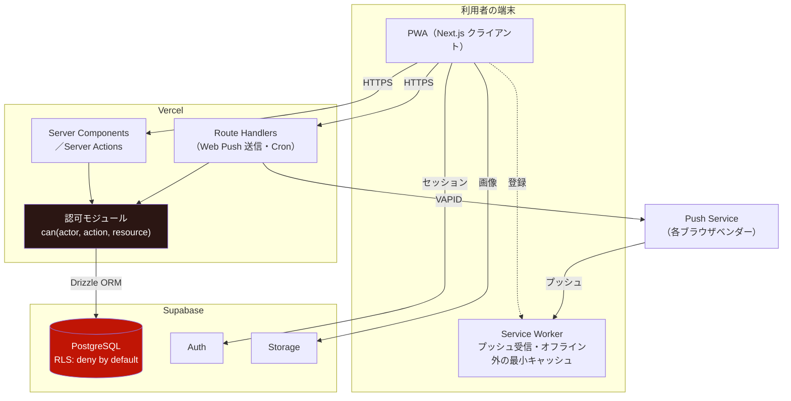
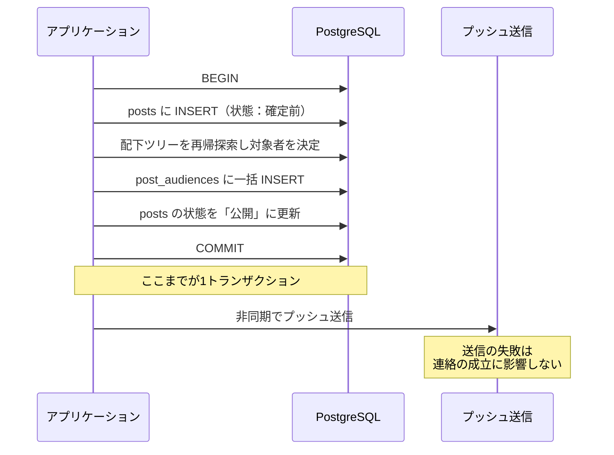
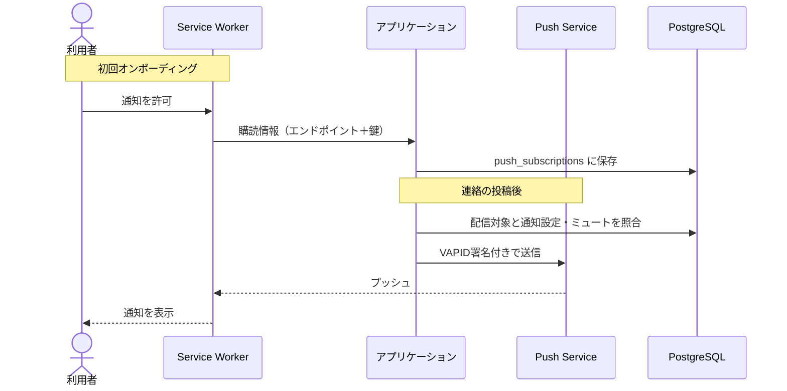

# 詳細設計書 02 — アーキテクチャと技術選定

| 項目 | 内容 |
|---|---|
| 文書名 | アーキテクチャと技術選定 |
| バージョン | 1.0 |
| 作成日 | 2026-08-17 |
| ステータス | レビュー中 |
| 対象工程 | 工程1（詳細設計） |
| 上位文書 | [基本設計書](01_basic_design.md) |

### 本書の位置づけ

基本設計書が「**何を作るか**」を定義したのに対し、詳細設計は「**どう作るか**」を定義する。本書はその最初の1冊であり、**技術スタックと、堅牢性をどう担保するかの方針**を定める。以降の詳細設計文書（DB設計・API仕様・UI設計）は本書の決定を前提とする。

**基本設計書で確定した事項は本書で覆さない。** 特に提供形態（WEBアプリ／PWA、決定37）は確定済みである。

---

## 目次

1. [設計方針](#1-設計方針)
2. [技術スタック](#2-技術スタック)
3. [システム構成](#3-システム構成)
4. [堅牢性の設計](#4-堅牢性の設計)
5. [認証・セッション](#5-認証セッション)
6. [通知アーキテクチャ](#6-通知アーキテクチャ)
7. [ファイルストレージ](#7-ファイルストレージ)
8. [定期実行](#8-定期実行)
9. [環境構成とデプロイ](#9-環境構成とデプロイ)
10. [意思決定履歴](#10-意思決定履歴)

---

## 1. 設計方針

本工程では、発注者の要望により次の2点を最優先する。

### 1.1 堅牢性

**「壊れないこと」ではなく「壊れ方を設計すること」**を堅牢性と定義する。想定外の入力・同時実行・外部サービスの障害は必ず起きる。起きたときに、データが矛盾せず、権限が漏れず、利用者に何が起きたかが伝わる状態を保つ。

本アプリで特に壊れやすい箇所は、基本設計の段階で既に特定されている。

| # | 壊れやすい箇所 | 壊れたときの被害 | 対処 |
|---|---|---|---|
| 1 | 権限マトリクス35行の担保 | 権限のない者が連絡を配信できる／他人のグループを乗っ取れる | 第4.1節 |
| 2 | グループツリーの再帰探索 | 無限ループ、配信対象の取りこぼし・過剰配信 | 第4.2節 |
| 3 | 配信対象の確定 | 通知した相手と閲覧できる相手の食い違い | 第4.3節 |
| 4 | グループ名の全国一意 | 同時作成による重複 | 第4.4節 |
| 5 | 最後の管理者の離脱 | 同時辞任によりグループが管理者不在になる | 第4.5節 |
| 6 | QRスキャンの二重実行 | スタンプの重複付与、つながりの重複 | 第4.6節 |
| 7 | 通知の配信失敗 | 連絡が届かない（＝アプリの存在意義の毀損） | 第6章 |

### 1.2 デザイン性とUX

方向性は「**ミニマル基調＋コレクションにのみ質感**」で確定している。

| 領域 | 方向性 |
|---|---|
| 連絡・グループ・設定 | 無彩色に深緑のアクセント1色。余白を広くとり、情報密度を抑える |
| コレクション（スタンプ・カード） | 紙の地と箔押し風の縁。集めたものが「もの」として見える |

実用の画面は読みやすさに徹し、愛着の画面だけに質感を差す。この使い分け自体が、アプリの人格になる。

詳細は `05_ui_design_system.md`（別途作成）で定義する。本書ではアーキテクチャがこの方針を阻害しないことのみ確認する（第2.3節）。

### 1.3 1人開発という制約

開発体制は基本的に1人である。これは制約であると同時に、**設計方針を決める最も強い条件**でもある。

- **運用作業がゼロに近いこと。** サーバやミドルウェアを自前で管理する構成は採らない。1人が数年間運用し続けられることが、堅牢性の前提である
- **構成要素を増やさないこと。** 使う技術が増えるほど、障害の切り分けと学習の負担が増える
- **平凡であること。** 巧妙な設計より、後から誰でも読める設計を選ぶ。ローバースカウト自体が数年で入れ替わる以上、開発者の交代も想定する

---

## 2. 技術スタック

### 2.1 選定結果

| 層 | 選定 | 主な理由 |
|---|---|---|
| 言語 | **TypeScript** | チームの素地。フロントとバックを同一言語で書ける |
| フレームワーク | **Next.js（App Router）** | フロント・バックエンドを1つのコードベースに収められる。1人開発の負荷が最小 |
| ホスティング | **Vercel** | Next.js との親和性。インフラ運用が不要 |
| データベース | **PostgreSQL（Supabase）** | 再帰CTE・ユニーク制約・一括INSERT。基本設計の要求を満たす（第2.2節） |
| DBアクセス | **Drizzle ORM** | 型安全でありながら生SQLに近く、再帰CTEを書ける。標準的なPostgreSQLへ移行できる |
| 認証 | **Supabase Auth** | メール認証とセッション管理。1人開発で自前実装は避ける |
| ストレージ | **Supabase Storage** | アバター・スタンプ画像 |
| プッシュ通知 | **Web Push（VAPID）** | W3C標準仕様。特定ベンダーに依存しない（第6章） |
| 定期実行 | **Vercel Cron** | アーカイブ・休眠の検知 |
| QR読み取り | **ZXing系ライブラリ** | iOS Safari が `BarcodeDetector` を持たないため（第2.4節） |
| QR生成 | サーバ側で生成 | 掲示用QRの画像化 |

### 2.2 データベースに PostgreSQL を選ぶ理由

**これは選択ではなく、基本設計からの要請である。** 基本設計は次の3つを要求しており、いずれもリレーショナルデータベース、とりわけPostgreSQLの得意分野にあたる。

| 基本設計の要求 | 必要な機能 | ドキュメント指向DBでの困難 |
|---|---|---|
| 配下配信の対象決定（基本設計書 第9.3節） | **再帰的なツリー探索** | 階層をたどるたびに読み取りが発生し、深さが不定だと実装も費用も破綻する |
| グループ名の全国一意（決定21） | **ユニーク制約** | 一意性をアプリ側で保証する必要があり、同時作成の競合を防げない |
| 配信対象スナップショット（決定33） | **一括INSERTとトランザクション** | 複数ドキュメントにまたがる原子性の担保が難しい |

PostgreSQL では、それぞれ再帰CTE（`WITH RECURSIVE`）・`UNIQUE` 制約・トランザクションで素直に解決できる。**堅牢性をデータベースの機能に肩代わりさせられる**点が、1人開発では特に大きい。

### 2.3 却下した選択肢

| 選択肢 | 却下の理由 |
|---|---|
| Firebase（Firestore） | 上表のとおり、再帰探索とユニーク制約が不得手。配下配信の実装が複雑化し、本アプリの中核機能が最も脆い部分になる |
| 自前バックエンド＋自己管理のPostgreSQL | 1人開発では運用が続かない。バックアップ・監視・パッチ適用の負担が設計方針1.3に反する |
| Rails / Laravel によるモノリス | 堅牢だが、チームの素地（TypeScript）から外れる。またPWAとミニマルUIを別途組む必要があり、1人開発では二重の負担になる |
| React Native / ネイティブアプリ | 提供形態はWEBアプリで確定済み（決定37） |

### 2.4 QR読み取りの実現方式

ブラウザ標準の `BarcodeDetector` API は Chromium 系では利用できるが、**iOS Safari では利用できない**。本アプリはQRを中核の入口に据えており（決定18）、iOSで動かないことは許容できない。

したがって **ZXing系のJavaScriptライブラリによる読み取りを標準とする**。`BarcodeDetector` が利用可能な環境ではそちらを使う最適化は行わない（分岐を増やすと、1人開発では検証しきれない環境差が生まれるため）。

> **【実装時に検証】** カメラ映像からの読み取り速度が、基本設計の非機能要件（スキャンから結果表示まで3秒以内）を満たすことを実機で確認する。満たさない場合はライブラリの再選定を行う。

### 2.5 ロックインを避ける方針

運用コストの上限が未定であるため、**規模やコストに応じて構成要素を差し替えられる**ようにしておく。特定サービスに深く依存するほど、後の移行が高くつく。

| 要素 | 依存度 | 移行のしやすさを保つ工夫 |
|---|---|---|
| PostgreSQL | 低 | Drizzle ORM 経由でのみアクセスし、Supabase 固有のクエリ機能（PostgREST等）は使わない。標準的なPostgreSQLへそのまま移せる |
| 認証 | 中 | 認証は Supabase Auth を使うが、**アプリ内のユーザー識別子は自前の `users` テーブルで持つ**。認証基盤を差し替えても、アプリのデータモデルは無傷で残る |
| ストレージ | 低 | 保存・取得を薄いモジュールで包み、呼び出し側から実装を隠す |
| プッシュ通知 | 低 | W3C標準の Web Push（VAPID）を用い、FCM等の独自基盤に依存しない |
| ホスティング | 中 | Vercel 固有機能の利用を Cron に限定する。Cron は代替手段が多い |

**RLS（行レベルセキュリティ）の位置づけ。** Supabase は RLS による認可を推奨するが、本アプリでは**認可の主たる責務はアプリケーション層に置く**（第4.1節）。RLS は「アプリ層のバグを致命傷にしないための第2の防壁」として、deny-by-default で併用する。RLS を主たる認可機構にすると、権限マトリクス35行をSQLポリシーとして表現することになり、可読性と検証容易性を大きく損なうためである。

> **【要確認・Vercel の利用規約】** Vercel の無料プラン（Hobby）は**非商用利用に限られる**。本プロジェクトは同人制作であり現時点では該当すると考えられるが、稟議を経て組織の事業となる場合は有料プランへの移行、または別のホスティングへの切り替えが必要になりうる。稟議のタイミング（基本設計書 決定42）で再確認する。

---

## 3. システム構成

### 3.1 構成図



### 3.2 各層の責務

| 層 | 責務 | 置かないもの |
|---|---|---|
| Service Worker | プッシュの受信と表示、アプリシェルのキャッシュ | 業務ロジック（端末上のロジックは信用しない） |
| クライアント | 表示と入力。楽観的更新は行わない | 認可判定（表示制御は行うが、それを信頼しない） |
| Server Components / Server Actions | 画面ごとのデータ取得と更新 | 認可判定の実装そのもの（認可モジュールへ委譲） |
| **認可モジュール** | **権限マトリクスの唯一の実装** | データ取得（判定に必要な情報は引数で受け取る） |
| Drizzle / PostgreSQL | 永続化、一意性・参照整合性・トランザクション | 業務ルール（RLSは最終防壁に限る） |

**クライアント側の権限判定は、UIの出し分けにのみ用いる。** 「ボタンを表示しない」ことと「操作を拒否する」ことは別の仕組みで担保する。後者はすべてサーバ側で行う。

---

## 4. 堅牢性の設計

第1.1節で特定した7つの箇所について、それぞれ具体的な設計を定める。

### 4.1 認可の一元化

**権限マトリクス（基本設計書 第8.2節）35行を、コード上の1箇所で表現する。**

```
can(actor, action, resource) → boolean
```

すべてのサーバ側処理は、データを変更する前に必ずこの関数を通る。呼び出し漏れを防ぐため、次の規律を設ける。

| 規律 | 内容 |
|---|---|
| 単一の入口 | 認可判定を行う関数は1つだけとする。個別の画面や処理に判定ロジックを書かない |
| 網羅性の担保 | `action` を列挙型で定義し、権限マトリクスの各行と1対1で対応させる。行が増えたら型エラーで気づける |
| 既定は拒否 | 未知の `action` に対しては拒否を返す |
| 検証の容易さ | 認可モジュールは副作用を持たず、引数と戻り値だけで完結させる。権限マトリクス35行×5ロールを総当たりでテストできる状態にする |
| 第2の防壁 | PostgreSQL の RLS を deny-by-default で有効にする。アプリ層が認可を通し忘れても、データベースが最後に止める |

**総当たりテストを可能にすることが、この設計の目的である。** 35行×5ロールは175通りにすぎず、すべてを機械的に検証できる。認可を各所に散らすと、この検証ができなくなる。

### 4.2 グループツリーの再帰探索

配下配信の対象を決めるため、あるグループの子孫すべてを取得する。PostgreSQL の再帰CTE（`WITH RECURSIVE`）を用いる。

**探索の条件**

| 条件 | 内容 |
|---|---|
| 経路の有効性 | 親子関係状態が `承認済` のもののみたどる。`申請中`・`切断済` は経路として扱わない |
| グループの状態 | `活動中` のグループのみ対象とする。`アーカイブ`・`休眠` は対象から除外し、**その配下もたどらない** |
| 深さの上限 | 探索の深さに上限を設ける（既定：10）。上限に達した場合はそこで打ち切り、記録を残す |

**循環参照の防止**

親子関係は木構造でなければならないが、`A→B→C→A` のような循環が作られると再帰探索が終わらない。二段構えで防ぐ。

1. **作成時の検査** — 親グループの設定申請時に、設定しようとしている親が自分自身または自分の子孫でないことを確認する。子孫である場合は申請自体を拒否する
2. **探索時の防御** — 再帰CTEで訪問済みのグループIDを保持し、既に訪れたグループには再帰しない。深さ上限と併せ、万一循環が生じても探索が終わらない事態を避ける

**1だけでは不十分である。** 承認のタイミングによっては、申請時点で循環がなくても承認時点で循環が成立しうる。承認時にも同じ検査を行うが、それでも取りこぼす可能性を考え、探索側でも防御する。

### 4.3 配信対象スナップショットの整合性

連絡の配信対象は投稿時点で確定し、以後変化しない（決定33）。`post_audiences` に対象者を1行ずつ記録する。

**確定と通知の順序**



**要点は2つある。**

1. **投稿と配信対象の確定を同一トランザクションに収める。** 途中で失敗した場合は投稿ごと巻き戻る。「投稿はあるが誰にも届かない」「一部にしか届いていない」という中間状態を作らない
2. **プッシュ送信はトランザクションの外に出す。** プッシュは補助手段であり（基本設計書 第10.1節 原則4）、その失敗が連絡の成立を妨げてはならない。通知はアプリ内の通知一覧に必ず残るため、プッシュが落ちても連絡は追える

**規模の見積もり。** 想定登録者は1,000〜1,500人であり、最大の配信（最上位グループから配下すべて）でも対象は全登録者以下にとどまる。この規模では同期的な一括INSERTで十分である。将来、対象が数万件規模になる場合は非同期化を検討するが、**現時点で非同期化しない**。1人開発では、キューという構成要素を増やすことの負担のほうが大きい。

### 4.4 グループ名の一意性と同時作成

**データベースのユニーク制約で担保する。** アプリケーション側での事前チェックは、利用者への即時フィードバック（決定21の代替名提案）のためだけに行い、一意性の保証には用いない。

| 段階 | 目的 | 担保 |
|---|---|---|
| 入力中のリアルタイム判定 | 利用者への即時フィードバック | なし（参考情報） |
| 作成時のユニーク制約違反 | **一意性の保証** | PostgreSQL の `UNIQUE` |

同時に同じ名前で作成された場合、後からコミットした側が制約違反となる。この場合は共通エラー方針（基本設計書 第7.8節）に従い「直前に使用された」旨を示し、代替名を再提案する。

**名前の正規化。** 見た目が同じで実体が異なる名前を防ぐため、比較用に正規化した列を持ち、そちらにユニーク制約を張る。正規化では以下を行う。

- 前後の空白の除去、連続する空白の単一化
- 全角英数字を半角に統一
- 英字の大文字小文字を統一
- Unicode 正規化（NFKC）

表示は利用者が入力したままの文字列を用いる。

### 4.5 最後の管理者の離脱（競合の防止）

「唯一の管理者は後任を指名するまで脱退・辞任できない」（決定34）を実装する際、**2人の管理者が同時に辞任すると両方とも成功してしまう**という競合が生じる。それぞれが「自分以外にもう1人いる」と判定するためである。

これを防ぐため、辞任・脱退の処理では**対象グループの管理者行をロックしたうえで人数を数える**。

```
BEGIN
  SELECT user_id FROM memberships
   WHERE group_id = ? AND role = '管理者' AND status = '承認済'
   FOR UPDATE                      ← 行をロックして取得する
  取得できた行が1件以下なら中止（自分しかいない）
  自分のロールを変更／脱退を記録
COMMIT
```

**件数の数え方に注意がいる。** `count(*)` と `FOR UPDATE` は併用できないため
（PostgreSQL が拒否する）、行を取得してロックし、件数はアプリケーション側で数える。

同じ配慮は次の操作にも必要である。

| 操作 | 競合の内容 |
|---|---|
| 管理者の辞任 | 同時辞任により管理者が0人になる |
| メンバーの脱退（管理者が脱退する場合） | 同上 |
| 管理者権限の剥奪 | オーナーが同時に複数の管理者を剥奪して0人になる（オーナー自身は管理者のため実際には0にならないが、判定は同様に行う） |
| オーナーの移譲 | 移譲先が同時に脱退し、オーナー不在になる |

### 4.6 冪等性（QRスキャンと交換）

QRのスキャンは、通信の再送やボタンの二度押しで重複して実行されうる。**同じ操作を何度実行しても結果が変わらないようにする。**

| 操作 | 冪等性の担保 |
|---|---|
| スタンプの獲得 | `stamp_grants` に `UNIQUE(stamp_id, user_id)` を張る。重複時はエラーとせず「獲得済み」として扱い、共通エラー方針に従って獲得日時を示す |
| カードの交換 | `connections` に `UNIQUE(user_a_id, user_b_id)` を張る。**2人の組み合わせを一意に表すため、常に小さいIDを `user_a_id` に格納する**（正規化）。これがないと `(1,2)` と `(2,1)` が別行として作られる |
| つながりの解除後の再交換 | 解除は行の削除ではなく状態遷移（基本設計書 第9.2節）。再交換時は既存行の状態を戻す |
| ブロック | `UNIQUE(blocker_id, blocked_id)` |

### 4.7 エラーハンドリングと可観測性

| 項目 | 方針 |
|---|---|
| 失敗の分類 | 「利用者の入力によるもの」と「システム側の異常」を型で区別する。前者は共通エラー方針（基本設計書 第7.8節）に従って利用者に説明し、後者は一般的なメッセージを返して詳細をログに残す |
| 情報の漏洩防止 | ブロックの有無、存在しないグループと権限のないグループの区別など、**エラーメッセージから内部状態が漏れないようにする**（基本設計書 第7.8節） |
| ログ | 業務上の監査ログ（`audit_logs`）と、障害調査用の運用ログを分ける。前者は無期限保持（決定43）、後者は期間を定めて破棄する |
| 相関ID | 1リクエストに識別子を付与し、関連するログを追えるようにする |

---

## 5. 認証・セッション

| 項目 | 方式 |
|---|---|
| 認証基盤 | Supabase Auth |
| 認証手段 | メールアドレス＋パスワード、およびメールリンク |
| セッション | HttpOnly Cookie。クライアントのJavaScriptからトークンを読めないようにする |
| ユーザー識別子 | **アプリ内では自前の `users.id` を用いる。** 認証基盤側のIDは `users` テーブルに外部キーとして持つのみとする |

**自前のユーザーテーブルを持つ理由は2つある。**

1. 認証基盤を差し替えても、アプリのデータモデルが無傷で残る（第2.5節）
2. 退会時に個人特定情報のみを削除し、記録を残す設計（決定43）を実現するには、認証基盤のユーザーとは別に、アプリ側でユーザーの状態を管理する必要がある

**退会の処理**

| 手順 | 内容 |
|---|---|
| 1 | `users` の状態を `退会` に変更し、氏名・メールアドレス・アバターを削除する |
| 2 | `profile_cards` を削除する（他者のコレクションからも消える） |
| 3 | `connections` をすべて解除する |
| 4 | 所属を脱退として記録する |
| 5 | オーナーであるグループのうち、他に管理者がいないものを `休眠` に移行する |
| 6 | 認証基盤側のアカウントを削除する |
| 7 | 投稿・コメント・監査ログは**残す**。投稿者は「退会したユーザー」として表示する |

手順1〜5は同一トランザクションで行う。手順6は外部サービスへの操作のため、トランザクションの外で行い、失敗した場合は再試行できるようにする。

---

## 6. 通知アーキテクチャ

通知はこのアプリの生命線であり、同時に最大の失敗要因でもある（基本設計書 第10章）。

### 6.1 方式

**W3C標準の Web Push（VAPID）を用いる。** FCM等のベンダー固有基盤には依存しない。プッシュの中継は各ブラウザベンダーのPush Serviceが担い、こちらは購読情報（エンドポイント）を保持して署名付きで送信する。



### 6.2 送信対象の決定

送信するかどうかは、**3段階の絞り込み**で決まる。

| 段階 | 判定 | 根拠 |
|---|---|---|
| 1 | 配信対象者か（`post_audiences` に存在するか） | 決定33 |
| 2 | 該当チャンネルの通知が有効か | 基本設計書 第10.2節 |
| 3 | **配信元グループがミュートされていないか** | 決定32 |

段階3が重要である。ミュートは所属グループではなく**配信元グループ**に対して設定される。`post_audiences` が配信元グループIDを保持しているため（基本設計書 第9.2節）、配下配信であっても「どのグループから来たか」で判定できる。

### 6.3 障害への対処

| 事象 | 対処 |
|---|---|
| 購読の失効（Push Service が 404 / 410 を返す） | 該当の購読情報を削除する。端末の再登録時に新しい購読が保存される |
| 一時的な送信失敗 | 一定回数まで再試行する。それでも失敗した場合は諦め、ログに残す |
| Push Service の障害 | **連絡自体は成立している。** アプリ内の通知一覧には残るため、利用者はアプリを開けば確認できる |
| iOS でホーム画面未追加 | プッシュは届かない（基本設計書 第14.2節 制約1）。アプリ内に恒常的な案内を表示し、あわせてカレンダー登録を第二の到達経路とする |

**プッシュの送信結果を、連絡の成否と結びつけない。** これが通知設計の原則4（プッシュを唯一の経路にしない）をアーキテクチャとして実現する形である。

---

## 7. ファイルストレージ

| 用途 | 内容 |
|---|---|
| アバター画像 | 利用者がアップロード |
| スタンプ画像 | テンプレート生成の結果、または管理者がアップロード（基本設計書 F-11） |

| 項目 | 方針 |
|---|---|
| 保存先 | Supabase Storage |
| 抽象化 | 保存・取得・削除を薄いモジュールで包み、呼び出し側から実装を隠す（第2.5節） |
| 検証 | アップロード時にファイル形式とサイズを検証する。画像として解釈できないファイルを拒否する |
| 変換 | アップロード時に規定のサイズへ変換し、原本は保持しない。容量の増加を抑え、無期限保持（決定43）と両立させる |
| 命名 | 推測できない識別子を用い、URLから他人のファイルを辿れないようにする |
| 削除 | 退会時にアバターを削除する。スタンプ画像はグループの記録として残す |

---

## 8. 定期実行

| ジョブ | 頻度 | 内容 |
|---|---|---|
| アーカイブ移行 | 日次 | 期限を過ぎた `活動中` のグループを `アーカイブ` へ |
| 休眠判定 | 日次 | 管理者が0人の状態が既定期間続いたグループを `休眠` へ |
| 購読の掃除 | 週次 | 長期間送信に失敗し続けている購読情報を削除 |

実行基盤は Vercel Cron を用いる。

**すべてのジョブを冪等に作る。** 同じ日に二度実行されても結果が変わらないようにする。定期実行は失敗と再実行が避けられないため、冪等性がないと状態が壊れる。

---

## 9. 環境構成とデプロイ

| 環境 | 用途 | 備考 |
|---|---|---|
| ローカル | 開発 | Supabase のローカル環境を用い、本番データに触れない |
| プレビュー | 動作確認 | ブランチごとに自動作成。**本番とは別のデータベースを用いる** |
| 本番 | 実運用 | `main` へのマージで反映 |

| 項目 | 方針 |
|---|---|
| 秘密情報 | 環境変数で管理し、リポジトリに含めない。`.gitignore` に `.env*` を追加する |
| マイグレーション | Drizzle のマイグレーション機能を用い、スキーマ変更を履歴として残す。手作業でのスキーマ変更は行わない |
| バックアップ | Supabase の自動バックアップを用いる。取得頻度と保管世代は運用設計（`07_operations.md`）で定める |
| ロールバック | Vercel のデプロイ履歴から即座に戻せる。ただし**データベースのマイグレーションは戻らない**ため、破壊的な変更は段階的に行う |

**破壊的なスキーマ変更を避ける規律。** 列の削除やリネームは、「新しい列の追加 → 両方に書き込む期間 → 読み取りの切り替え → 古い列の削除」という順序で行う。1人開発では、デプロイ直後に問題が判明しても戻せない状況を作らないことが重要である。

---

## 10. 意思決定履歴

本書で確定した技術的判断。基本設計書の意思決定履歴（決定1〜44）とは別系統で `T-` を付して管理する。

| # | 項目 | 決定 | 日付 | 理由 |
|---|---|---|---|---|
| T-01 | 言語とフレームワーク | TypeScript ＋ Next.js（App Router） | 2026-08-17 | チームの素地。フロントとバックを1つのコードベースに収められ、1人開発の負荷が最小になる |
| T-02 | データベース | PostgreSQL | 2026-08-17 | 再帰CTE・ユニーク制約・トランザクションが必要であり、基本設計の要求を満たす唯一の現実的な選択 |
| T-03 | 基盤サービス | Supabase（DB・認証・ストレージ）＋ Vercel（ホスティング） | 2026-08-17 | 1人開発でインフラ運用を持たないため。無料枠で開始できる |
| T-04 | DBアクセス | Drizzle ORM | 2026-08-17 | 型安全でありながら再帰CTEを書ける。標準的なPostgreSQLへ移行できる |
| T-05 | 認可の実装 | アプリケーション層に一元化し、RLSは deny-by-default の第2防壁とする | 2026-08-17 | 権限マトリクス35行をSQLポリシーで表現すると可読性と検証容易性を失う。総当たりテストが可能な形を優先する |
| T-06 | ユーザー識別子 | 認証基盤とは別に自前の `users` テーブルで管理する | 2026-08-17 | 認証基盤を差し替えてもデータモデルが無傷で残る。退会時に個人特定情報のみ削除する設計（決定43）にも必要 |
| T-07 | プッシュ通知 | W3C標準の Web Push（VAPID）を自前実装 | 2026-08-17 | ベンダー固有基盤に依存しない。決定37（WEBアプリ）と整合する |
| T-08 | 配信対象の確定 | 投稿と同一トランザクションで同期的に確定する。非同期化しない | 2026-08-17 | 想定規模（登録者1,000〜1,500人）では同期で十分。キューという構成要素を増やす負担のほうが大きい |
| T-09 | 循環参照の防止 | 申請時・承認時の検査と、探索時の訪問済み管理・深さ上限の二段構え | 2026-08-17 | 申請時に循環がなくても承認時点で成立しうるため、検査だけでは防ぎきれない |
| T-10 | グループ名の一意性 | 正規化した列にユニーク制約を張り、DBで担保する | 2026-08-17 | アプリ側の事前チェックでは同時作成の競合を防げない |
| T-11 | 最後の管理者の保護 | 行ロック（`FOR UPDATE`）のうえで人数を数える | 2026-08-17 | 同時辞任により両方が「自分以外にもういる」と判定し、管理者0人になる競合を防ぐ |
| T-12 | QR読み取り | ZXing系ライブラリ。`BarcodeDetector` との分岐は設けない | 2026-08-17 | iOS Safari が `BarcodeDetector` を持たない。分岐を増やすと1人開発では検証しきれない環境差が生まれる |
| T-13 | 画像の取り扱い | アップロード時に規定サイズへ変換し、原本は保持しない | 2026-08-17 | 無期限保持（決定43）と容量の抑制を両立させる |

### 実装時に検証する事項

| # | 項目 | 判断の基準 |
|---|---|---|
| 1 | QR読み取りの速度 | スキャンから結果表示まで3秒以内（基本設計書 第13.3節） |
| 2 | 配下配信の処理時間 | 最大規模の配信で投稿操作を待たせないこと |
| 3 | Vercel Hobby プランの利用可否 | 稟議のタイミングで利用規約を再確認する |
| 4 | 無料枠での容量 | 無期限保持の方針が容量上限に抵触しないか（`07_operations.md` で監視項目に含める） |
