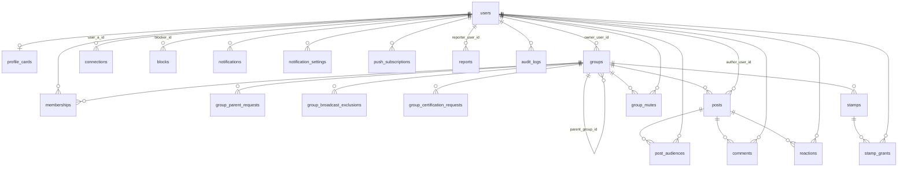

# 詳細設計書 03 — データベース物理設計

| 項目 | 内容 |
|---|---|
| 文書名 | データベース物理設計 |
| バージョン | 1.0 |
| 作成日 | 2026-08-17 |
| ステータス | レビュー中 |
| 対象工程 | 工程1（詳細設計） |
| 上位文書 | [基本設計書](01_basic_design.md) / [アーキテクチャ](02_architecture.md) |

### 本書の位置づけ

基本設計書 第9章の概念データモデルを、PostgreSQL の物理設計へ落とし込む。あわせて、[アーキテクチャ](02_architecture.md) 第4章で定めた堅牢性の設計を、**制約とインデックスとしてデータベースに実装する**。

本書の中心的な考え方は、**守れるものはすべてデータベースに守らせる**ことである。1人開発では、アプリケーションのコードレビューによる品質担保に限界がある。一意性・参照整合性・状態の妥当性をデータベース制約として表現しておけば、アプリケーションにバグがあってもデータは壊れない。

---

## 目次

1. [設計方針](#1-設計方針)
2. [テーブル一覧](#2-テーブル一覧)
3. [ER図](#3-er図)
4. [テーブル定義](#4-テーブル定義)
5. [主要クエリの設計](#5-主要クエリの設計)
6. [インデックス方針](#6-インデックス方針)
7. [マイグレーション方針](#7-マイグレーション方針)
8. [意思決定履歴](#8-意思決定履歴)

---

## 1. 設計方針

### 1.1 命名規則

| 対象 | 規則 | 例 |
|---|---|---|
| テーブル名 | 複数形・スネークケース | `groups`, `post_audiences` |
| 列名 | スネークケース | `parent_group_id` |
| 主キー | `id` | |
| 外部キー | `<単数形>_id` | `group_id`, `author_user_id` |
| 真偽値 | `is_` / `has_` を付けない。状態は列挙で表す | `status`（`is_active` としない） |
| 日時 | `_at` で終える | `created_at`, `left_at` |
| インデックス | `idx_<テーブル>_<列>` | `idx_memberships_user_status` |
| 制約 | `uq_` / `ck_` / `fk_` を接頭辞とする | `uq_groups_name_normalized` |

### 1.2 共通の型方針

| 項目 | 方針 | 理由 |
|---|---|---|
| 主キー | `uuid`（`gen_random_uuid()`） | QRやURLに識別子が現れるため、連番だと他の資源を推測できてしまう |
| 日時 | `timestamptz` | タイムゾーンを持たない型は、将来必ず問題になる |
| 文字列の状態値 | **`text` ＋ `CHECK` 制約**（PostgreSQL の `ENUM` 型は使わない） | 値の追加・変更が単純なマイグレーションで済む。仕様が動く段階では変更容易性を優先する。型安全性は TypeScript 側の union 型で確保する |
| 柔軟な構造 | `jsonb` | スタンプのデザイン定義、カードの外部リンクなど、構造が定まりきらないもののみ |
| 削除 | **物理削除しない。状態列で表す** | 記録を無期限に保持する方針（基本設計書 決定43）と、参照整合性の保護のため |

### 1.3 共通列

すべてのテーブルに次を持たせる（関連テーブルで複合主キーを用いるものを除く）。

| 列 | 型 | 内容 |
|---|---|---|
| `id` | `uuid` | 主キー。既定値 `gen_random_uuid()` |
| `created_at` | `timestamptz` | 既定値 `now()` |
| `updated_at` | `timestamptz` | 既定値 `now()`。更新時にトリガで自動更新 |

### 1.4 状態を持つテーブルの原則

物理削除を行わないため、状態列（`status`）を持つテーブルが多くなる。ここで次の規律を設ける。

- **状態の遷移はアプリケーションで制御し、到達可能な値だけを `CHECK` 制約で列挙する**
- **状態と日時をセットで持つ。** 「いつその状態になったか」が追えないと、障害時に何も分からなくなる
- **一覧の取得では状態による絞り込みを必ず行う。** 絞り込み忘れを防ぐため、頻出する組み合わせには部分インデックスを張り、意図しない全件走査を性能面からも検知できるようにする

---

## 2. テーブル一覧

| # | テーブル | 内容 | 対応する概念モデル |
|---|---|---|---|
| 1 | `users` | 利用者 | `User` |
| 2 | `profile_cards` | プロフィールカード | `ProfileCard` |
| 3 | `groups` | グループ | `Group` |
| 4 | `group_parent_requests` | 親グループの設定申請 | `Group.親子関係状態` を分離 |
| 5 | `group_broadcast_exclusions` | 配下配信の経路切断 | 決定31 |
| 6 | `group_certification_requests` | 認証バッジの申請 | `Group.認証状態` を分離 |
| 7 | `memberships` | 所属 | `Membership` |
| 8 | `posts` | 連絡 | `Post` |
| 9 | `post_audiences` | 配信対象スナップショット | `PostAudience` |
| 10 | `comments` | コメント | `Comment` |
| 11 | `reactions` | リアクション | `Reaction` |
| 12 | `stamps` | スタンプ | `Stamp` |
| 13 | `stamp_grants` | スタンプの獲得 | `StampGrant` |
| 14 | `connections` | つながり | `Connection` |
| 15 | `blocks` | ブロック | `Block` |
| 16 | `group_mutes` | グループ単位ミュート | `GroupMute` |
| 17 | `notifications` | 通知 | `Notification` |
| 18 | `notification_settings` | 通知チャンネル設定 | `NotificationSetting` |
| 19 | `push_subscriptions` | プッシュ購読情報 | 物理設計で追加 |
| 20 | `reports` | 通報 | `Report` |
| 21 | `audit_logs` | 監査ログ | `AuditLog` |

**概念モデルから分離した3テーブルについて。** 基本設計では `Group` が親子関係状態と認証状態を直接持っていたが、物理設計では申請テーブルへ分離する。理由は次のとおり。

- 却下・再申請の履歴が残る（監査と、運営の判断の一貫性のために必要）
- 承認済みの親だけが `groups.parent_group_id` に入るため、**配信のクエリが「承認済みかどうか」を意識しなくてよくなる**。第4.2節（アーキテクチャ）の再帰探索が単純になる

---

## 3. ER図



---

## 4. テーブル定義

### 4.1 users

利用者。退会後も行は残り、個人を特定する情報のみが削除される（基本設計書 決定43）。

| 列 | 型 | 制約 | 内容 |
|---|---|---|---|
| `id` | `uuid` | PK | |
| `auth_user_id` | `uuid` | UNIQUE, NULL可 | 認証基盤側のID。退会時に `NULL` にする |
| `display_name` | `text` | NULL可 | 表示名。退会時に `NULL` |
| `email` | `text` | NULL可 | 退会時に `NULL` |
| `status` | `text` | NOT NULL, CHECK | `active` / `suspended` / `withdrawn` |
| `withdrawn_at` | `timestamptz` | NULL可 | |
| `created_at` | `timestamptz` | NOT NULL | |
| `updated_at` | `timestamptz` | NOT NULL | |

- `ck_users_withdrawn`：`status = 'withdrawn'` のとき `display_name`・`email`・`auth_user_id` がすべて `NULL` であること

**この制約が退会処理の正しさを保証する。** 「退会したのに個人情報が残っている」状態をデータベースが拒否するため、アプリケーション側の削除漏れが本番データに残らない。

### 4.2 profile_cards

プロフィールカード。退会時に**物理削除する**（本テーブルは例外）。他者のコレクションからも消えるため。

| 列 | 型 | 制約 | 内容 |
|---|---|---|---|
| `user_id` | `uuid` | PK, FK→users | |
| `display_name` | `text` | NOT NULL | |
| `avatar_path` | `text` | NULL可 | ストレージ上の位置 |
| `bio` | `text` | NULL可 | 自己紹介 |
| `external_links` | `jsonb` | NOT NULL, 既定 `[]` | 外部サービスへのリンク |
| `shows_affiliation` | `boolean` | NOT NULL, 既定 `true` | 所属を表示するか（決定38） |
| `design` | `jsonb` | NOT NULL, 既定 `{}` | カードデザイン |
| `qr_token` | `text` | NOT NULL, UNIQUE | カードQRの識別子。推測不可能な値 |
| `qr_token_rotated_at` | `timestamptz` | NOT NULL | 盗撮対策。利用者が再発行できる |

### 4.3 groups

| 列 | 型 | 制約 | 内容 |
|---|---|---|---|
| `id` | `uuid` | PK | |
| `name` | `text` | NOT NULL | 表示用。利用者が入力したまま |
| `name_normalized` | `text` | NOT NULL, **UNIQUE** | 一意性の判定用（第4.4節：アーキテクチャ） |
| `kind` | `text` | NOT NULL, CHECK | `official` / `project` / `event` / `other` |
| `owner_user_id` | `uuid` | NOT NULL, FK→users | オーナー |
| `parent_group_id` | `uuid` | NULL可, FK→groups | **承認済みの親のみ** |
| `join_policy` | `text` | NOT NULL, CHECK | `invite` / `request` / `open` |
| `is_certified` | `boolean` | NOT NULL, 既定 `false` | 認証バッジ |
| `description` | `text` | NULL可 | |
| `expires_at` | `timestamptz` | NULL可 | 期限 |
| `status` | `text` | NOT NULL, CHECK | `active` / `archived` / `dormant` |
| `join_qr_token` | `text` | NOT NULL, UNIQUE | 参加QRの識別子 |
| `archived_at` / `dormant_at` | `timestamptz` | NULL可 | |

- `uq_groups_name_normalized`：`UNIQUE(name_normalized)` — **グループ名の全国一意をデータベースで担保する**
- `ck_groups_not_self_parent`：`parent_group_id IS DISTINCT FROM id`

**`name_normalized` の生成規則**（アーキテクチャ 第4.4節）

1. 前後の空白を除去し、連続する空白を1つにまとめる
2. Unicode 正規化（NFKC）— 全角英数字が半角に統一される
3. 英字を小文字に統一

アプリケーション側で生成して格納する。生成列（`GENERATED ALWAYS AS`）は使わない。NFKC 正規化を PostgreSQL の関数だけで完結させると可読性を損ない、規則を変えたときの再計算も難しくなるためである。

### 4.4 group_parent_requests

親グループの設定申請。承認されて初めて `groups.parent_group_id` が設定される。

| 列 | 型 | 制約 | 内容 |
|---|---|---|---|
| `id` | `uuid` | PK | |
| `child_group_id` | `uuid` | NOT NULL, FK→groups | 申請する側 |
| `parent_group_id` | `uuid` | NOT NULL, FK→groups | 親になる側 |
| `requested_by_user_id` | `uuid` | NOT NULL, FK→users | |
| `status` | `text` | NOT NULL, CHECK | `pending` / `approved` / `rejected` / `withdrawn` |
| `decided_by_user_id` | `uuid` | NULL可, FK→users | |
| `decided_at` | `timestamptz` | NULL可 | |

- `uq_gpr_pending`：`UNIQUE(child_group_id) WHERE status = 'pending'` — **1つのグループが同時に複数の親へ申請することを防ぐ**部分ユニークインデックス
- `ck_gpr_not_self`：`child_group_id <> parent_group_id`

### 4.5 group_broadcast_exclusions

上位グループが、自ツリー内の子孫との配信経路を切断した記録（決定31）。

| 列 | 型 | 制約 | 内容 |
|---|---|---|---|
| `ancestor_group_id` | `uuid` | NOT NULL, FK→groups | 切断した側（上位） |
| `excluded_group_id` | `uuid` | NOT NULL, FK→groups | 除外される側 |
| `excluded_by_user_id` | `uuid` | NOT NULL, FK→users | |
| `created_at` | `timestamptz` | NOT NULL | |

- 主キー：`(ancestor_group_id, excluded_group_id)`

**切断は「上位グループごと」に効く。** 東京連絡会が「あさひ隊」を切断しても、直上の親であるすみだ協議会からの配信には引き続き含まれる。切断はあくまで「その上位グループの配下配信から外す」という意味であり、親子関係そのものを断つわけではない。除外されたグループの**配下も併せて対象外になる**（第5.1節）。

### 4.6 group_certification_requests

| 列 | 型 | 制約 | 内容 |
|---|---|---|---|
| `id` | `uuid` | PK | |
| `group_id` | `uuid` | NOT NULL, FK→groups | |
| `requested_by_user_id` | `uuid` | NOT NULL, FK→users | |
| `status` | `text` | NOT NULL, CHECK | `pending` / `approved` / `rejected` |
| `decided_by_user_id` | `uuid` | NULL可, FK→users | システム管理者 |
| `decided_at` | `timestamptz` | NULL可 | |
| `note` | `text` | NULL可 | 判断の記録（運用ガイドラインとの突合に用いる） |

- `uq_gcr_pending`：`UNIQUE(group_id) WHERE status = 'pending'`

### 4.7 memberships

| 列 | 型 | 制約 | 内容 |
|---|---|---|---|
| `id` | `uuid` | PK | |
| `group_id` | `uuid` | NOT NULL, FK→groups | |
| `user_id` | `uuid` | NOT NULL, FK→users | |
| `status` | `text` | NOT NULL, CHECK | `invited` / `requested` / `active` / `rejected` / `left` |
| `role` | `text` | NOT NULL, CHECK | `admin` / `member` |
| `invited_by_user_id` | `uuid` | NULL可, FK→users | |
| `joined_at` | `timestamptz` | NULL可 | `active` になった日時 |
| `left_at` | `timestamptz` | NULL可 | |

- `uq_memberships_group_user`：`UNIQUE(group_id, user_id)`
- `idx_memberships_admin`：`(group_id) WHERE role = 'admin' AND status = 'active'` — **管理者数のロック付き取得に用いる**（アーキテクチャ 第4.5節）
- `idx_memberships_user_active`：`(user_id) WHERE status = 'active'`

### 4.8 posts

| 列 | 型 | 制約 | 内容 |
|---|---|---|---|
| `id` | `uuid` | PK | |
| `group_id` | `uuid` | NOT NULL, FK→groups | |
| `author_user_id` | `uuid` | NOT NULL, FK→users | |
| `body` | `text` | NOT NULL | |
| `scope` | `text` | NOT NULL, CHECK | `self` / `descendants` |
| `event_at` | `timestamptz` | NULL可 | 任意の日時。カレンダー登録に用いる |
| `status` | `text` | NOT NULL, CHECK | `published` / `deleted` |
| `edited_at` | `timestamptz` | NULL可 | 設定されていれば「編集済み」と表示する |
| `deleted_at` | `timestamptz` | NULL可 | |

### 4.9 post_audiences

配信対象のスナップショット（決定33）。本アプリで最も行数が増えるテーブル。

| 列 | 型 | 制約 | 内容 |
|---|---|---|---|
| `post_id` | `uuid` | NOT NULL, FK→posts | |
| `user_id` | `uuid` | NOT NULL, FK→users | |
| `source_group_id` | `uuid` | NOT NULL, FK→groups | **連絡を投稿したグループ。**ミュート判定に用いる（決定 T-18） |
| `post_created_at` | `timestamptz` | NOT NULL | `posts.created_at` の複製 |

- 主キー：`(post_id, user_id)`
- `idx_post_audiences_timeline`：`(user_id, post_created_at DESC)`

**`post_created_at` を複製する理由。** タイムラインは「自分宛の連絡を新しい順に取得する」クエリであり、本テーブルだけで並べ替えを完結させたい。`posts` と結合してから並べ替えると、対象が増えたときに一時領域での並べ替えが発生する。投稿日時は作成後に変化しないため、複製しても不整合は起きない。

### 4.10 comments

| 列 | 型 | 制約 | 内容 |
|---|---|---|---|
| `id` | `uuid` | PK | |
| `post_id` | `uuid` | NOT NULL, FK→posts | |
| `author_user_id` | `uuid` | NOT NULL, FK→users | |
| `body` | `text` | NOT NULL | |
| `status` | `text` | NOT NULL, CHECK | `published` / `deleted` |
| `edited_at` / `deleted_at` | `timestamptz` | NULL可 | |

### 4.11 reactions

| 列 | 型 | 制約 | 内容 |
|---|---|---|---|
| `post_id` | `uuid` | NOT NULL, FK→posts | |
| `user_id` | `uuid` | NOT NULL, FK→users | |
| `kind` | `text` | NOT NULL, CHECK | `ack`（了解） / `joining`（参加したい） |
| `created_at` | `timestamptz` | NOT NULL | |

- 主キー：`(post_id, user_id, kind)`

**種別ごとに1行とする。** 「了解」と「参加したい」は排他ではなく、両方を付けられる。

`kind = 'joining'` を付けた利用者は、同じ連絡の配信対象者に**表示名とアバターが公開される**（決定36）。`kind = 'ack'` は個人が特定される形では表示せず、件数のみを示す（基本設計書 第7.3節の注意書き）。

### 4.12 stamps

| 列 | 型 | 制約 | 内容 |
|---|---|---|---|
| `id` | `uuid` | PK | |
| `group_id` | `uuid` | NOT NULL, FK→groups | |
| `name` | `text` | NOT NULL | |
| `activity_date` | `date` | NOT NULL | |
| `design` | `jsonb` | NOT NULL | テンプレート種別とパラメータ、または画像の位置 |
| `acquisition_method` | `text` | NOT NULL, CHECK | `venue_qr` / `roll_call`（決定39） |
| `qr_token` | `text` | NULL可, UNIQUE | `venue_qr` のときのみ発行 |
| `valid_from` | `timestamptz` | NOT NULL | |
| `valid_until` | `timestamptz` | NOT NULL | |

- `ck_stamps_valid_period`：`valid_from < valid_until`
- `ck_stamps_qr_token`：`acquisition_method = 'venue_qr'` のときのみ `qr_token IS NOT NULL`

### 4.13 stamp_grants

| 列 | 型 | 制約 | 内容 |
|---|---|---|---|
| `stamp_id` | `uuid` | NOT NULL, FK→stamps | |
| `user_id` | `uuid` | NOT NULL, FK→users | |
| `method` | `text` | NOT NULL, CHECK | `venue_qr` / `roll_call` / `manual` |
| `granted_by_user_id` | `uuid` | NULL可, FK→users | 点呼・手動付与のとき |
| `status` | `text` | NOT NULL, CHECK | `valid` / `revoked` |
| `granted_at` / `revoked_at` | `timestamptz` | | |

- 主キー：`(stamp_id, user_id)` — **二度押しや再送での重複付与を構造的に防ぐ**（アーキテクチャ 第4.6節）

### 4.14 connections

| 列 | 型 | 制約 | 内容 |
|---|---|---|---|
| `user_a_id` | `uuid` | NOT NULL, FK→users | |
| `user_b_id` | `uuid` | NOT NULL, FK→users | |
| `status` | `text` | NOT NULL, CHECK | `active` / `released` |
| `established_at` / `released_at` | `timestamptz` | | |

- 主キー：`(user_a_id, user_b_id)`
- `ck_connections_order`：**`user_a_id < user_b_id`**

**この `CHECK` 制約が要である。** 2人の組み合わせを常に同じ順序で格納することで、`(A,B)` と `(B,A)` が別々の行として作られることを防ぐ。アプリケーション側で並べ替えを忘れても、データベースが拒否する。

### 4.15 blocks

| 列 | 型 | 制約 | 内容 |
|---|---|---|---|
| `blocker_id` | `uuid` | NOT NULL, FK→users | |
| `blocked_id` | `uuid` | NOT NULL, FK→users | |
| `created_at` | `timestamptz` | NOT NULL | |

- 主キー：`(blocker_id, blocked_id)`
- `ck_blocks_not_self`：`blocker_id <> blocked_id`

**ブロックは一方向である。** `connections` と異なり順序の正規化は行わない。AがBをブロックしても、BはAをブロックしていない。

### 4.16 group_mutes

| 列 | 型 | 制約 | 内容 |
|---|---|---|---|
| `user_id` | `uuid` | NOT NULL, FK→users | |
| `group_id` | `uuid` | NOT NULL, FK→groups | **配信元グループ**（決定32） |
| `created_at` | `timestamptz` | NOT NULL | |

- 主キー：`(user_id, group_id)`

**`group_id` は所属グループとは限らない。** 上位グループからの配下配信を静かにするため、自分が所属していないグループもミュートできる。外部キーは `groups` を参照し、`memberships` は参照しない。

### 4.17 notifications / notification_settings / push_subscriptions

**notifications**

| 列 | 型 | 制約 | 内容 |
|---|---|---|---|
| `id` | `uuid` | PK | |
| `user_id` | `uuid` | NOT NULL, FK→users | |
| `channel` | `text` | NOT NULL, CHECK | `N1`〜`N8`（基本設計書 第10.2節） |
| `body` | `text` | NOT NULL | |
| `link` | `text` | NOT NULL | 遷移先。**必ず持つ**（基本設計書 第10.1節 原則5） |
| `read_at` | `timestamptz` | NULL可 | |

- `idx_notifications_user`：`(user_id, created_at DESC)`

**notification_settings**

| 列 | 型 | 制約 | 内容 |
|---|---|---|---|
| `user_id` | `uuid` | NOT NULL, FK→users | |
| `channel` | `text` | NOT NULL, CHECK | |
| `enabled` | `boolean` | NOT NULL, 既定 `true` | |

- 主キー：`(user_id, channel)`
- `ck_ns_n8_always`：`channel <> 'N8' OR enabled = true` — **N8（運営からのお知らせ）はOFFにできない**（基本設計書 第10.2節）

**push_subscriptions**

| 列 | 型 | 制約 | 内容 |
|---|---|---|---|
| `id` | `uuid` | PK | |
| `user_id` | `uuid` | NOT NULL, FK→users | |
| `endpoint` | `text` | NOT NULL, UNIQUE | Push Service のエンドポイント |
| `p256dh` / `auth` | `text` | NOT NULL | 暗号鍵 |
| `failure_count` | `integer` | NOT NULL, 既定 `0` | |
| `last_failure_at` | `timestamptz` | NULL可 | |

1人が複数の端末を使うため、`user_id` に対して複数行を許す。

### 4.18 reports

| 列 | 型 | 制約 | 内容 |
|---|---|---|---|
| `id` | `uuid` | PK | |
| `reporter_user_id` | `uuid` | NOT NULL, FK→users | |
| `target_type` | `text` | NOT NULL, CHECK | `post` / `comment` / `card` / `stamp` / `group` |
| `target_id` | `uuid` | NOT NULL | **外部キーは張らない**（対象が複数テーブルにまたがるため） |
| `reason` | `text` | NOT NULL | |
| `status` | `text` | NOT NULL, CHECK | `pending` / `in_progress` / `resolved` / `dismissed` |
| `handled_by_user_id` | `uuid` | NULL可, FK→users | |
| `handled_at` | `timestamptz` | NULL可 | |

### 4.19 audit_logs

匿名性ポリシー（基本設計書 第12.2節）を成立させる基盤。**無期限に保持する**（決定43）。

| 列 | 型 | 制約 | 内容 |
|---|---|---|---|
| `id` | `uuid` | PK | |
| `user_id` | `uuid` | NULL可, FK→users | 退会後も行は残る |
| `action` | `text` | NOT NULL | 操作の種別 |
| `target_type` | `text` | NULL可 | |
| `target_id` | `uuid` | NULL可 | |
| `ip_address` | `inet` | NULL可 | |
| `user_agent` | `text` | NULL可 | |
| `created_at` | `timestamptz` | NOT NULL | |

- `idx_audit_logs_user`：`(user_id, created_at DESC)`
- `idx_audit_logs_target`：`(target_type, target_id)`

**書き込み専用として扱う。** 更新・削除は行わない。参照はシステム管理者による照合時のみである。

---

## 5. 主要クエリの設計

本アプリの正しさは、次の4つのクエリに集約される。

### 5.1 配下配信の対象決定

「あるグループとその配下すべてに所属する利用者」を求める。アーキテクチャ 第4.2節の条件をすべて満たす。

```sql
WITH RECURSIVE subtree AS (
    -- 起点：投稿元のグループ
    SELECT g.id, 0 AS depth
      FROM groups g
     WHERE g.id = :origin_group_id
       AND g.status = 'active'

    UNION ALL

    -- 再帰：子をたどる
    SELECT c.id, s.depth + 1
      FROM groups c
      JOIN subtree s ON c.parent_group_id = s.id
     WHERE c.status = 'active'                    -- アーカイブ・休眠はその配下ごと除外
       AND s.depth < 10                           -- 深さ上限
       AND NOT EXISTS (                           -- 経路が切断されていない
           SELECT 1 FROM group_broadcast_exclusions e
            WHERE e.ancestor_group_id = :origin_group_id
              AND e.excluded_group_id = c.id
       )
)
SELECT DISTINCT
       m.user_id,
       :origin_group_id AS source_group_id       -- 配信元＝連絡を投稿したグループ
  FROM memberships m
  JOIN subtree s ON s.id = m.group_id
  JOIN users u ON u.id = m.user_id
 WHERE m.status = 'active'
   AND u.status = 'active';
```

**設計上の要点**

| 要点 | 内容 |
|---|---|
| `parent_group_id` は承認済みのみ | 承認前の親子関係はそもそも `groups` に反映されないため（第2章）、クエリ側で状態を意識しなくてよい |
| アーカイブ・休眠はその配下ごと除外 | 再帰の継続条件に含めているため、休眠グループの下にぶら下がる孫も自動的に除外される |
| 切断は起点グループごとに判定 | `ancestor_group_id = :origin_group_id` で絞る。直上の親からの配信には影響しない |
| 重複排除 | `DISTINCT` で1人1件に絞る（基本設計書 第9.3節 規則1） |
| 配信元グループの記録 | **連絡を投稿したグループ**を記録する（決定 T-18）。対象者の所属グループではない |
| 停止・退会した利用者の除外 | `users.status = 'active'` で絞る。ログインできない利用者を対象に含めない |
| 深さ上限 | 万一の循環に対する最後の防御。上限に達した場合は記録を残す |

`PostgreSQL` の再帰CTEには訪問済み管理の組み込み機能（`CYCLE` 句、PostgreSQL 14以降）もある。実装時には `CYCLE id SET is_cycle USING path` の採用を検討する。

### 5.2 統合タイムラインの取得

```sql
SELECT p.*, pa.source_group_id
  FROM post_audiences pa
  JOIN posts p ON p.id = pa.post_id
 WHERE pa.user_id = :user_id
   AND p.status = 'published'
   AND pa.post_created_at < :cursor          -- カーソル方式のページング
 ORDER BY pa.post_created_at DESC
 LIMIT 20;
```

`idx_post_audiences_timeline (user_id, post_created_at DESC)` により、並べ替えなしで取得できる。

**ページングはカーソル方式とする。** `OFFSET` は件数が増えるほど遅くなり、また読んでいる間に新しい連絡が届くと表示がずれる。タイムラインのように先頭が伸び続ける一覧では、カーソル方式でなければ正しく動かない。

### 5.3 管理者数のロック付き確認

「唯一の管理者は後任を指名するまで離脱できない」（決定34）を、同時実行に対して正しく実装する（アーキテクチャ 第4.5節）。

```sql
BEGIN;

-- 対象グループの管理者行をロックして取得する
SELECT user_id
  FROM memberships
 WHERE group_id = :group_id
   AND role = 'admin'
   AND status = 'active'
   FOR UPDATE;

-- 取得できた行が 1 件以下なら中止（自分しかいない）

UPDATE memberships
   SET role = 'member'
 WHERE group_id = :group_id AND user_id = :user_id;

COMMIT;
```

> **`count(*)` と `FOR UPDATE` は併用できない。** PostgreSQL は
> 「FOR UPDATE is not allowed with aggregate functions」として拒否する。
> 行を取得してロックし、**件数はアプリケーション側で数える**。
> （本書 v1.0 では集約と併用する SQL を記載していたが、実行できないため改めた）

**`FOR UPDATE` がないと、2人の管理者が同時に辞任したときに両方が成功する。** それぞれが「自分以外にもう1人いる」と判定するためである。行ロックにより、後から来た側は先の処理の完了を待ち、更新後の状態を見る。

ロックがかかるのは既存の管理者行である。新たな管理者が同時に追加されること（ファントム）は防げないが、それは件数を増やす方向であり、守りたい不変条件（管理者を0人にしない）は破られない。

同じ配慮を、脱退・権限剥奪・オーナー移譲にも適用する。

### 5.4 プッシュ送信対象の決定

基本設計の3段階の絞り込み（アーキテクチャ 第6.2節）を1つのクエリで表す。

```sql
SELECT ps.endpoint, ps.p256dh, ps.auth
  FROM post_audiences pa
  JOIN users u  ON u.id = pa.user_id AND u.status = 'active'
  JOIN push_subscriptions ps ON ps.user_id = pa.user_id
 WHERE pa.post_id = :post_id
   -- 段階2：チャンネルが有効
   AND NOT EXISTS (
       SELECT 1 FROM notification_settings ns
        WHERE ns.user_id = pa.user_id AND ns.channel = 'N1' AND ns.enabled = false
   )
   -- 段階3：配信元グループがミュートされていない
   AND NOT EXISTS (
       SELECT 1 FROM group_mutes gm
        WHERE gm.user_id = pa.user_id AND gm.group_id = pa.source_group_id
   );
```

**段階3が決定32の実装である。** ミュートの判定に `pa.source_group_id` を用いるため、配下配信であっても「県連盟からの連絡だけを静かにする」が成立する。所属グループを基準にしていたら、この判定は書けない。

---

## 6. インデックス方針

| 方針 | 内容 |
|---|---|
| 外部キーには索引を張る | PostgreSQL は外部キーに自動で索引を作らない。親行の削除・更新時に子テーブルの全件走査が発生する |
| 状態で絞る一覧には部分索引 | `WHERE status = 'active'` のように常に付く条件は索引に含める。索引が小さくなり、絞り込み忘れも検知しやすい |
| 索引は必要になってから足す | 想定規模（登録者1,000〜1,500人）では、多くのクエリが索引なしでも十分速い。**推測で索引を増やさない** |
| 検証 | 主要クエリについて実行計画を確認し、意図した索引が使われることを確かめる |

### 主要な索引

| テーブル | 索引 | 用途 |
|---|---|---|
| `post_audiences` | `(user_id, post_created_at DESC)` | タイムライン（第5.2節） |
| `memberships` | `(group_id) WHERE role='admin' AND status='active'` | 管理者数の確認（第5.3節） |
| `memberships` | `(user_id) WHERE status='active'` | 所属一覧 |
| `groups` | `(parent_group_id)` | 再帰探索（第5.1節） |
| `groups` | `(name_normalized)`（UNIQUE） | 一意性の担保と名称検索 |
| `notifications` | `(user_id, created_at DESC)` | 通知一覧 |
| `audit_logs` | `(user_id, created_at DESC)` / `(target_type, target_id)` | 発信者情報の照合 |

**グループ名の検索について。** 部分一致検索を行う場合、`name_normalized` への `UNIQUE` 索引（B-tree）は前方一致にしか効かない。中間一致が必要になった時点で `pg_trgm` 拡張と GIN 索引の追加を検討する。**現時点では追加しない**（方針「必要になってから足す」に従う）。

---

## 7. マイグレーション方針

| 項目 | 方針 |
|---|---|
| ツール | Drizzle のマイグレーション機能。手作業でのスキーマ変更は行わない |
| 適用 | 前進のみ。巻き戻しスクリプトは用意しない |
| 破壊的変更 | 列の削除・改名は「追加 → 両方に書く → 読み替え → 削除」の4段階で行う |
| データ投入 | 初期データ（通知チャンネルの既定値など）はマイグレーションに含める |

**巻き戻しスクリプトを用意しない理由。** 1人開発では、めったに実行されない巻き戻し手順は検証されないまま古びる。検証されていない巻き戻しは、障害時にかえって状況を悪化させる。前進のみと決め、破壊的変更を4段階に分けることで、戻る必要が生じない状態を作る（アーキテクチャ 第9章）。

---

## 8. 意思決定履歴

| # | 項目 | 決定 | 日付 | 理由 |
|---|---|---|---|---|
| T-14 | 状態値の型 | PostgreSQL の `ENUM` 型を使わず、`text` ＋ `CHECK` 制約とする | 2026-08-17 | 値の追加・変更が単純なマイグレーションで済む。仕様が動く段階では変更容易性を優先する。型安全は TypeScript 側で確保する |
| T-15 | 主キー | `uuid`（`gen_random_uuid()`） | 2026-08-17 | 識別子がQRやURLに現れるため、連番だと他の資源を推測できる |
| T-16 | 削除の扱い | 物理削除せず状態列で表す。ただし `profile_cards` は退会時に物理削除する | 2026-08-17 | 記録の無期限保持（決定43）と参照整合性の保護。カードのみ例外なのは、他者のコレクションからも消す必要があるため |
| T-17 | 親子関係と認証の分離 | `groups` から申請テーブルへ分離し、`groups.parent_group_id` には承認済みのみを入れる | 2026-08-17 | 却下・再申請の履歴が残る。配信のクエリが承認状態を意識しなくてよくなり、再帰探索が単純になる |
| T-18 | 配信元グループの定義 | `source_group_id` には**連絡を投稿したグループ**を記録する（対象者の所属グループではない） | 2026-08-17 | 所属グループを基準にすると、県連盟の配下配信を静かにするために自分の団をミュートすることになり、団自身の連絡まで消える。基本設計書 第10.3節が避けようとしている失敗そのものになる |
| T-19 | タイムラインの並べ替え | `post_audiences` に `post_created_at` を複製し、単一テーブルで並べ替えを完結させる | 2026-08-17 | 結合後の並べ替えを避ける。投稿日時は変化しないため不整合が起きない |
| T-20 | ページング | カーソル方式とする（`OFFSET` を使わない） | 2026-08-17 | 先頭が伸び続ける一覧では `OFFSET` は表示がずれる。件数が増えたときの劣化も避けられる |
| T-21 | つながりの正規化 | `CHECK (user_a_id < user_b_id)` を課す | 2026-08-17 | `(A,B)` と `(B,A)` の二重登録を、アプリの実装に依存せずデータベースで防ぐ |
| T-22 | 退会の担保 | `CHECK` 制約で「退会状態なら個人特定情報がすべて NULL」を強制する | 2026-08-17 | アプリケーションの削除漏れが本番データに残らないようにする |
| T-23 | 通報対象への外部キー | `reports.target_id` に外部キーを張らない | 2026-08-17 | 対象が複数テーブルにまたがるため。整合性はアプリケーションで担保し、対象消失時は通報を `dismissed` として扱う |
| T-24 | マイグレーション | 前進のみとし、巻き戻しスクリプトを用意しない | 2026-08-17 | 検証されない巻き戻し手順は障害時に状況を悪化させる。破壊的変更を4段階に分けて戻る必要をなくす |
| T-25 | 索引 | 推測で増やさず、必要になってから追加する | 2026-08-17 | 想定規模では多くのクエリが索引なしでも十分速い。索引は書き込みの負担と保守対象を増やす |

### 実装時に検証する事項

| # | 項目 | 判断の基準 |
|---|---|---|
| 1 | 再帰CTEの実行計画 | 想定される最大のツリーで、探索が索引を用いること |
| 2 | `CYCLE` 句の採用可否 | PostgreSQL 14以降の `CYCLE` 句で循環検出を簡潔に書けるか |
| 3 | タイムラインの実行計画 | `idx_post_audiences_timeline` が使われ、並べ替えが発生しないこと |
| 4 | `post_audiences` の増加量 | 無期限保持の方針（決定43）に対し、容量が現実的な範囲に収まるか |
