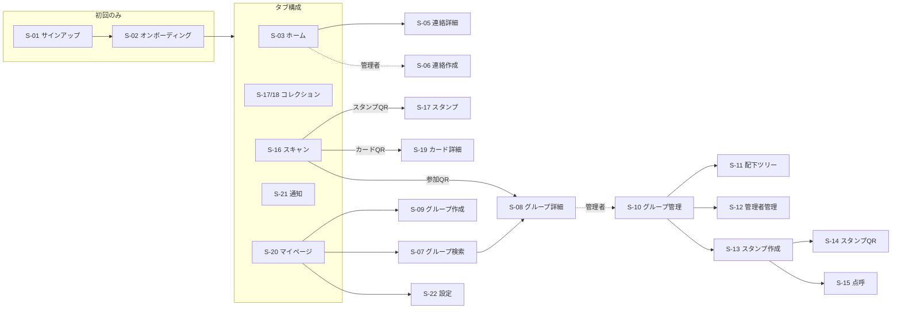

# 詳細設計書 06 — 画面詳細設計

| 項目 | 内容 |
|---|---|
| 文書名 | 画面詳細設計 |
| バージョン | 1.0 |
| 作成日 | 2026-08-17 |
| ステータス | レビュー中 |
| 対象工程 | 工程1（詳細設計） |
| 上位文書 | [基本設計書](01_basic_design.md) / [UIデザインシステム](05_ui_design_system.md) / [API仕様](04_api_spec.md) |

### 本書の位置づけ

基本設計書 第11章で定めた画面一覧（S-01〜S-27）を、実装できる粒度まで具体化する。部品の定義は [UIデザインシステム](05_ui_design_system.md) に、操作の定義は [API仕様](04_api_spec.md) にあり、本書はそれらの**組み合わせ方**を定める。

本書ではMVP対象の S-01〜S-24 を扱う。Phase 2 以降の S-25〜S-27 は該当フェーズで作成する。

---

## 目次

1. [共通事項](#1-共通事項)
2. [画面遷移](#2-画面遷移)
3. [オンボーディング](#3-オンボーディング)
4. [ホームタブ](#4-ホームタブ)
5. [コレクションタブ](#5-コレクションタブ)
6. [スキャンタブ](#6-スキャンタブ)
7. [通知タブ](#7-通知タブ)
8. [マイページタブ](#8-マイページタブ)
9. [運営管理](#9-運営管理)
10. [意思決定履歴](#10-意思決定履歴)

---

## 1. 共通事項

### 1.1 画面の骨格

```
┌────────────────────────────┐
│ ← タイトル            [操作] │  ヘッダー（56px）
├────────────────────────────┤
│                            │
│         コンテンツ           │  スクロール領域
│                            │
├────────────────────────────┤
│  ホーム コレク ◉ 通知 マイ   │  タブバー（56px＋セーフエリア）
└────────────────────────────┘
```

| 項目 | 規則 |
|---|---|
| ヘッダー | タブの最上位画面ではタイトルのみ。下位画面では左に戻る |
| タブバー | タブの最上位画面と、その配下の一覧画面で表示。**入力・スキャン中は隠す** |
| スクロール | ヘッダーは固定。タブバーも固定 |

### 1.2 4つの状態

すべての一覧・詳細画面は、次の4状態を持つ（デザインシステム 原則4）。

| 状態 | 表示 |
|---|---|
| 読み込み中 | 骨格表示（スケルトン）。スピナーは使わない |
| 内容あり | 通常表示 |
| 空 | 画面ごとに固有の空状態（デザインシステム 第6.8節） |
| 失敗 | 理由と再試行ボタン。**画面全体を潰さず、可能な範囲は表示する** |

**スケルトンを用いる理由。** スピナーは「何が出るか」が分からないが、骨格表示は出現する形をあらかじめ示すため、体感の待ち時間が短くなる。

### 1.3 エラーの提示

| 種別 | 提示 |
|---|---|
| 画面全体の失敗 | 画面内に理由と再試行 |
| 操作の失敗 | トースト（3秒）。**破壊的操作の失敗はトーストにせず、ダイアログで示す** |
| 入力の失敗 | 該当項目の直下に理由 |

文言は API仕様 第3章のエラーコードに対応させる。

### 1.4 オフライン

通信不能時は、画面上部に常時バーを表示する。

> ⚠ オフラインです。表示中の内容は最後に取得したものです。

**操作は受け付けず、押せない状態にする。** 送信できたように見せて後で失敗するより、できないと分かるほうがよい。

---

## 2. 画面遷移



---

## 3. オンボーディング

### S-01 サインアップ／ログイン

| 項目 | 内容 |
|---|---|
| 目的 | アカウントの作成と認証 |
| 構成 | ロゴ／メールアドレス／パスワード／主ボタン／切替リンク |
| 注意 | ログイン失敗時、アカウントの存在を推測させない一般的な文言を用いる（API仕様 第3.2節） |

### S-02 オンボーディング

**本アプリで最も重要な画面である。** ここで通知が設定されなければ、以降のすべての機能が届かない（基本設計書 第10.4節）。

4ステップで構成する。

```
┌────────────────────────────┐
│              ●●○○           │  進捗
│                            │
│   ホーム画面に追加してください   │  --fs-title
│                            │
│   ┌──────────────────────┐  │
│   │  [共有] → [ホーム画面に  │  │  端末に応じた図
│   │   追加] を選んでください   │  │
│   └──────────────────────┘  │
│                            │
│   追加しないと、連絡のお知らせ   │  --fs-body
│   が届きません。              │
│                            │
│   ┌──────────────────────┐  │
│   │        追加しました       │  │  Primary
│   └──────────────────────┘  │
│         あとで設定する         │  Ghost
└────────────────────────────┘
```

| # | ステップ | 内容 | スキップ |
|---|---|---|---|
| 1 | ホーム画面への追加 | 端末（iOS / Android）を判別して手順の図を出し分ける | 可 |
| 2 | 通知の許可 | ブラウザの許可ダイアログを出す前に、なぜ必要かを1文で示す | 可 |
| 3 | 表示名の設定 | プロフィールカードの最小項目 | 不可 |
| 4 | グループを探す | 検索画面へ。所属がなくても完了できる | 可 |

| 規則 | 内容 |
|---|---|
| iOS でホーム画面未追加 | ステップ1をスキップした場合、**ホームに常時バナーを表示**する（閉じられない） |
| 通知を拒否した場合 | 「設定から後で許可できます」と示し、マイページに導線を常設する |
| 許可ダイアログの前置き | ブラウザの許可は一度拒否されると再要求が難しい。**必ず前置きの画面を挟む** |

**ステップ1と2の順序を入れ替えない。** iOS ではホーム画面に追加していない状態で通知を要求しても権限が得られないため、追加を先に案内する。

---

## 4. ホームタブ

### S-03 統合タイムライン

本アプリの中心画面。

```
┌────────────────────────────┐
│ RoveringNow          [絞込] │
├────────────────────────────┤
│ すみだローバースカウト協議会 ✓ │
│ 10月12日の集会について        │
│                            │
│ 今週土曜、いつもの公民館に9時   │
│ 集合です。持ち物は…           │
│                            │
│ ●●● ＋3人が参加            │
│                            │
│ 了解 4      参加したい 6     │
├────────────────────────────┤
│ たまがわローバー会 ✓          │
│ …                          │
└────────────────────────────┘
```

| 項目 | 内容 |
|---|---|
| データ | `getTimeline`（カーソル方式、20件ずつ） |
| 並び | 投稿日時の降順 |
| 本文 | 4行で省略し、続きは詳細へ |
| グループ名 | 認証バッジを伴う。**タップでそのグループに絞り込む** |
| 参加意向 | 1人以上のときのみ表示（デザインシステム 第6.3節） |
| 更新 | 引き下げて再読み込み |
| 追加読み込み | 末尾に到達したら自動 |
| 投稿ボタン | **管理できるグループが1つ以上ある場合のみ**右下に表示 |

**空状態を2種類持つ。**

| 状況 | 表示 |
|---|---|
| どのグループにも所属していない | 「まだどのグループにも参加していません」＋グループを探すボタン |
| 所属はあるが連絡がない | 「新しい連絡はまだありません」 |

前者は行動を促し、後者は何もしなくてよいことを伝える。混同すると、所属済みの利用者に無用な焦りを与える。

### S-04 グループフィルタ

| 項目 | 内容 |
|---|---|
| 形式 | ボトムシート |
| 内容 | 「すべて」＋所属グループの一覧（各行にミュート状態を表示） |
| 選択 | 単一選択。選択するとシートを閉じ、タイムラインに反映 |
| 副次操作 | 各行の右端からミュートの切り替え |

**フィルタ画面にミュートを置く。** 「このグループの通知だけ止めたい」と思うのは、タイムラインでそのグループの連絡が多いと感じたときである。設定画面の奥ではなく、その場で操作できるようにする。

### S-05 連絡詳細

| 領域 | 内容 |
|---|---|
| 見出し | グループ名（認証バッジ）／投稿日時／「編集済み」表示 |
| 本文 | 全文。`--fs-body` / 行間1.8 |
| 日時 | `event_at` があればカードで示し、**カレンダーに追加**ボタンを置く |
| リアクション | 「了解」「参加したい」。押下で即時反映 |
| 参加者 | 「参加したい」を押した人の一覧（タップで全員表示） |
| コメント | 時系列。自分のものは編集・削除が可能 |
| 入力 | 画面下部に固定。フォーカス時はタブバーを隠す |
| 操作 | 投稿者なら編集・削除。それ以外は通報 |

**カレンダー追加をここに置く。** iOS でプッシュが届かない利用者にとって、OS標準のカレンダー通知が第二の到達経路になる（基本設計書 第10.4節）。

### S-06 連絡作成・編集

**誤配信の影響が最も大きい画面である。** 配下配信は数百人に届きうるうえ、届いた後に取り消せない（訂正は編集で行うが、既に読まれた内容は戻せない）。

```
┌────────────────────────────┐
│ ← 連絡を作成            [送信]│
├────────────────────────────┤
│ 送信元                      │
│ ┌────────────────────────┐ │
│ │ すみだローバースカウト協議会 ▾│ │
│ └────────────────────────┘ │
│                            │
│ 届く範囲                    │
│ ( ) このグループのみ  12人    │
│ (●) 配下すべて              │
│      4グループ・38人         │
│                            │
│ 本文                        │
│ ┌────────────────────────┐ │
│ │                        │ │
│ └────────────────────────┘ │
│                            │
│ 日時（任意）      [ 設定する ] │
└────────────────────────────┘
```

| 項目 | 内容 |
|---|---|
| 送信元 | 管理者であるグループから選択。1つだけなら固定表示 |
| 届く範囲 | **選択肢の横に対象人数を常時表示する** |
| 配下すべて | 配下を持たないグループでは選択肢自体を出さない |
| 本文 | 2000文字。上限に近づいたときのみ残数を表示 |
| 日時 | 任意。設定すると受信側にカレンダー追加ボタンが出る |
| 送信前 | **配下配信のときのみ確認シート**を挟む |

**対象人数を常時表示することが、この画面の要である。** 「配下すべて」と書かれていても、それが何人なのかは投稿者に見えない。数字が出ていれば、38人のつもりが340人だったという事故に気づける。人数は範囲を切り替えるたびに再計算する。

確認シート（配下配信時のみ）：

> **4グループ・38人に送信します**
> 送信後、本文は編集できますが、通知はやり直せません。
> 　[ 戻る ]　[ 送信する ]

**編集時は範囲と送信元を変更できない。** 配信対象は投稿時点で確定しているため（決定33）、後から範囲を変えても届く相手は変わらない。変えられるように見せることが誤解を生む。

---

## 5. コレクションタブ

### S-17 コレクション（スタンプ）／ S-18 コレクション（カード）

上部のセグメントで切り替える。**この領域だけ紙の地とする**（デザインシステム 第7章）。

```
┌────────────────────────────┐
│  ［ スタンプ ］  カード      │
├────────────────────────────┤
│ ░░░░░░░░░░░░░░░░░░░░░░░░░ │ 紙の地
│                            │
│  ╔══╗   ╔══╗   ╔══╗       │
│  ║◉ ║   ║✦ ║   ║▲ ║       │
│  ╚══╝   ╚══╝   ╚══╝       │
│  夏キャン  奉仕   造形        │
│                            │
│  ┌--┐   ┌--┐               │ 未獲得の枠
│  └--┘   └--┘               │
│ ░░░░░░░░░░░░░░░░░░░░░░░░░ │
└────────────────────────────┘
```

| 項目 | 内容 |
|---|---|
| スタンプ | 3列。獲得日の降順 |
| 未獲得の枠 | 末尾に破線の枠を数個置く（デザインシステム 第6.8節） |
| カード | 2列。交換日の降順 |
| 絞り込み | 年ごと（スタンプ）／グループごと（カード） |
| 新着 | 前回閲覧以降に増えたものに、控えめな印を付ける |

**未獲得の枠を「あと何個」と数えない。** スタンプは達成すべき目標ではなく活動の記録である（決定34の考え方）。枠は「これから増える場所」を示すだけに留める。

### S-19 カード詳細

| 領域 | 内容 |
|---|---|
| カード | 実寸に近い大きさで表示（縦横比 63:88） |
| 情報 | 表示名／所属（表示設定がある場合）／自己紹介／外部リンク |
| 交換日 | 「2027年8月14日に交換」 |
| 共通のスタンプ | **同じ活動に参加した記録があれば表示する** |
| 操作 | つながりを解除／ブロック／通報 |

**共通のスタンプを示す。** 同じスタンプを持っているということは、同じ活動に居合わせたということである。「どこで会った人か」を思い出す手がかりになる。

操作は画面下部の控えめな位置に置き、`Danger` として表示する。確認シートには次を明示する。

> **つながりを解除します**
> このカードはコレクションから消えます。相手には通知されません。もう一度交換することはできます。

---

## 6. スキャンタブ

### S-16 QRスキャナ

3種類のQRを自動判別する（決定18）。**利用者は用途の違いを意識しない。**

```
┌────────────────────────────┐
│                        [×] │
│                            │
│      ┌──────────────┐      │
│      │              │      │
│      │   カメラ映像    │      │
│      │              │      │
│      └──────────────┘      │
│                            │
│   QRコードを枠に合わせてください │
│                            │
│   ┌──────────────────────┐ │
│   │    自分のカードを表示     │ │
│   └──────────────────────┘ │
└────────────────────────────┘
```

| 読み取ったQR | 遷移 |
|---|---|
| スタンプQR | 獲得処理 → 獲得演出 → S-17 |
| カードQR | 交換処理 → S-19 |
| 参加QR | S-08（グループ詳細・参加方式に応じた導線） |
| 本アプリ以外のQR | 「このQRコードは読み取れません」 |

| 項目 | 内容 |
|---|---|
| タブバー | 隠す（全画面） |
| カメラ拒否時 | 許可の必要性を説明し、設定への導線を示す |
| 副ボタン | 「自分のカードを表示」— 相手に読ませる側になれる |
| 連続読み取り | 1回読み取ったら停止する。誤って複数回処理しない |

**「自分のカードを表示」をこの画面に置く。** カード交換は「読む人」と「読ませる人」が必要であり、スキャナを開いた利用者が読ませる側だったという場面が頻繁に起きる。画面を移動せずに切り替えられるようにする。

### S-14 スタンプQR表示（管理者）

| 項目 | 内容 |
|---|---|
| 表示 | QRを画面いっぱいに。スタンプ名と有効期間を併記 |
| 明るさ | 表示中は画面輝度を上げる（屋外での読み取りのため） |
| スリープ | 表示中は画面を消灯させない |
| 印刷 | PDF として保存できる（紙で掲示するため） |

**紙での掲示を前提に設計する。** 会場QRを選んだ運営者は、端末を持って立ち続けないことを選んでいる（決定39）。印刷できなければこの方式の意味がない。

### S-15 点呼モード（管理者）

| 項目 | 内容 |
|---|---|
| 動作 | 参加者のカードQRを連続で読み取る |
| 表示 | 読み取った人数と、直近の数名の名前 |
| 連続性 | 1人読み取ったら**自動で次の読み取りに戻る**（都度の確認を挟まない） |
| 重複 | 既に付与済みの相手は「済」と表示し、エラーにしない |
| 終了 | 完了ボタンで一覧を表示 |

**都度の確認を挟まないことが要である。** 列を作らないためには1人あたり数秒で終える必要がある。確認を挟むと点呼方式の利点が失われる。

---

## 7. 通知タブ

### S-21 通知一覧

| 項目 | 内容 |
|---|---|
| 並び | 作成日時の降順 |
| 表示 | チャンネルのアイコン／本文／相対時刻 |
| 未読 | 左端に点。開いた時点で既読 |
| 遷移 | すべての通知が遷移先を持つ（基本設計書 第10.1節 原則5） |
| 空状態 | 「お知らせはまだありません」 |
| 一括操作 | 「すべて既読にする」 |

**チャンネルごとのタブに分けない。** 通知は「見逃したものを拾う」ための画面であり、分類より時系列が優先される。

---

## 8. マイページタブ

### S-20 マイページ

| 領域 | 内容 |
|---|---|
| 自分のカード | プレビュー。タップで編集 |
| QR表示 | 「カードを見せる」ボタン |
| 所属グループ | 一覧。管理者であるものには印 |
| 操作 | グループを作る／グループを探す |
| 設定 | 設定画面へ |

### S-07 グループ検索

| 項目 | 内容 |
|---|---|
| 検索 | 名前の前方一致 |
| 並び | **認証バッジ付きを上位**（基本設計書 F-03） |
| 各行 | グループ名＋バッジ／種別／親グループ／メンバー数 |
| 空結果 | 「見つかりません」＋グループを作る導線 |

**空結果から作成へ導く。** 探しても無いということは、まだ誰も作っていないということである。

### S-08 グループ詳細

| 領域 | 内容 |
|---|---|
| 見出し | グループ名＋認証バッジ／種別 |
| 階層 | 親グループがあれば表示（タップで遷移） |
| 情報 | 説明／メンバー数／期限（あれば） |
| 参加 | 参加方式に応じたボタン（参加する／参加を申請する／招待制のため申請不可） |
| メンバー時 | ミュート切り替え／脱退 |
| 管理者時 | 管理画面への導線 |
| アーカイブ・休眠時 | 状態を明示し、投稿できない旨を示す |

### S-09 グループ作成

| 項目 | 内容 |
|---|---|
| グループ名 | 入力停止から400ms後に重複判定（デザインシステム 第6.7節） |
| 種別 | 公式組織／プロジェクト／イベント／その他。**選択に応じて説明文を変える** |
| 参加方式 | 招待制／参加申請制／フルオープン。それぞれ一言で説明 |
| 期限 | 任意。プロジェクト・イベントを選ぶと既定で入力欄を開く |
| 説明 | 任意 |

**種別によって既定値を変える。**

| 種別 | 参加方式の既定 | 期限 |
|---|---|---|
| 公式組織 | 参加申請制 | 入力欄を閉じる |
| プロジェクト | 招待制 | 入力欄を開く |
| イベント | フルオープン | 入力欄を開く |
| その他 | 参加申請制 | 閉じる |

既定値で完成している状態を作る（デザインシステム 原則3）。多くの利用者は種別を選んだだけで作成できる。

### S-10 グループ管理（管理者）

| 区画 | 内容 |
|---|---|
| 申請 | 参加申請の一覧。承認／却下 |
| メンバー | 一覧。招待／除名 |
| 管理者 | S-12 へ |
| 階層 | 親グループの設定／S-11 配下ツリーへ |
| スタンプ | 一覧／S-13 作成へ |
| 認証 | 未認証なら申請ボタン。申請中なら状態表示 |
| グループ設定 | 名前・説明・参加方式・期限の変更／アーカイブ |

### S-11 配下ツリー（管理者）

決定31の実装。

```
┌────────────────────────────┐
│ ← 配下のグループ              │
├────────────────────────────┤
│ すみだローバースカウト協議会 ✓ │
│ └ あさひ第3ローバー隊 ✓  12人 │
│ └ みどりが丘ローバー隊 ✓ 8人  │
│ └ すみだ地区キャンプ実行委員会 │
│                    18人 [切断]│
│                            │
│ 配下すべてに配信すると、        │
│ 合計 38人 に届きます           │
└────────────────────────────┘
```

| 項目 | 内容 |
|---|---|
| 表示 | 自グループを起点とする子孫すべて（孫以降を含む） |
| 各行 | グループ名／認証バッジ／メンバー数 |
| 切断 | 各行から実行。確認シートを挟む |
| 切断済み | 灰色で表示し「切断中」と示す。復帰も可能 |
| 合計 | 配下配信の対象人数を末尾に表示 |

**孫以降まで一覧に出すことが、この画面の目的である。** 承認は直上1段しか行われないため、この画面がなければ祖先は自分のツリーに誰が加わったか知る手段を持たない。

### S-12 管理者管理

| 項目 | 内容 |
|---|---|
| 一覧 | 管理者の一覧。オーナーには印 |
| 任命 | メンバーから選んで管理者にする |
| 剥奪 | **オーナーのみ実行可能。**オーナー自身は対象外 |
| 辞任 | 自分が管理者のとき。唯一の管理者なら後任の指名を求める |
| オーナー移譲 | オーナーのみ。移譲先は管理者に限る |

唯一の管理者が辞任しようとした場合：

> **後任を決めてください**
> あなたはこのグループの唯一の管理者です。辞任するには、先に別のメンバーを管理者にしてください。
> 　[ 閉じる ]　[ 管理者を任命する ]

### S-13 スタンプ作成（管理者）

| 項目 | 内容 |
|---|---|
| 名称・活動日 | 必須 |
| デザイン | テンプレート（形・色・アイコン）。プレビューを即時反映 |
| 画像 | 任意。アップロードするとテンプレートを上書き |
| 取得方式 | **会場QR／点呼**。それぞれの特性を一言で説明 |
| 有効期間 | 既定は活動日の当日。変更可 |

取得方式の説明文：

| 方式 | 説明 |
|---|---|
| 会場QR | 掲示したQRを参加者が読み取ります。印刷して貼れます |
| 点呼 | 運営が参加者のカードを読み取ります。確実ですが、人手が要ります |

**「不正されにくい」という言葉を使わない。** 運営者が選ぶ基準は手間と確実さであり、不正の話を持ち出すと参加者を疑う設計に見える。

### S-22 設定

| 区画 | 内容 |
|---|---|
| 通知 | チャンネルごとのON/OFF（N-8は変更不可として表示）／ミュート中のグループ一覧 |
| ホーム画面追加 | 未追加の場合のみ表示。手順への導線 |
| ブロック | ブロック中の一覧。解除可能 |
| アカウント | メールアドレス変更／パスワード変更／**退会** |
| 情報 | 利用規約／プライバシーポリシー／バージョン |

退会の確認：

> **退会します**
> 表示名・メールアドレス・プロフィールカードは削除されます。
> あなたが投稿した連絡とコメントは「退会したユーザー」として残ります。
> あなたが唯一の管理者であるグループは、運営が引き継げる状態になります。
> **この操作は取り消せません。**
> 　[ 閉じる ]　[ 退会する ]

**何が消えて何が残るかを、退会前に具体的に示す。** データ保持の方針（決定43）は利用者にとって直感的でないため、ここで明示する必要がある。

### S-23 通報

| 項目 | 内容 |
|---|---|
| 対象 | 通報元から引き継ぐ（表示のみ） |
| 理由 | 選択式（不適切な内容／なりすまし／スパム／その他）＋自由記述 |
| 送信後 | 「受け付けました」。**対応結果は通知しない**旨を添える |

---

## 9. 運営管理

### S-24 運営管理コンソール（システム管理者）

PC表示を主対象とする（基本設計書 第13.4節）。

| 区画 | 内容 |
|---|---|
| 通報 | 一覧（未対応を上位）／対象の内容表示／非表示化・警告・停止 |
| 認証審査 | 申請一覧／グループ情報／付与・却下／判断の記録 |
| 名称移管 | 対象の指定／外部確認の記録／異議申立て期間の管理 |
| 休眠グループ | 一覧／メンバーからの申し出／新オーナーの設定 |
| 発信者情報の照合 | **照合の理由を必須入力**とし、実行を監査ログに記録 |

**照合には理由の入力を必須とする。** 恣意的な閲覧を防ぐという方針（基本設計書 第12.2節）を、画面の制約として実装する。

---

## 10. 意思決定履歴

| # | 項目 | 決定 | 日付 | 理由 |
|---|---|---|---|---|
| T-47 | 読み込み中の表示 | スピナーではなく骨格表示を用いる | 2026-08-17 | 出現する形をあらかじめ示すため、体感の待ち時間が短くなる |
| T-48 | 配信対象人数の常時表示 | 連絡作成画面で、範囲の選択肢に対象人数を常に表示する | 2026-08-17 | 「配下すべて」が何人なのかは投稿者に見えない。38人のつもりが340人だったという事故を防ぐ |
| T-49 | 配下配信時の確認 | 配下配信のときのみ確認シートを挟む | 2026-08-17 | 自グループのみの投稿にまで確認を求めると、手軽さ（プロダクト原則2）を損なう |
| T-50 | 編集時の範囲固定 | 編集画面では送信元と配信範囲を変更できない | 2026-08-17 | 配信対象は投稿時点で確定するため（決定33）、変えられるように見せると誤解を生む |
| T-51 | 空状態の使い分け | タイムラインの空状態を「未所属」と「連絡なし」で分ける | 2026-08-17 | 混同すると、所属済みの利用者に無用な焦りを与える |
| T-52 | ミュートの置き場所 | 設定画面だけでなく、グループフィルタとグループ詳細にも置く | 2026-08-17 | 「このグループの通知を止めたい」と思うのはタイムラインを見ている瞬間である |
| T-53 | スキャナ内のカード表示 | スキャナ画面に「自分のカードを表示」を置く | 2026-08-17 | 交換には読む側と読ませる側が必要であり、開いた側が読ませる側である場面が頻繁にある |
| T-54 | 点呼の連続性 | 1人読み取るごとの確認を挟まず、自動で次へ戻る | 2026-08-17 | 列を作らないためには1人数秒で終える必要がある。確認を挟むと点呼方式の利点が失われる |
| T-55 | スタンプQRの印刷 | PDF として保存でき、紙で掲示できるようにする | 2026-08-17 | 会場QRを選んだ運営者は端末を持って立たないことを選んでいる（決定39）。印刷できなければ意味がない |
| T-56 | 種別による既定値 | グループ作成で、種別に応じて参加方式と期限の既定を変える | 2026-08-17 | 多くの利用者が種別を選ぶだけで作成できる（デザインシステム 原則3） |
| T-57 | 取得方式の説明文 | 「不正されにくい」という表現を使わない | 2026-08-17 | 運営者が選ぶ基準は手間と確実さである。不正の話は参加者を疑う設計に見える |
| T-58 | 退会前の明示 | 何が消えて何が残るかを具体的に列挙する | 2026-08-17 | データ保持の方針（決定43）は利用者にとって直感的でない |
| T-59 | 照合理由の必須化 | 発信者情報の照合に理由の入力を求める | 2026-08-17 | 恣意的な閲覧を防ぐ方針を、画面の制約として実装する |
| T-60 | オフライン時の操作 | 操作を受け付けず、押せない状態にする | 2026-08-17 | 送信できたように見せて後で失敗するより、できないと分かるほうがよい |

### 実装時に検証する事項

| # | 項目 | 判断の基準 |
|---|---|---|
| 1 | オンボーディングの完了率 | クローズドβで、ホーム画面追加と通知許可がどの程度完了するか |
| 2 | 配信対象人数の算出速度 | 範囲の切り替えに対し、人数表示が待たせないこと |
| 3 | 点呼の速度 | 1人あたり3秒以内で連続読み取りできること |
| 4 | スタンプQRの印刷 | 実際に印刷したQRが、屋外の照明条件で読み取れること |
