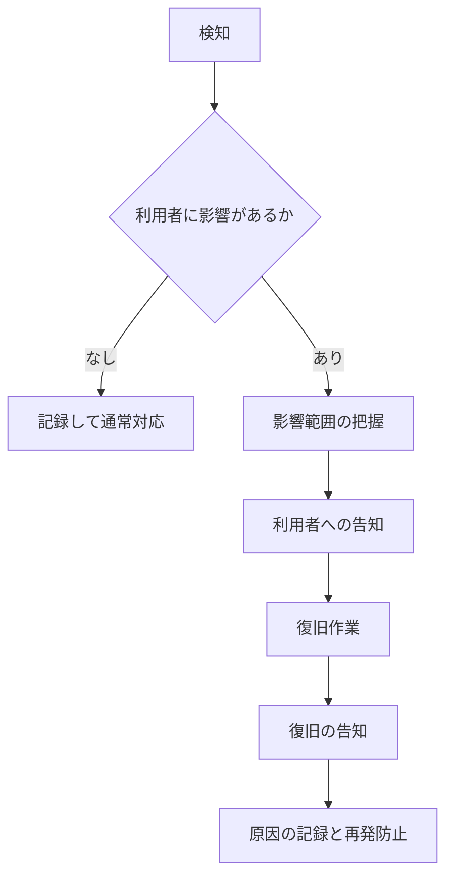
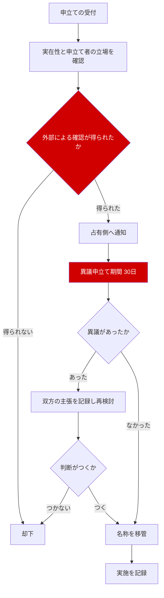

# 詳細設計書 07 — 運用設計と運用ガイドライン

| 項目 | 内容 |
|---|---|
| 文書名 | 運用設計と運用ガイドライン |
| バージョン | 1.0 |
| 作成日 | 2026-08-17 |
| ステータス | レビュー中 |
| 対象工程 | 工程1（詳細設計） |
| 上位文書 | [基本設計書](01_basic_design.md) / [アーキテクチャ](02_architecture.md) |

### 本書の位置づけ

基本設計書 第12章・第13.5節で「定めること」とされた運用上の取り決めを具体化する。前半（第1〜4章）は**システムの運用設計**、後半（第5〜8章）は**人が判断するための運用ガイドライン**である。

**本書の読者には、開発者でない運営者が含まれる。** 第5章以降は技術的な前提を置かずに書く。

> **【前提】** 本プロジェクトは同人制作であり、運営の責任主体は開発完了後の稟議で確定する（基本設計書 決定42）。本書では担当者を人名や所属で固定せず、**役割**として記述する。稟議の結果がどうであれ、本書を書き換えずに済むようにする。

---

## 目次

1. [運用の役割](#1-運用の役割)
2. [監視](#2-監視)
3. [障害対応](#3-障害対応)
4. [バックアップと復旧](#4-バックアップと復旧)
5. [運用ガイドライン：認証審査](#5-運用ガイドライン認証審査)
6. [運用ガイドライン：名称移管](#6-運用ガイドライン名称移管)
7. [運用ガイドライン：通報対応](#7-運用ガイドライン通報対応)
8. [運用ガイドライン：休眠グループの復旧](#8-運用ガイドライン休眠グループの復旧)
9. [グループ管理者向けの手引き](#9-グループ管理者向けの手引き)
10. [意思決定履歴](#10-意思決定履歴)

---

## 1. 運用の役割

| 役割 | 担うこと | 想定人数 |
|---|---|---|
| **システム運用** | 監視、障害対応、バックアップ、デプロイ | 1名（開発者と同一） |
| **モデレーション** | 通報対応、認証審査、名称移管、休眠グループの復旧 | 1名以上 |
| **サポート** | 利用者からの問い合わせ対応 | 1名以上（モデレーションと兼任可） |

**モデレーションを開発者が兼任することの危うさを記しておく。** 通報対応は時間の読めない仕事であり、開発と兼任すると、忙しい時期に通報が滞る。全国公開の前に、**モデレーションだけは開発者以外が担える体制にする**ことを推奨する。これは技術ではなく体制の問題であり、稟議の際に併せて諮る事項である。

---

## 2. 監視

### 2.1 監視項目

| # | 項目 | 見るもの | 異常とみなす条件 |
|---|---|---|---|
| 1 | サービスの死活 | 主要画面が応答するか | 応答なし、または5秒超が3回連続 |
| 2 | **プッシュ配信の成否** | 送信数に対する失敗率 | 失敗率が20%を超える |
| 3 | **配下配信の処理時間** | `createPost` の所要時間 | 5秒を超える |
| 4 | エラー率 | サーバ側の `INTERNAL` 発生数 | 1時間に10件を超える |
| 5 | データベース接続 | 接続数と待ち時間 | 上限の80%に達する |
| 6 | **ストレージ使用量** | データベースとファイルの容量 | 契約上限の70%に達する |
| 7 | Cron の実行 | 日次ジョブの完走 | 実行されない、または失敗 |

**項目2と3を重点とする。** この2つが本アプリの中核機能（連絡が届くこと）に直結し、かつ静かに壊れる。エラーとして表面化しないまま、通知だけが届かなくなる事態を検知できるようにする。

**項目6を監視する理由。** データを無期限に保持する方針（決定43）を採っているため、容量は増える一方である。無料枠で始める以上、上限に達すると**書き込みが止まる**。余裕のあるうちに気づく必要がある。

### 2.2 通知先

| 深刻度 | 条件 | 通知先 |
|---|---|---|
| 緊急 | サービス停止、データベース接続不能 | 運用担当へ即時（メール＋プッシュ） |
| 警告 | 上記の異常条件に該当 | 運用担当へ即時（メール） |
| 情報 | Cron の完走、日次のサマリ | 日次でまとめて |

**1人運用であるため、通知先は1つでよい。** ただし**通知の宛先を本アプリ自身にしない。** アプリが停止しているときに、アプリ経由の通知は届かない。

---

## 3. 障害対応

### 3.1 対応の流れ



### 3.2 利用者への告知

| 状況 | 告知手段 |
|---|---|
| アプリは動くが一部機能が不調 | チャンネル N-8（運営からのお知らせ） |
| **アプリ全体が停止している** | **アプリ外の手段**（後述） |
| 計画停止 | 事前に N-8 で告知 |

**アプリが停止しているとき、N-8 は使えない。** これは基本設計書 第13.5節で未決とされていた「障害時の代替告知手段」にあたる。次のとおり定める。

| 手段 | 内容 |
|---|---|
| **主** | 静的な障害情報ページを、アプリ本体とは別のホスティングに置く。アプリのドメインからリンクしておく |
| 従 | 運営が保有するSNSアカウントでの告知 |

**別のホスティングに置くことが要である。** 同じ基盤に置いた障害情報ページは、障害時に一緒に落ちる。静的ファイル1枚であれば、無料の別サービスで十分に賄える。

### 3.3 想定される障害と一次対応

| 障害 | 影響 | 一次対応 |
|---|---|---|
| 基盤サービスの障害 | アプリ全体 | 復旧を待つ。障害情報ページで告知 |
| データベースの容量上限 | 書き込み不能 | 不要なデータ（運用ログ等）を削除し、プランを見直す |
| プッシュ配信の全面失敗 | 通知が届かない | **連絡自体は成立している。**アプリ内の通知一覧は機能する旨を告知 |
| 特定グループの配下配信が遅い | 投稿が待たされる | ツリーの深さと配下件数を確認。切断や構造の見直しを管理者に相談 |
| 誤った一斉配信 | 多数への誤通知 | **通知は取り消せない。**投稿者に編集を促し、必要なら N-8 で訂正を告知 |

---

## 4. バックアップと復旧

### 4.1 目標値

基本設計書 第13.5節で未決とされていた RPO / RTO を定める。

| 指標 | 目標 | 根拠 |
|---|---|---|
| **RPO（許容データ損失）** | **24時間** | 日次バックアップで賄える範囲。1人運用で、より短い目標を掲げても実現手段がない |
| **RTO（許容復旧時間）** | **72時間** | 1人運用のため、深夜・移動中に障害が起きた場合の着手までの時間を織り込む |

**目標を実態より短く掲げない。** 「RTO 4時間」と書いても、1人運用で常時対応できるわけではない。守れない目標は、障害時に判断を誤らせるだけである。実態に即した値を宣言し、利用規約にも同じ水準で記載する。

> 期限のある活動（当日の集合連絡など）に本アプリのみを用いることは推奨しない。並行稼働の方針（基本設計書 第12.5節）は、この可用性の限界とも整合している。

### 4.2 バックアップ

| 対象 | 頻度 | 保管 |
|---|---|---|
| データベース | 日次（基盤サービスの自動バックアップ） | 7世代 |
| **ストレージ（画像）** | 週次 | 4世代 |
| スキーマ定義 | コミットごと（リポジトリで管理） | 無期限 |

### 4.3 復旧の対象と優先順位

| 優先 | 対象 | 理由 |
|---|---|---|
| 1 | ユーザー、グループ、所属 | これがないと誰も何もできない |
| 2 | 連絡、配信対象、コメント | アプリの中核 |
| 3 | スタンプ獲得、つながり | **失うと利用者の記録が消える。**復旧できない場合の影響が大きい |
| 4 | 監査ログ | 法的な要請に関わる |
| 5 | 通知、購読情報 | 再生成できる |

### 4.4 復旧手順の検証

**バックアップからの復旧を、年に1回以上、実際に試す。** 取得されているだけで復旧できないバックアップは、存在しないのと同じである。検証はプレビュー環境に対して行い、結果を記録する。

---

## 5. 運用ガイドライン：認証審査

基本設計書 決定41 で「詳細設計フェーズの必須成果物」とされた判断基準。

### 5.1 目的

認証バッジは「**このグループは、実在するローバースカウトの公式組織であり、申請者はその運営に関わっている**」ことを示す。それ以上でもそれ以下でもない。

| バッジが意味すること | 意味しないこと |
|---|---|
| 組織が実在する | 活動が活発である |
| 申請者が運営に関わっている | 運営が優れている |
| 名称が正しい | 日本連盟が公認している |

**「日本連盟の公認」ではない点を、申請画面と一般利用者向けの説明の両方に明記する。** 誤解されると、アプリ運営が持たない権威を主張することになる。

### 5.2 審査の基準

次の3点をすべて満たす場合に付与する。

| # | 基準 | 確認の方法 |
|---|---|---|
| 1 | **種別が「公式組織」である** | 申請時の種別 |
| 2 | **組織が実在する** | 日本連盟・県連盟等の公開情報、または既に認証済みの上位グループからの確認 |
| 3 | **申請者が当該組織の運営に関わっている** | 組織の公開情報、上位組織の管理者による確認、または組織名義の連絡先からの回答 |

### 5.3 判断に迷う場合

| 状況 | 扱い |
|---|---|
| 組織は実在するが、申請者の立場が確認できない | **保留**。申請者に追加の確認方法を求める |
| 上位グループが認証済みで、その管理者が申請を支持している | 付与してよい |
| 名称が実在の組織と紛らわしいが、別の集まりである | **却下**し、名称の変更を案内する |
| 過去に認証を却下した申請者からの再申請 | 前回の記録を確認したうえで、あらためて基準に照らす |

**迷ったら付与しない。** 誤って付与したバッジは、偽の公式組織に権威を与える。誤って却下した場合は再申請できるが、誤付与の被害は取り返しがつかない。

### 5.4 応答目標

| 項目 | 目標 |
|---|---|
| 一次応答 | **7日以内** |
| 判断の完了 | 一次応答から14日以内（追加確認が必要な場合を含む） |

**目標を守れない場合、申請者にその旨を伝える。** 沈黙が最も不信を招く。

### 5.5 記録

すべての判断について、次を残す（`group_certification_requests.note`）。

- 確認した情報の出所
- 判断の理由
- 保留・却下の場合、申請者に伝えた内容

**記録は、審査者が交代したときに一貫性を保つためのものである。** 同じような申請に異なる判断が下されると、制度そのものが信用されなくなる。

---

## 6. 運用ガイドライン：名称移管

基本設計書 決定27・決定40 の手続。**アプリ運営が持つ権限のうち、最も強く、最も慎重を要するものである。**

### 6.1 適用する場合

グループ名は全国で一意であるため（決定21）、実在する組織の名称が無関係な利用者に先取りされると、本来の組織が名乗れなくなる。この救済としてのみ用いる。

| 適用する | 適用しない |
|---|---|
| 実在の組織名を、無関係な人物が使用している | 似ているが別の名称である |
| なりすましと判断できる（組織の説明・画像を流用している等） | 単に先に登録されていただけで、実体のある別の集まりである |
| 実体がなく、名称のみが占有されている | 活動が停滞しているが、メンバーは存在する |

### 6.2 手続



### 6.3 遵守する事項

| # | 事項 | 理由 |
|---|---|---|
| 1 | **外部（連盟等）による正当性の確認を必須とする** | 同名の正当な組織が併存しうる。運営の単独裁量による裁定は、連盟のガバナンス下にある組織に対する越権となる（決定40） |
| 2 | **異議申立て期間を30日設ける** | 占有側にも言い分がある可能性を排除しない |
| 3 | **判断がつかない場合は却下する** | 現状を維持するほうが、誤った移管より害が小さい |
| 4 | **実施を記録する** | 監査ログに残し、判断の経緯を追えるようにする |
| 5 | **移管前のグループは削除しない** | 名称のみを解除し、グループ自体は別名で存続させる |

**5番目が重要である。** 移管は名称を巡る救済であり、相手のグループを消す権限ではない。占有側にもメンバーがいる可能性があり、その人たちの記録を巻き添えにしてはならない。

---

## 7. 運用ガイドライン：通報対応

### 7.1 応答目標

| 深刻度 | 例 | 一次対応 |
|---|---|---|
| **緊急** | 個人への脅迫、個人情報の暴露、違法な内容 | **24時間以内** |
| 高 | 誹謗中傷、なりすまし、明白な嫌がらせ | 3日以内 |
| 中 | スパム、不適切な画像、規約違反の疑い | 7日以内 |
| 低 | 判断の分かれる内容、単なる不快感 | 14日以内 |

**緊急に該当するかどうかを、受付時に必ず判定する。** 一覧を上から順に処理すると、緊急のものが埋もれる。

### 7.2 判断の基準

| 措置 | 適用する場合 |
|---|---|
| 却下 | 規約違反にあたらない。**意見の相違や不快感は違反ではない** |
| 非表示化 | 規約違反にあたる内容。投稿者に理由を通知する |
| 警告 | 違反が軽微、または初回 |
| アカウント停止 | 重大な違反、または警告後の再発 |
| グループ削除 | なりすまし、実体のない占拠、違反の温床となっている場合 |

### 7.3 対応の原則

| # | 原則 | 内容 |
|---|---|---|
| 1 | **通報者に結果を通知しない** | 通報の応酬を招く。受付のみ通知する（画面仕様 S-23） |
| 2 | **被通報者には理由を通知する** | 何が問題だったか分からなければ、改善しようがない |
| 3 | **グループ管理者に判断させない** | 管理者自身が通報対象になりうる（決定26） |
| 4 | **自分が当事者である通報を自分で裁かない** | 別の担当者に回す。1人しかいない場合は判断を保留し、体制を整えてから対応する |
| 5 | **記録を残す** | 同一人物の反復を把握するために必要 |

### 7.4 体制の見積もり

基本設計書 第4.4節のとおり、**クローズドβの通報頻度から全国公開時の頻度を外挿してはならない。** βは互いに面識のある協力者同士で行われ、荒れにくい。

想定登録者数（約1,170人。基本設計書 KPI-1）を基準に、次を目安とする。

| 段階 | 想定 | 必要な体制 |
|---|---|---|
| 公開直後（3か月） | 利用が集中し、通報も増える | 週に数回、対応の時間を確保できる担当者1名以上 |
| 定常時 | 週に数件程度 | 同上 |
| Phase 2（匿名掲示板）以降 | **大幅に増える** | **担当者2名以上。**掲示板の公開前に体制を確認する |

**Phase 2 の掲示板公開は、モデレーション体制が整うまで行わない。** 匿名の場を、対応できない体制で開くことは無責任である。これを Phase 2 着手の前提条件とする。

---

## 8. 運用ガイドライン：休眠グループの復旧

### 8.1 休眠になる条件

管理者が1人も存在しない状態が **30日** 続いたグループを休眠とする（基本設計書 第9.4節）。

### 8.2 復旧の手続

| # | 手順 |
|---|---|
| 1 | 休眠グループのメンバーから、運営に対して管理者設定の申し出を受ける |
| 2 | 申し出た人物が、そのグループのメンバー（`status='active'`）であることを確認する |
| 3 | 他のメンバーが存在する場合、**そのメンバーへ通知し、異議申立ての機会を7日設ける** |
| 4 | 異議がなければ、申し出た人物を新しいオーナーに設定する |
| 5 | 実施を記録する |

### 8.3 メンバーが存在しない休眠グループ

| 状況 | 扱い |
|---|---|
| メンバー0人、休眠から**180日**経過 | 名称の解放を検討できる |
| 過去の連絡・スタンプがある | **削除しない。**名称のみを解放し、グループは匿名の識別子で存続させる |

**記録は消さない。** そのグループで活動した人のコレクションには、スタンプが残っている。グループ側の記録を消すと、そのスタンプが由来を失う。

---

## 9. グループ管理者向けの手引き

基本設計書 第12.5節で必要とされた資料の内容。**技術的な前提を置かず、1枚に収める。**

### 9.1 はじめかた（3ステップ）

```
1. グループを作る
   マイページ →「グループを作る」
   名前・種別・参加方式を選ぶだけ。1分で終わります。

2. メンバーを集める
   グループ管理 →「参加QRを表示」
   このQRを、いつもの連絡手段や掲示板に貼ってください。
   読み取った人がそのまま参加できます。

3. 連絡を送る
   ホーム画面の投稿ボタンから。
   届く人数が表示されるので、確認してから送れます。
```

### 9.2 覚えておいてほしいこと

| # | 事項 |
|---|---|
| 1 | **連絡を投稿できるのは管理者だけです。** メンバーはコメントで返信できます |
| 2 | **通知は取り消せません。** 本文は後から直せますが、届いた通知は戻りません |
| 3 | **「配下すべて」に送るときは人数を確認してください。** 想定より多いことがあります |
| 4 | **管理者を増やしておいてください。** あなた1人だと、辞めるときに手続きが必要になります |
| 5 | **スタンプは活動ごとに作ります。** 会場にQRを貼るか、参加者のカードを読み取るかを選べます |

**4番目を強調する。** ローバースカウトは数年で入れ替わる。管理者が1人のまま卒業すると、そのグループは休眠になり、運営への申し出が必要になる。**あらかじめ複数の管理者を置いておけば、この手間はすべて避けられる。**

### 9.3 困ったときは

| 状況 | 対応 |
|---|---|
| 参加申請が来ているか分からない | グループ管理の画面に件数が出ます |
| 間違った内容を送ってしまった | 連絡を開いて編集してください。「編集済み」と表示されます |
| メンバーが参加できないと言っている | 参加方式を確認してください。「招待制」だと申請できません |
| グループ名が使えない | 全国で1つだけの名前になります。地区名などを添えてみてください |
| 管理者を辞めたい | 先に別のメンバーを管理者にしてから辞任してください |

---

## 10. 意思決定履歴

| # | 項目 | 決定 | 日付 | 理由 |
|---|---|---|---|---|
| T-61 | 障害時の代替告知 | 静的な障害情報ページを、**アプリ本体とは別のホスティング**に置く | 2026-08-17 | 同じ基盤に置いたページは障害時に一緒に落ちる。静的ファイル1枚なら無料の別サービスで賄える |
| T-62 | RPO | 24時間 | 2026-08-17 | 日次バックアップで賄える範囲。1人運用でより短い目標を掲げても実現手段がない |
| T-63 | RTO | 72時間 | 2026-08-17 | 1人運用で常時対応はできない。守れない目標は障害時の判断を誤らせる |
| T-64 | 復旧手順の検証 | 年1回以上、実際にバックアップから復旧を試す | 2026-08-17 | 復旧できないバックアップは存在しないのと同じ |
| T-65 | 認証バッジの意味 | 「実在する公式組織であり、申請者が運営に関わっている」ことのみを示す。**日本連盟の公認ではない**と明記する | 2026-08-17 | 誤解されると、アプリ運営が持たない権威を主張することになる |
| T-66 | 認証の判断 | 迷った場合は付与しない | 2026-08-17 | 誤付与は偽の公式組織に権威を与え、取り返しがつかない。誤却下は再申請で回復できる |
| T-67 | 認証の応答目標 | 一次応答7日以内、判断は14日以内 | 2026-08-17 | 沈黙が最も不信を招く。守れない場合はその旨を伝える |
| T-68 | 名称移管の判断 | **判断がつかない場合は却下する** | 2026-08-17 | 現状維持のほうが、誤った移管より害が小さい |
| T-69 | 名称移管の範囲 | 名称のみを解除し、グループ自体は別名で存続させる | 2026-08-17 | 移管は名称の救済であり、相手のグループを消す権限ではない。占有側のメンバーの記録を巻き添えにしない |
| T-70 | 通報結果の通知 | 通報者に結果を通知しない。被通報者には理由を通知する | 2026-08-17 | 前者は通報の応酬を招く。後者は改善の機会として必要 |
| T-71 | 当事者の回避 | 自分が当事者である通報を自分で裁かない | 2026-08-17 | 1人しかいない場合は判断を保留し、体制を整えてから対応する |
| T-72 | Phase 2 の前提条件 | **匿名掲示板の公開は、モデレーション体制が2名以上になるまで行わない** | 2026-08-17 | 匿名の場を、対応できない体制で開くことは無責任である |
| T-73 | 休眠グループの記録 | 名称を解放してもグループと記録は削除しない | 2026-08-17 | メンバーのコレクションに残るスタンプが由来を失う |
| T-74 | 管理者向けの助言 | 「管理者を複数置く」ことを手引きで強調する | 2026-08-17 | ローバーは数年で入れ替わる。あらかじめ複数置けば、休眠と復旧の手間をすべて避けられる |

### 稟議に併せて諮る事項

| # | 事項 | 理由 |
|---|---|---|
| 1 | **モデレーション担当を開発者以外に置くこと** | 通報対応は時間が読めず、開発と兼任すると忙しい時期に滞る |
| 2 | Phase 2 に向けた体制の拡充 | 匿名掲示板の公開には2名以上が必要（T-72） |
| 3 | 有料プランへの移行判断 | 容量とホスティングの制約（アーキテクチャ 第2.5節） |
| 4 | RPO / RTO の水準の妥当性 | 実態に即した値であり、利用規約にも同水準で記載する |
